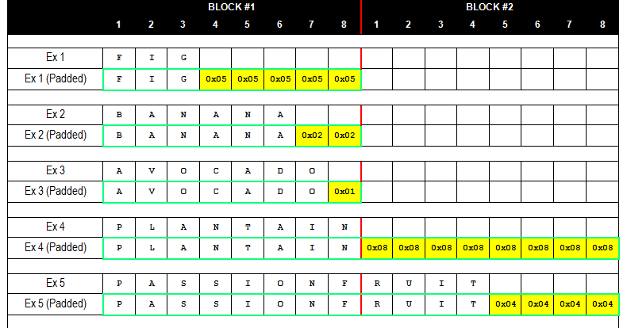

# W1D4 - Cryptography 2: Hashing, RSA, Breaking Block Ciphers

Today you'll learn more about fundamental cryptographic primitives and discover their vulnerabilities. You'll build MD5, implement HMAC, create RSA key pairs, and execute padding oracle attacks - gaining deep insight into both offensive and defensive cryptography.


## Table of Contents

- [Content & Learning Objectives](#content--learning-objectives)
    - [1️⃣ Cryptographic Hashing and HMAC](#-cryptographic-hashing-and-hmac)
    - [2️⃣ RSA Public Key Cryptography](#-rsa-public-key-cryptography)
    - [3️⃣ Padding Oracle Attacks](#-padding-oracle-attacks)
- [1️⃣ Cryptographic Hashing and HMAC](#-cryptographic-hashing-and-hmac-)
    - [Why Hashing Matters](#why-hashing-matters)
    - [Exercise 1.1: Implementing MD5](#exercise--implementing-md)
        - [MD5 Algorithm Overview](#md-algorithm-overview)
        - [MD5 Building Blocks](#md-building-blocks)
        - [MD5 Implementation](#md-implementation)
    - [Understanding MD5's Structure](#understanding-mds-structure)
    - [Finding MD5 Collisions](#finding-md-collisions)
        - [Demonstrating MD5 Collisions](#demonstrating-md-collisions)
        - [Real-World Impact](#real-world-impact)
        - [Modern Alternatives](#modern-alternatives)
    - [Exercise 1.2: Breaking a naive Message Authentication Code](#exercise--breaking-a-naive-message-authentication-code)
        - [Real-World Uses](#real-world-uses)
        - [Naive Approach: Hash with Secret](#naive-approach-hash-with-secret)
        - [Breaking the Naive Approach: Length Extension Attack](#breaking-the-naive-approach-length-extension-attack)
        - [Implementing Length Extension Attack](#implementing-length-extension-attack)
    - [Exercise 1.3: Building proper HMAC implementation](#exercise--building-proper-hmac-implementation)
        - [HMAC Security Properties](#hmac-security-properties)
    - [Exercise 1.4: Secure Password Storage](#exercise--secure-password-storage)
        - [The Evolution of Password Storage](#the-evolution-of-password-storage)
    - [Interactive Exercise: Understanding Password Cracking Economics](#interactive-exercise-understanding-password-cracking-economics)
- [2️⃣ RSA Public Key Cryptography](#-rsa-public-key-cryptography-)
    - [Why RSA Matters](#why-rsa-matters)
    - [Key Properties of Secure RSA](#key-properties-of-secure-rsa)
    - [Helper Functions](#helper-functions)
    - [Exercise 2.1: RSA Key Generation](#exercise--rsa-key-generation)
    - [Exercise 2.2: RSA Encryption and Decryption](#exercise--rsa-encryption-and-decryption)
    - [Exercise 2.3: RSA Digital Signatures](#exercise--rsa-digital-signatures)
    - [Summary and Security Considerations](#summary-and-security-considerations)
        - [Vulnerabilities of Textbook RSA and Their Mitigations](#vulnerabilities-of-textbook-rsa-and-their-mitigations)
        - [Modern RSA Implementation Security](#modern-rsa-implementation-security)
- [3️⃣ Padding Oracle Attacks](#-padding-oracle-attacks-)
    - [Why Learn about Padding Oracles Attacks?](#why-learn-about-padding-oracles-attacks)
    - [Exercise 3.1: PKCS#7 Padding](#exercise--pkcs-padding)
        - [Exercise - implement add_pkcs7_padding](#exercise---implement-addpkcspadding)
        - [Exercise - implement remove_pkcs7_padding](#exercise---implement-removepkcspadding)
    - [Exercise 3.2: CBC Mode Implementation](#exercise--cbc-mode-implementation)
        - [Exercise - implement cbc_encrypt](#exercise---implement-cbcencrypt)
        - [Exercise - implement cbc_decrypt](#exercise---implement-cbcdecrypt)
    - [Exercise 3.3: The Vulnerable Server and Initialization Vector](#exercise--the-vulnerable-server-and-initialization-vector)
        - [Exercise - implement VulnerableServer](#exercise---implement-vulnerableserver)
        - [Exercise - think about Initialization Vector](#exercise---think-about-initialization-vector)
    - [Exercise 4: The Padding Oracle Attack](#exercise--the-padding-oracle-attack)
        - [Attacking a single block](#attacking-a-single-block)
        - [Attacking multiple blocks](#attacking-multiple-blocks)
        - [Exercise - implement padding_oracle_attack_block](#exercise---implement-paddingoracleattackblock)
        - [Exercise - implement padding_oracle_attack](#exercise---implement-paddingoracleattack)
    - [Exercise 5: Combining Techniques to Break SSL - The POODLE Attack](#exercise--combining-techniques-to-break-ssl---the-poodle-attack)
        - [POODLE: Padding Oracle part](#poodle-padding-oracle-part)
        - [POODLE: JavaScript Injection part](#poodle-javascript-injection-part)
        - [POODLE: Downgrade Attack part](#poodle-downgrade-attack-part)
        - [Exercise: POODLE Lessons Learned](#exercise-poodle-lessons-learned)
        - [Defenses Against Padding Oracles](#defenses-against-padding-oracles)
- [Summary: Lessons from Cryptographic Implementation](#summary-lessons-from-cryptographic-implementation)
    - [What You've Learned](#what-youve-learned)
    - [Quiz](#quiz)

## Content & Learning Objectives

### 1️⃣ Cryptographic Hashing and HMAC
You'll implement MD5 from scratch, discover length extension attacks, and build proper HMAC authentication.

> **Learning Objectives**
> - Understand how cryptographic hash functions work internally
> - Learn about Message Authentication Codes and their vulnerabilities
> - Implement secure HMAC according to RFC 2104
> - Explore password storage evolution and economics

### 2️⃣ RSA Public Key Cryptography
You'll generate RSA keys, implement encryption/decryption, and create digital signatures.

> **Learning Objectives**
> - Understand the mathematical foundation of RSA
> - Implement secure key generation and cryptographic operations
> - Learn about digital signatures and their properties

### 3️⃣ Padding Oracle Attacks
You'll implement CBC mode encryption and execute the famous padding oracle attack.

> **Learning Objectives**
> - Understand block cipher modes and padding schemes
> - Create and exploit padding oracle vulnerabilities
> - Learn about real-world attacks like POODLE


## 1️⃣ Cryptographic Hashing and HMAC

Cryptographic hash functions are one-way mathematical functions that take an input of arbitrary length and produce a fixed-size output called a hash or digest.
MD5 (Message Digest 5) is a widely known hash function that produces a 128-bit hash value, typically represented as a 32-character hexadecimal string.
Designed by Ron Rivest in 1991, MD5 was initially used for verifying data integrity and creating digital signatures.
The algorithm processes input data in 512-bit blocks through four rounds of operations, mixing the data thoroughly to ensure that even a single bit change in the input produces a completely different hash.
However, MD5 is now considered cryptographically broken due to discovered vulnerabilities that allow attackers to find collisions (different inputs producing the same hash) relatively easily.
Despite being unsuitable for security applications, MD5 still sees use in non-cryptographic contexts like checksums for file integrity verification.

**HMAC (Hash-based Message Authentication Code)** is a construction that combines a cryptographic hash function with a secret key to provide both data integrity and authentication.
Unlike simple hashing, HMAC proves not only that data hasn't been tampered with, but also that it came from someone possessing the secret key.
The HMAC algorithm works by processing the key and message through the hash function in a specific way: HMAC(K,m) = H((K ⊕ opad) || H((K ⊕ ipad) || m)), where H is the hash function, K is the secret key, and ipad/opad are specific padding constants.
This double hashing with the key provides security even if the underlying hash function has certain weaknesses.
HMAC is widely used in various security protocols including TLS, IPsec, and API authentication schemes.
Importantly, even though MD5 is broken for collision resistance, HMAC-MD5 remains relatively secure for message authentication, though HMAC with stronger hash functions like SHA-256 is preferred for new applications.

### Why Hashing Matters

Cryptographic hash functions are everywhere in security:
- **Password storage**: Never store passwords in plaintext!
- **Data integrity**: Detect if files have been tampered with
- **Digital signatures**: Verify authenticity of messages
- **Blockchain**: Proof-of-work and linking blocks
- **API authentication**: Secure communication without sending secrets

What makes cryptographic hash functions useful for security are these properties:

1. **Deterministic**: The same input always produces the same output.
2. **Collision resistance**: It's computationally infeasible to find two different inputs that produce the same hash output.
3. **Avalanche effect**: A tiny change to the input (even flipping a single bit) causes a large, unpredictable change in the output. Roughly half the output bits should flip, ensuring full keyspace utilization.
4. **One-way (non-invertible)**: Given a hash output, it's computationally infeasible to find the original input.

<details>
<summary>Vocabulary: Cryptographic Hash Terms</summary><blockquote>

- **Hash function**: A mathematical function that maps data of arbitrary size to fixed-size values
- **Digest**: The output of a hash function, also called a hash value or hash
- **Collision**: When two different inputs produce the same hash output
- **Preimage attack**: Finding an input that produces a given hash output
- **Birthday attack**: Finding any two inputs that produce the same hash (exploits birthday paradox)

</blockquote></details>


```python


from typing import List
import math
from collections.abc import Callable
import hmac
import hashlib
import os
import sys
from typing import Tuple, Optional, Callable, Literal
import secrets
import json
from Crypto.Cipher import AES


sys.path.append(os.path.dirname(os.path.dirname(os.path.realpath(__file__))))
from aisb_utils import report
```

### Exercise 1.1: Implementing MD5

> **Difficulty**: 🔴🔴⚪⚪⚪
> **Importance**: 🔵🔵🔵🔵⚪


You'll implement MD5 from scratch to understand how cryptographic hash functions work internally. This involves bit manipulation, modular arithmetic, and careful attention to detail.

#### MD5 Algorithm Overview

MD5 processes data in 512-bit blocks and produces a 128-bit hash. On a high level, it does:
1. Pads the message so that its length in bits is divisible by 512
2. Initializes a 4 32-bit word state (A, B, C, D)
3. Processes the message in 512-bit blocks, updating the state after each block
4. Concatenates the final state bytes to produce the final 128-bit hash.

Processing of each 512-bit block involves updatung the state in 64 rounds.
Each round uses one of four auxiliary functions (F, G, H, I) and follows this pattern:
```
A, B, C, D = D, (B + left_rotate((A + F(B,C,D) + X[k] + T[i]), s)), B, C
```
Where:
- F, G, H, I are bitwise functions operating on B, C, D
- X[k] is a 32-bit word from the current message block
- T[i] is a pre-computed constant
- s is a rotation amount

Don't worry if this seems complex - you'll implement it step by step!


#### MD5 Building Blocks


```python


# MD5 uses four auxiliary functions that operate on three 32-bit words:
def md5_f(x: int, y: int, z: int) -> int:
    """MD5 auxiliary function F: (x & y) | (~x & z)"""
    return (x & y) | (~x & z)


def md5_g(x: int, y: int, z: int) -> int:
    """MD5 auxiliary function G: (x & z) | (y & ~z)"""
    return (x & z) | (y & ~z)


def md5_h(x: int, y: int, z: int) -> int:
    """MD5 auxiliary function H: x ^ y ^ z"""
    return x ^ y ^ z


def md5_i(x: int, y: int, z: int) -> int:
    """MD5 auxiliary function I: y ^ (x | ~z)"""
    return y ^ (x | ~z)


# Pre-computed sine-based constants using the formula T[i] = floor(2^32 * abs(sin(i+1)))
MD5_T = [
    int(math.floor((2**32) * abs(math.sin(i + 1)))) & 0xFFFFFFFF for i in range(64)
]

# Rotation amounts for each round
MD5_S = [
    7,
    12,
    17,
    22,
    7,
    12,
    17,
    22,
    7,
    12,
    17,
    22,
    7,
    12,
    17,
    22,  # Round 1
    5,
    9,
    14,
    20,
    5,
    9,
    14,
    20,
    5,
    9,
    14,
    20,
    5,
    9,
    14,
    20,  # Round 2
    4,
    11,
    16,
    23,
    4,
    11,
    16,
    23,
    4,
    11,
    16,
    23,
    4,
    11,
    16,
    23,  # Round 3
    6,
    10,
    15,
    21,
    6,
    10,
    15,
    21,
    6,
    10,
    15,
    21,
    6,
    10,
    15,
    21,  # Round 4
]


# Helper functions for converting between bytes and integers.
# These functions are provided for you to save time on code less relevant to the goals of the exercise;
# But you can re-implement them yourself if you want to practice bit manipulation!
def bytes_to_int32_le(data: bytes, offset: int) -> int:
    """Convert 4 bytes starting at offset to 32-bit little-endian integer."""
    return (
        data[offset]
        | (data[offset + 1] << 8)
        | (data[offset + 2] << 16)
        | (data[offset + 3] << 24)
    )


def int32_to_bytes_le(value: int) -> bytes:
    """Convert 32-bit integer to 4 bytes in little-endian format."""
    return bytes(
        [value & 0xFF, (value >> 8) & 0xFF, (value >> 16) & 0xFF, (value >> 24) & 0xFF]
    )


def int64_to_bytes_le(value: int) -> bytes:
    """Convert 64-bit integer to 8 bytes in little-endian format."""
    low_32 = value & 0xFFFFFFFF
    high_32 = (value >> 32) & 0xFFFFFFFF
    return int32_to_bytes_le(low_32) + int32_to_bytes_le(high_32)


def left_rotate(value: int, amount: int) -> int:
    """Left rotate a 32-bit integer by the specified amount."""
    # Ensure we're working with 32-bit values
    value &= 0xFFFFFFFF
    return ((value << amount) | (value >> (32 - amount))) & 0xFFFFFFFF


# === Start implementing from here ===
def md5_padding(message: bytes) -> bytes:
    """
    Apply MD5 padding to message.

    MD5 padding works as follows:
    1. Append a single '1' bit (together with trailing zeroes, corresponds to a 0x80 byte)
    2. Append '0' bits until message length ≡ 448 bits mod 512 (i.e., 56 bytes mod 64)
    3. Append original message length as 64-bit little-endian integer

    Args:
        message: Input message as bytes

    Returns:
        Padded message ready for MD5 processing.
        The result has length in bytes divisible by 64 and the last 8 bytes are the length of the original message.
    """
    # TODO: Implement MD5 padding
    # 1. Save original message length in bytes
    # 2. Append 0x80 (the '1' bit)
    # 3. Pad with zero bytes until the size modulo 64 is 56
    # 4. Convert message length to bits
    # 5. Append bit-length as 64-bit little-endian
    pass
from w1d4_test import test_left_rotate
from w1d4_test import test_md5_padding_length
from w1d4_test import test_md5_padding_content


test_left_rotate(left_rotate)
test_md5_padding_length(md5_padding)
test_md5_padding_content(md5_padding)
```

#### MD5 Implementation


```python


def md5_process_block(block: bytes, state: List[int]) -> List[int]:
    """
    Process a single 512-bit block with MD5 algorithm.

    Args:
        block: 64-byte block to process
        state: Current MD5 state: variables [A, B, C, D]

    Returns:
        Updated MD5 state
    """
    assert len(state) == 4, "State must be a list of 4 32-bit integers"
    # TODO: Implement MD5 block processing
    # 1. Convert 64-byte block into 16 32-bit words in little-endian order
    #    - use the bytes_to_int32_le function
    # 2. Initialize A, B, C, D from state
    # 3. For each of 64 rounds (i from 0 to 63):
    #    - Choose function and message index k based on round:
    #      * Round 1 (i < 16): use md5_f, k = i
    #      * Round 2 (i < 32): use md5_g, k = (5*i + 1) % 16
    #      * Round 3 (i < 48): use md5_h, k = (3*i + 5) % 16
    #      * Round 4 (i >= 48): use md5_i, k = (7*i) % 16
    #    - Compute value: temp = A + function(B,C,D) + X[k] + MD5_T[i]
    #    - Mask the value to the low 32 bits
    #    - Left rotate the value by MD5_S[i] bits (use the left_rotate function)
    #    - Add B to the rotated value
    #    - Mask the result temp value to the low 32 bits
    #    - Rotate the state variables: A,B,C,D = D,temp,B,C
    # 4. Return the new state:
    #    - add the resulting values of A, B, C, D to the respective values in the state given in the argument
    #    - e.g., state[0] = (state[0] + A)
    #    - mask the new state values to the low 32 bits
    pass


def md5_hash(message: bytes) -> bytes:
    """
    Compute MD5 hash of message.

    Args:
        message: Input message as bytes

    Returns:
        16-byte MD5 hash
    """
    # TODO: Implement MD5 hash function
    # 1. Initialize state with MD5 magic constants: [0x67452301, 0xEFCDAB89, 0x98BADCFE, 0x10325476]
    # 2. Pad the message using md5_padding() to make the length in bytes divisible by 64
    # 3. Process each 64-byte block:
    #    - For each block, apply the md5_process_block function to the block and the current state
    #    - Update the current state to be the result of md5_process_block
    # 4. Convert final state to bytes:
    #    - convert the state values to little-endian bytes
    #    - concatenate the bytes to get the final hash bytes
    pass


def md5_hex(message: bytes) -> str:
    """Compute MD5 hash and return as hex string."""
    return md5_hash(message).hex()
from w1d4_test import test_md5_process_block
from w1d4_test import test_md5


test_md5_process_block(md5_process_block)
test_md5(md5_hex)
```

### Understanding MD5's Structure

Now that you've implemented MD5, let's explore what makes it tick:

**Why These Design Choices?**

1. **Block-based processing**: Handles arbitrary-length input efficiently
2. **Four rounds with different functions**: Provides diffusion - small input changes affect the entire output
3. **Message scheduling**: Each round uses message words in different orders for better mixing
4. **Modular addition and rotation**: Creates nonlinear relationships that are hard to reverse

**The Merkle-Damgård Construction**

MD5 follows the Merkle-Damgård construction:
```
Hash = H(H(H(H(IV, Block1), Block2), Block3), ...)
```

(IV is an "initialization vector" - the initial state. For MD5, IV consists of four 32-bit magic constants.)

This design has a crucial property: if the compression function (processing one block) is collision-resistant, then the entire hash function is collision-resistant.

**But what happens when that assumption breaks?**

Let's explore MD5's vulnerabilities in the next exercise...


### Finding MD5 Collisions

MD5 is cryptographically broken - it's possible to find two different messages that produce the same hash. While finding collisions from scratch requires sophisticated techniques, we can demonstrate the impact using known collision pairs.

**Why Collisions Matter**

Hash collisions break the fundamental assumption that different inputs produce different outputs. When attackers can find two different messages with the same hash, they can perform devastating attacks that bypass security systems relying on hash uniqueness.

Many security systems assume that if two strings or files have the same hash, they must be identical. Collisions break this assumption, allowing attackers to substitute malicious content while maintaining the same hash value.

Examples of attack scenarios:

- **Certificate forgery**: Creating fake SSL certificates with same hash as legitimate ones. An attacker can generate a malicious certificate that has the same MD5 hash as a trusted certificate, potentially allowing them to impersonate websites or services.

- **Software tampering**: Replace legitimate software with malware that has the same hash. If software distribution relies on MD5 checksums for integrity verification, attackers can create malicious versions that pass integrity checks.

- **Document forgery**: Create contracts or other documents with the same hash but different content. An attacker could create two versions of a contract - one benign for initial review and signing, another malicious with the same hash for later substitution.

- **Password attacks**: Find alternative passwords that hash to the same value. While less practical due to salting in modern systems, this could potentially bypass authentication in poorly designed systems.

#### Demonstrating MD5 Collisions

Finding a new MD5 collision can take hours to days, therefore we'll limit ourselves to demonstrating an existing collision:


```python

# Famous MD5 collision pair discovered by researchers
COLLISION_A = bytes.fromhex(
    "d131dd02c5e6eec4693d9a0698aff95c2fcab58712467eab4004583eb8fb7f89"
    "55ad340609f4b30283e488832571415a085125e8f7cdc99fd91dbdf280373c5b"
    "d8823e3156348f5bae6dacd436c919c6dd53e2b487da03fd02396306d248cda0"
    "e99f33420f577ee8ce54b67080a80d1ec69821bcb6a8839396f9652b6ff72a70"
)

COLLISION_B = bytes.fromhex(
    "d131dd02c5e6eec4693d9a0698aff95c2fcab50712467eab4004583eb8fb7f89"
    "55ad340609f4b30283e4888325f1415a085125e8f7cdc99fd91dbd7280373c5b"
    "d8823e3156348f5bae6dacd436c919c6dd53e23487da03fd02396306d248cda0"
    "e99f33420f577ee8ce54b67080280d1ec69821bcb6a8839396f965ab6ff72a70"
)


def demonstrate_md5_collision():
    """Show that two different messages can have the same MD5 hash."""
    print("\nMessage differences at positions:")
    for i, (a, b) in enumerate(zip(COLLISION_A, COLLISION_B)):
        if a != b:
            print(f"  Position {i}: {a:02x} vs {b:02x}")

    hash_a = md5_hex(COLLISION_A)
    hash_b = md5_hex(COLLISION_B)

    print("MD5 Collision Demonstration")
    print("=" * 40)
    print(f"Message A: {COLLISION_A.hex()[:60]}...")
    print(f"MD5(A):    {hash_a}")
    print()
    print(f"Message B: {COLLISION_B.hex()[:60]}...")
    print(f"MD5(B):    {hash_b}")
    print()
    print(f"Messages identical? {COLLISION_A == COLLISION_B}")
    print(f"Hashes identical? {hash_a == hash_b}")


demonstrate_md5_collision()
```

#### Real-World Impact

MD5 has been cryptographically broken since 2004.
Practical exploits are available since 2008 when the first rogue CA certificate was forged by Stevens et al.

MD5-based certificates were universally rejected by browsers and operating systems only by early 2014. The weakness in MD5 was exploited, e.g., by [Flame malware](https://en.wikipedia.org/wiki/Flame_(malware)) (2012), where a nation-state actor used MD5 collisions to forge Microsoft certificates, making the malware appear to be legitimate Microsoft software.

#### Modern Alternatives

Because of these vulnerabilities, MD5 should never be used for security purposes. Modern alternatives include:
- **SHA-256**: Part of SHA-2 family, no known practical attacks
- **SHA-3**: Different construction from SHA-2, provides additional security margin
- **BLAKE3**: Modern, fast, and secure hash function

However, MD5 is still acceptable for non-security uses like checksums for data corruption detection.

In the next exercise, we'll see how hash functions are used to build authentication systems...


### Exercise 1.2: Breaking a naive Message Authentication Code

Now that you understand how hash functions work internally, let's explore how they're used to build secure authentication systems. You'll discover why naive approaches fail in this exercise, and build a proper HMAC implementation in the next one.

> **Difficulty**: 🔴🔴⚪⚪⚪
> **Importance**: 🔵🔵🔵🔵⚪

**What are Message Authentication Codes?**

Message authentication codes (MACs) ensure two critical properties:
1. **Integrity**: The message hasn't been modified
2. **Authentication**: The message came from someone who knows a shared secret

Unlike encryption, MACs doesn't hide the message content - it just proves the message is authentic and untampered.

[HMAC](https://en.wikipedia.org/wiki/HMAC), or "hashed-based message authentication code",
is a type of MAC based on a cryptographic hash function and a secret key.

A piece of data that provides authentication and integrity verification is also known as a *tag* (analogous to a *signature* in asymmetric cryptography).

<details>
<summary>Vocabulary: Authentication Terms</summary><blockquote>

- **MAC (Message Authentication Code)**: A cryptographic checksum that provides both integrity and authenticity
- **HMAC (Hash-based Message Authentication Code)**: Kind of MAC based on a cryptographic hash and a secret key
- **Tag**: The output of a MAC function, proves the message is authentic
- **Authentication**: Verifying that a message comes from a claimed sender
- **Integrity**: Ensuring that data has not been modified or corrupted
- **Shared secret**: A confidential key shared by communicating parties
- **Replay attack**: Retransmitting a valid data transmission maliciously

</blockquote></details>

#### Real-World Uses
HMAC is everywhere in modern security:

- **API Authentication**: Services like AWS use HMAC signatures to authenticate API requests
- **JWT Tokens**: JSON Web Tokens use HMAC to prevent tampering with claims
- **Cookie Signing**: Web frameworks use HMAC to detect tampered session cookies
- **Webhook Verification**: GitHub, Stripe, etc. use HMAC to verify webhook authenticity


#### Naive Approach: Hash with Secret

HMAC relies on a shared secret key. Since a good hash function is one-way, it's not possible to recover the secret from the hash when we combine it with the message before hashing. The most straightforward approach is thus to just concatenate the message with the secret, and hash the result.

This provides two desired security properties: **Integrity** - any modification to the message will produce a completely different HMAC due to the avalanche effect, making tampering detectable. **Authentication** - only parties who know the shared secret can generate valid HMACs; given a message, the validator generates the expected HMAC and compares it with the received one; a match proves the message came from a legitimate source.


```python


def naive_mac(message: bytes, secret: bytes) -> bytes:
    """
    Naive message authentication: Hash(secret || message)

    Args:
        message: The message to authenticate
        secret: Secret key known only to legitimate parties
    Returns:
        Authentication tag
    """
    # TODO: Implement naive MAC
    # Concatenate secret and message, then hash the result
    # Use the md5_hash function you implemented earlier
    pass


def naive_verify(message: bytes, secret: bytes, tag: bytes) -> bool:
    """
    Verify a message using the naive MAC.

    Args:
        message: The message to verify
        secret: Secret key
        tag: Authentication tag to check

    Returns:
        True if the tag is valid for the message
    """
    # TODO: Implement naive verification
    # Compute the expected tag for the message and compare it with the provided tag
    pass
from w1d4_test import test_naive_mac


test_naive_mac(naive_mac, naive_verify)
```

#### Breaking the Naive Approach: Length Extension Attack

The naive approach has a critical flaw: vulnerability to **length extension attacks**. The vulnerability follows from the MD5's Merkle-Damgård construction.
You'll find the explanation in the following text toggle, but you can also try to figure it out yourself if you want a challenge!

<details>
<summary>How length extension against Merkle-Damgård construction works</summary><blockquote>

If you know Hash(A), you can compute Hash(A || B) for any B without knowing A!

This happens because:
1. MD5 processes data in blocks and maintains internal state
2. The final hash is just the internal state after processing all blocks
3. An attacker can use the known hash as the starting state for additional blocks

</blockquote></details>


#### Implementing Length Extension Attack

Given `Hash(message || secret)` and the length of `(message || secret)`, an attacker can compute `Hash(message || secret || padding || additional_data)` even without knowing the secret.

Think for a moment how you would implement the technical details:
- How would you determine the "glue padding" that MD5 appended to (message || secret)?
- How can you get the 4 values of the internal state that correspond to the internal state after processing (message || secret)?
- What's remaining to be done to compute the final hash once you have the glue padding and internal state?


```python


def length_extension_attack(
    original_message: bytes,
    original_tag: bytes,
    secret_length: int,
    additional_data: bytes,
) -> tuple[bytes, bytes]:
    """
    Perform a length extension attack against the naive MAC.

    This demonstrates how an attacker can forge valid MACs for new messages
    without knowing the secret key.

    Args:
        original_message: Message with known valid MAC
        original_tag: Valid MAC for original_message
        secret_length: Length of the secret (often can be guessed/brute-forced)
        additional_data: Data to append and authenticate

    Returns:
        (forged_message, forged_tag) - New message and its valid MAC
    """
    # TODO: Implement length extension attack
    # Step 1: Determine the "glue padding" that MD5 applied to (secret || original_message)
    # - The padding only depends on input length, not contents,
    #   therefore you can use a dummy value of secret_length + len(original_message) to construct input to md5_padding(),
    # - Extract just the padding part that was added as glue_padding

    # Step 2: Build the forged message that the attacker will present as
    #   concatenation of original_message + glue_padding + additional_data

    # Step 3: Convert the original tag back to MD5 internal state
    # - The tag represents the MD5 state after processing (secret || original_message || glue_padding)
    # - Use bytes_to_int32_le to extract 4 32-bit words from the tag

    # Step 4: Determine what final padding is needed
    # - Calculate total length: secret_length + len(original_message) + len(glue_padding) + len(additional_data)
    # - Create dummy data of that length and apply md5_padding()
    # - Extract the final padding that would be added

    # Step 5: Continue MD5 processing from the known state
    # - Process (additional_data + final_padding) starting from the extracted state
    # - Use md5_process_block for each 64-byte block

    # Step 6: Convert final state back to bytes for the forged tag

    pass
from w1d4_test import test_length_extension_attack


test_length_extension_attack(length_extension_attack, naive_mac, naive_verify)
```

### Exercise 1.3: Building proper HMAC implementation

The length extension attack shows why we need a more sophisticated approach.
We are going to implement HMAC according to RFC 2104 to see how it addresses the problem using a clever construction.

> **Difficulty**: 🔴🔴🔴⚪⚪
> **Importance**: 🔵🔵🔵🔵🔵


**HMAC Construction**

HMAC works by hashing twice with different keys:

```
HMAC(key, message) = Hash(opad ⊕ key || Hash(ipad ⊕ key || message))
```

Where:
- `ipad` = 0x36 repeated for block size (inner padding)
- `opad` = 0x5C repeated for block size (outer padding)
- `key` is the secret key normalized to the hash function's block size
- `⊕` is XOR operation
- `||` is concatenation

**Why This Design Works**

1. **Two hash calls**: Even if you can extend the inner hash, you can't extend the outer hash without knowing the key
2. **Different keys**: The inner and outer keys are different (key ⊕ ipad vs key ⊕ opad)
3. **No state leakage**: The final hash doesn't reveal the intermediate state
4. **Key length doesn't weaken security**: normalizing the key length prevents prevents key length attacks  and maintains entropy distribution

Let's implement it:


```python


def hmac_md5(key: bytes, message: bytes) -> bytes:
    """
    Implement HMAC using MD5 as the underlying hash function.

    Args:
        key: Secret key for authentication
        message: Message to authenticate

    Returns:
        HMAC tag (16 bytes for MD5)
    """
    block_size = 64  # MD5 block size in bytes - normalize the key length to this size
    ipad = 0x36  # Inner padding byte
    opad = 0x5C  # Outer padding byte
    # TODO: Implement HMAC-MD5

    # Step 1: Normalize the key length
    # - If key longer than block_size, hash it with md5_hash
    # - Otherwise, pad key to exactly block_size bytes with null bytes

    # Step 2: Compute inner hash
    # - compute Hash(ipad ⊕ key || message)
    # Hint: Use bytes(k ^ ipad for k in key) for XOR operation

    # Step 3: Compute HMAC
    # - compute Hash(opad ⊕ key || inner_hash)
    pass


def hmac_verify(key: bytes, message: bytes, tag: bytes) -> bool:
    """
    Verify an HMAC tag.

    Args:
        key: Secret key
        message: Message to verify
        tag: HMAC tag to check

    Returns:
        True if tag is valid
    """
    expected_tag = hmac_md5(key, message)
    return expected_tag == tag
from w1d4_test import test_hmac_md5
from w1d4_test import test_hmac_verify


test_hmac_md5(hmac_md5)
test_hmac_verify(hmac_verify)
```

#### HMAC Security Properties

Let's verify that HMAC is resistant to the length extension attack that broke our naive approach:


```python
from w1d4_test import test_hmac_security


test_hmac_security(hmac_md5, length_extension_attack, hmac_verify)
```

### Exercise 1.4: Secure Password Storage

Now that you understand how hash functions work, let's explore one of their most critical applications: storing passwords securely.

> **Difficulty**: 🔴🔴⚪⚪⚪
> **Importance**: 🔵🔵🔵🔵⚪
>
> You should spend up to ~20 minutes on this exercise.

Password storage is a fundamental security challenge that every application faces. Poor password storage has led to massive breaches affecting millions of users:
- **LinkedIn (2012)**: 6.5 million unsalted SHA-1 hashes leaked, most cracked within days
- **Adobe (2013)**: 150 million passwords stored with weak encryption, many cracked
- **Ashley Madison (2015)**: 30 million user accounts leaked; passwords were hashed with bcrypt, but some older accounts used MD5

In this section, you'll learn how password storage evolved from terrible practices to modern secure approaches.

#### The Evolution of Password Storage

**1. Plaintext Storage (Never Do This!)**

The most naive approach is storing passwords as plaintext. This is catastrophic because:
- Any database breach immediately exposes all passwords
- Insiders (employees, contractors) can see user passwords; misusing them is trivial and hard to detect

**2. Basic Hashing (Still Inadequate)**

The next evolution was to hash passwords:
```python
stored_password = hash(password)
```

This seems better - passwords aren't immediately visible. But it's still vulnerable to:
- **Rainbow tables**: Pre-computed hash lookups for common passwords
- **Dictionary attacks**: Hashing common passwords and comparing
- **Identical passwords have identical hashes**: If two users have the same password, it's obvious

**3. Salted Hashing (Better, But Not Enough)**

Adding salt prevents rainbow table attacks:
```python
stored_password = hash(password + salt)
```

There are two approaches:
- **Static salt** (same for all users): Prevents generic rainbow tables but a single brute-force pass can still crack all passwords
- **Per-user salt** (unique for each user): Forces attackers to crack each password individually

**4. Slow Hashing Algorithms (Modern Best Practice)**

The fundamental problem with MD5/SHA-256 for passwords is they're TOO FAST. Modern GPUs can compute billions of hashes per second.

Special password hashing algorithms are designed to be slow:
- **bcrypt**: Adjustable cost factor, typical setting makes it ~1 million times slower than MD5
- **Argon2**: The current gold standard, memory-hard to resist GPU/ASIC attacks

<details>
<summary>Vocabulary: Password Security Terms</summary><blockquote>

- **Rainbow table**: Pre-computed hash lookups for common passwords
- **Salt**: Random data added to passwords before hashing to prevent rainbow table attacks
- **Dictionary attack**: Systematically testing common passwords
- **Brute force**: Trying all possible password combinations
- **Hash rate**: How many hash operations can be performed per second
- **GPU/ASIC**: Specialized hardware for fast parallel computation
- **Cost factor**: Parameter that controls how slow a password hashing algorithm is
- **Pepper**: Secret added to passwords in a way similar to salt which is (unlike salt) not stored in a separate secret storate rather than alongside a password hash

</blockquote></details>

### Interactive Exercise: Understanding Password Cracking Economics

Open [hash-crack-cost.html](./resources/hash-crack-cost.html) in your browser and play with the configuration, then answer the questions below.

<details>
<summary>Question 1: Why does the tool show different costs for "Unsalted", "Static salt", and "Per-user salt"?</summary><blockquote>

With unsalted or static salt hashes, an attacker can test each password guess against ALL hashes simultaneously. For example, computing MD5("password123") once tells you if ANY of the 1000 users has that password.

With per-user salts, each password must be attacked individually.

The values for unsalted and static salt options is the same because we are assuming a brute-force attack. The values would be different if we assumed a rainbow table attack.
</blockquote></details>

<details>
<summary>Question 2: Change the algorithm from SHA-256 to Argon2. Why is the hash rate so dramatically different (2 × 10¹¹ vs 6,400 hashes/second)?</summary><blockquote>

Fast hash functions like MD5 and SHA-256 were designed for speed - they need to quickly verify file integrity or digital signatures. A modern GPU can compute over a trillion MD5 hashes per second!

Password hashing algorithms like Argon2 are intentionally slow and memory-hard:
- **Slow**: Each hash takes significant time (milliseconds vs nanoseconds)
- **Memory-hard**: Requires large amounts of RAM, making GPU/ASIC attacks expensive
- **Configurable**: You can adjust the cost as hardware improves

The 160 million times slowdown (1.04×10¹² ÷ 6,400) makes password cracking economically infeasible for most attackers.
</blockquote></details>

<details>
<summary>Question 3: [SHA-256](https://en.wikipedia.org/wiki/SHA-2) hash function is widely used in asymmetric cryptography and considered safe. Why is it not safe for hashing passwords then?</summary><blockquote>

SHA-256 is not safe for hashing passwords primarily because of the vastly different nature of the inputs in password hashing versus its use in asymmetric cryptography.

In asymmetric cryptography, SHA-256 typically hashes large, high-entropy inputs such as public keys, digital messages, or file contents. These inputs are often unpredictable and infeasible to brute-force. The role of the hash function here is to ensure integrity and collision resistance, which SHA-256 provides effectively.

However, in the context of password hashing, the inputs (i.e., passwords) are usually short, low-entropy, and highly guessable.
</blockquote></details>


## 2️⃣ RSA Public Key Cryptography

RSA (Rivest-Shamir-Adleman) is a public-key cryptosystem that revolutionized cryptography by enabling secure communication without requiring parties to share a secret key beforehand.
The algorithm relies on the mathematical difficulty of factoring large composite numbers, specifically the product of two large prime numbers.
In RSA, each user has a key pair: a public key (n, e) that can be freely shared, and a private key (n, d) that must be kept secret.
To encrypt a message, the sender converts it to a number m and computes $c = m^e \mod n$ using the recipient's public key.
The recipient then decrypts by computing $m = c^d \mod n$ using their private key.
The security stems from the fact that while it's easy to multiply two large primes together, it's computationally infeasible to factor their product back into the original primes, making it practically impossible to derive the private key from the public key.

Digital signatures with RSA work in reverse to encryption, providing authentication and non-repudiation rather than confidentiality.
To sign a message, the signer first creates a hash of the message using a cryptographic hash function, then "encrypts" this hash with their private key: signature = hash^d mod n.
Anyone can verify the signature by "decrypting" it with the signer's public key (hash' = signature^e mod n) and comparing the result to a fresh hash of the message.
If they match, it proves the signature was created by the holder of the private key and that the message hasn't been altered.
RSA remains widely used in various applications including HTTPS/TLS certificates, email encryption (PGP/GPG), and software signing.
However, RSA requires relatively large key sizes (2048 bits or more) for modern security standards, making it slower than elliptic curve alternatives for equivalent security levels, which is why many systems now use RSA primarily for signatures and key exchange rather than bulk encryption.

### Why RSA Matters

- **Asymmetric cryptography**: Enables secure communication without pre-shared secrets
- **Digital signatures**: Provides authentication and non-repudiation
- **Foundation of PKI**: Used in TLS/SSL certificates, email encryption, code signing
- **Mathematical elegance**: Based on the difficulty of factoring large numbers

### Key Properties of Secure RSA

1. **Large primes**: p and q should be hundreds of digits long (2048+ bits total)
2. **Proper padding**: Never encrypt raw data (use OAEP for encryption, PSS for signatures)
3. **Secure random numbers**: Critical for prime generation and padding
4. **Side-channel resistance**: Constant-time operations to prevent timing attacks
5. **Key management**: Private keys must be protected; public keys must be authenticated

<details>
<summary>Vocabulary: RSA Terms</summary><blockquote>

- **Public key**: (n, e) - the modulus and public exponent, can be shared freely
- **Private key**: (n, d) - the modulus and private exponent, must be kept secret
- **Modulus (n)**: Product of two primes p × q
- **Euler's totient φ(n)**: (p-1)(q-1) - count of integers coprime to n
- **Modular exponentiation**: Computing a^b mod n efficiently
- **Textbook RSA**: RSA without padding (insecure!)
- **OAEP/PSS**: Padding schemes that make RSA secure

</blockquote></details>


### Helper Functions

These functions are provided for you to use in your implementation - just copy then into your solution file.


```python

import random
from typing import Tuple, List


def _is_probable_prime(n: int, rounds: int = 5) -> bool:
    """Return True if ``n`` passes a Miller-Rabin primality test."""
    if n in (2, 3):
        return True
    if n <= 1 or n % 2 == 0:
        return False

    # Write n-1 as d * 2^s
    s = 0
    d = n - 1
    while d % 2 == 0:
        d //= 2
        s += 1

    for _ in range(rounds):
        a = random.randrange(2, n - 2)
        x = pow(a, d, n)
        if x in (1, n - 1):
            continue
        for __ in range(s - 1):
            x = pow(x, 2, n)
            if x == n - 1:
                break
        else:
            return False
    return True


def get_prime(bits: int, rng: random.Random | None = None) -> int:
    if rng is None:
        rng = random.Random()

    while True:
        candidate = rng.getrandbits(bits)
        candidate |= (1 << (bits - 1)) | 1
        if _is_probable_prime(candidate):
            return candidate
```

### Exercise 2.1: RSA Key Generation

> **Difficulty**: 🔴🔴🔴⚪⚪
> **Importance**: 🔵🔵🔵🔵🔵
>
> You should spend up to ~20 minutes on this exercise.

Now we'll generate RSA key pairs. The process is:

1. Generate two distinct primes p and q
2. Compute n = p × q (the modulus)
3. Compute φ(n) = (p-1)(q-1) (Euler's totient)
4. Choose public exponent e (typically 65537)
5. Compute private exponent d ≡ e⁻¹ (mod φ(n))

The security comes from the fact that knowing n doesn't let you compute φ(n) without factoring n into p and q.

<details>
<summary>Vocabulary: Key Generation Terms</summary><blockquote>

- **Modulus (n)**: Public value that's hard to factor
- **Totient φ(n)**: Number of integers coprime to n
- **Public exponent (e)**: Usually 65537 (2¹⁶ + 1) for efficiency
- **Private exponent (d)**: Modular multiplicative inverse of e
- **Coprime**: Two numbers with no common factors except 1
- **Modular inverse**: d such that e × d ≡ 1 (mod φ(n))

</blockquote></details>

Implement the `generate_keys` function that creates an RSA key pair.


```python


def generate_keys(bits: int = 16) -> Tuple[Tuple[int, int], Tuple[int, int]]:
    """Generate RSA public and private keys.

    Steps:
    1. Generate two primes p and q of bits//2 length each
    2. Ensure p ≠ q
    3. Compute n = p × q and φ(n) = (p-1) × (q-1)
    4. Choose e (try 65537 first, fall back if needed)
    5. Compute d = e⁻¹ mod φ(n)

    Args:
        bits: Approximate bit length of the modulus n.

    Returns:
        ((n, e), (n, d)) - public and private key tuples
    """
    # TODO: Implement key generation
    #    - Generate p and q (bits//2 each)
    #    - Ensure p ≠ q
    #    - Compute n and φ(n)
    #    - Choose e (check if coprime with φ)
    #    - Compute d using pow(e, -1, phi)
    pass
from w1d4_test import test_generate_keys


test_generate_keys(generate_keys)
```

### Exercise 2.2: RSA Encryption and Decryption

> **Difficulty**: 🔴🔴⚪⚪⚪
> **Importance**: 🔵🔵🔵🔵⚪
>
> You should spend up to ~15 minutes on this exercise.

RSA encryption and decryption use modular exponentiation:
- Encryption: c = m^e mod n (using public key)
- Decryption: m = c^d mod n (using private key)

This works because:
- e × d ≡ 1 (mod φ(n))
- By Euler's theorem: m^(e×d) ≡ m (mod n)

We'll implement a toy version of RSA that encrypts one byte at a time. Real RSA uses padding schemes like OAEP.

<details>
<summary>Vocabulary: Encryption Terms</summary><blockquote>

- **Plaintext (m)**: Original message
- **Ciphertext (c)**: Encrypted message
- **Modular exponentiation**: Computing a^b mod n efficiently
- **Malleability**: Property where ciphertexts can be manipulated
- **Homomorphic**: RSA is multiplicatively homomorphic

</blockquote></details>

Implement the `encrypt` and `decrypt` functions.


```python


def encrypt_rsa(public_key: Tuple[int, int], message: str) -> List[int]:
    """Encrypt a UTF-8 string one byte at a time.

    Process each byte of the message:
    1. Convert message to UTF-8 bytes
    2. For each byte b, compute c = b^e mod n
    3. Return list of encrypted values

    Args:
        public_key: Tuple (n, e) of modulus and public exponent
        message: The plaintext string

    Returns:
        List of encrypted integers (one per byte)
    """
    # TODO: Implement encryption
    #    - Extract n and e from public_key
    #    - Convert message to bytes with .encode("utf-8")
    #    - Encrypt each byte with pow(byte, e, n)
    #    - Return list of encrypted values
    pass


def decrypt_rsa(private_key: Tuple[int, int], ciphertext: List[int]) -> str:
    """Decrypt a list of integers with the private key.

    Process each encrypted value:
    1. For each ciphertext c, compute m = c^d mod n
    2. Collect decrypted values as bytes
    3. Decode UTF-8 string

    Args:
        private_key: Tuple (n, d) of modulus and private exponent
        ciphertext: List of encrypted integers

    Returns:
        Decrypted string
    """
    # TODO: Implement decryption
    #    - Extract n and d from private_key
    #    - Decrypt each value with pow(c, d, n)
    #    - Convert to bytes and decode UTF-8
    pass
```

<details>
<summary>Hint 1: Encryption</summary><blockquote>

```python
n, e = public_key
encrypted = []
for byte in message.encode("utf-8"):
    encrypted.append(pow(byte, e, n))
return encrypted
```

Or more concisely with a list comprehension.
</blockquote></details>

<details>
<summary>Hint 2: Decryption</summary><blockquote>

```python
n, d = private_key
decrypted = []
for c in ciphertext:
    decrypted.append(pow(c, d, n))
return bytes(decrypted).decode("utf-8")
```
</blockquote></details>


```python
from w1d4_test import test_encryption


test_encryption(encrypt_rsa, decrypt_rsa, generate_keys)
```

### Exercise 2.3: RSA Digital Signatures

> **Difficulty**: 🔴🔴🔴⚪⚪
> **Importance**: 🔵🔵🔵🔵⚪
>
> You should spend up to ~20 minutes on this exercise.

RSA can also create digital signatures. The operations are "reversed" compared to encryption:
- Signing: s = m^d mod n (using PRIVATE key)
- Verification: m = s^e mod n (using PUBLIC key)

This provides:
- **Authentication**: Only the private key holder can create valid signatures
- **Non-repudiation**: The signer cannot deny creating the signature
- **Integrity**: Any change to the message invalidates the signature

<details>
<summary>Vocabulary: Signature Terms</summary><blockquote>

- **Digital signature**: Mathematical proof of authenticity
- **Signing**: Creating a signature with private key
- **Verification**: Checking signature with public key
- **Non-repudiation**: Signer cannot deny signing
- **Hash-and-sign**: Real signatures hash the message first
- **Blind signatures**: Signing without seeing the message

</blockquote></details>

Implement the `sign` and `verify` functions.


```python


def sign(private_key: Tuple[int, int], message: str) -> List[int]:
    """Sign a UTF-8 message by raising bytes to the private exponent.

    Similar to decryption but applied to plaintext:
    1. Convert message to bytes
    2. For each byte m, compute s = m^d mod n
    3. Return list of signature values

    Args:
        private_key: Tuple (n, d) of modulus and private exponent
        message: The message to sign

    Returns:
        List of signature integers (one per byte)
    """
    # TODO: Implement signing
    #    - Extract n and d from private_key
    #    - Convert message to bytes
    #    - Sign each byte with pow(byte, d, n)
    pass


def verify(public_key: Tuple[int, int], message: str, signature: List[int]) -> bool:
    """Verify an RSA signature.

    Steps:
    1. For each signature value s, compute m = s^e mod n
    2. Check if recovered values match original message bytes
    3. Handle invalid signatures gracefully

    Args:
        public_key: Tuple (n, e) of modulus and public exponent
        message: The original message
        signature: List of signature values to verify

    Returns:
        True if signature is valid, False otherwise
    """
    # TODO: Implement verification
    #    - Extract n and e from public_key
    #    - Recover each byte with pow(s, e, n)
    #    - Check if recovered bytes match original message
    #    - Return False for any errors
    pass
```

<details>
<summary>Hint 1: Signing process</summary><blockquote>

Signing is like "encrypting with the private key":
```python
n, d = private_key
signature = []
for byte in message.encode("utf-8"):
    signature.append(pow(byte, d, n))
```
</blockquote></details>

<details>
<summary>Hint 2: Verification process</summary><blockquote>

Verify by "decrypting with the public key" and comparing:
```python
n, e = public_key
recovered = []
for s in signature:
    recovered.append(pow(s, e, n))
# Check if recovered matches original message
```
</blockquote></details>

<details>
<summary>Hint 3: Error handling</summary><blockquote>

A valid signature should:
- Recover to valid byte values (0-255)
- Decode as valid UTF-8
- Match the original message exactly

Return False if any of these fail.
</blockquote></details>


```python
from w1d4_test import test_signatures


test_signatures(sign, verify, generate_keys)
```

### Summary and Security Considerations

#### Vulnerabilities of Textbook RSA and Their Mitigations

**1. Deterministic Encryption**
- **Vulnerability**: Same plaintext always produces identical ciphertext
- **Why this matters**: Attackers can perform frequency analysis on encrypted communications, build dictionaries of common encrypted values (e.g., "Yes"→ciphertext₁, "No"→ciphertext₂), and recognize patterns in encrypted data
- **Mitigations**: RSA-OAEP adds randomized padding before encryption, ensuring the same message encrypts to different ciphertexts each time, providing semantic security

**2. Malleability**
- **Vulnerability**: RSA is multiplicatively homomorphic: E(m₁) × E(m₂) = E(m₁ × m₂)
- **Why this matters**: Attackers can manipulate encrypted values without decrypting them - multiply a salary by E(2) to double it, or multiply by E(0) to zero it out, all while maintaining valid encryption
- **Mitigations**: RSA-OAEP includes integrity checks and structured padding that makes malleated ciphertexts decrypt to invalid padding, preventing manipulation attacks

**3. Small Message Space**
- **Vulnerability**: Single bytes have only 256 possible values
- **Why this matters**: Attackers can pre-compute encryptions of all possible byte values, then instantly "decrypt" any ciphertext by table lookup - no key needed
- **Mitigations**: RSA-OAEP's randomized padding exponentially expands the effective message space, making brute force computationally infeasible

**4. No Integrity Protection**
- **Vulnerability**: Modified ciphertext decrypts to garbage without detection
- **Why this matters**: Attackers can corrupt data in transit, causing applications to process malicious input, crash systems, or leak information through error messages
- **Mitigations**: RSA-OAEP includes built-in integrity verification - corrupted ciphertexts are detected and rejected during decryption

**5. Small Key Sizes**
- **Vulnerability**: Our 16-bit keys can be factored in microseconds
- **Why this matters**: Once an attacker factors n = p × q, they can compute the private key and decrypt all messages or forge signatures
- **Mitigations**: Use ≥2048-bit keys (current standard) or ≥3072-bit keys (future-proof against quantum computers); factoring such numbers requires more computational power than exists

#### Modern RSA Implementation Security

**RSA-OAEP for Encryption**: Provides semantic security, prevents chosen ciphertext attacks, includes integrity verification

**RSA-PSS for Signatures**: Signs message hashes (not raw messages), adds randomized salt for security, provides strong unforgeability guarantees, much more efficient for long messages

**Side-Channel Protection**: Constant-time operations prevent timing attacks, blinding prevents power analysis, secure random number generation, protection against fault injection attacks


## 3️⃣ Padding Oracle Attacks
Now you'll implement one of the most elegant attacks in cryptography: the padding oracle attack. This attack demonstrates how a tiny information leak (whether padding is valid) can completely compromise encryption.

It has been used to break popular frameworks and protocols. E.g., this attack was used to completely break ASP.NET's authentication cookies in 2010, allowing attackers to forge admin credentials.
In 2015, the POODLE attack prompted final replacement of SSL with TLS.

### Why Learn about Padding Oracles Attacks?
<!-- FIXME: highlight this later where they can connect it with the exercises  -->

Padding oracle attacks demonstrate several critical security principles:

1. **Small leaks break cryptography**: Even revealing whether padding is valid breaks semantic security
2. **Implementation details matter**: Theoretically secure algorithms can be broken by poor implementation
3. **Side channels are everywhere**: Error messages, timing differences, and behavior changes leak information
4. **Defense in depth**: Encryption alone isn't enough - you need authentication too

Understanding this attack helps you **recognize similar vulnerabilities in AI systems**, where models might leak information through timing, error messages, or behavior differences (e.g., help an AI system recognize whether it's in a test or production environment).

<details>
<summary>Vocabulary: Padding Oracle Terms</summary><blockquote>

- **Oracle**: A system that answers queries about secret information through observable differences in behavior (e.g., timing, error messages, etc.), without directly revealing the secret itself.
- **Ciphertext**: The encrypted data produced by an encryption algorithm.
- **CBC Mode** (Cipher Block Chaining): Block cipher mode where each plaintext block is XORed with the previous ciphertext block before encryption, creating a dependency chain.
- **Initialization Vector (IV)**: A random value used to initialize the first block of ciphertext in CBC mode (i.e., the first block of ciphertext is XORed with the IV).
- **Side channel**: An unintended communication channel that leaks information through observable physical or behavioral characteristics of a system's implementation (e.g., time, power consumption, cache behavior, error messages,...)

</blockquote></details>
<br>


### Exercise 3.1: PKCS#7 Padding

Block ciphers (e.g., AES) only encrypt fixed-size blocks, but real messages have arbitrary lengths. Without padding, the cipher literally doesn't know what to do with incomplete blocks. PKCS#7 padding ensures that plaintext is a multiple of the block size.

#### Exercise - implement add_pkcs7_padding

> **Difficulty**: 🔴⚪⚪⚪⚪
> **Importance**: 🔵🔵⚪⚪⚪

Implement the `add_pkcs7_padding` function that adds PKCS#7 padding to a message.

The padding scheme is:
- If you need N bytes of padding, append N copies of the byte value N
- Add padding even if the plaintext is already a multiple of the block size

> Examples for 16-byte blocks:
> - `b"YELLOW SUBMARINE"` → Already 16 bytes, add 16 bytes of `\x10`
> - `b"HIJACKERS"` → 9 bytes, add 7 bytes of `\x07`
> - `b"A"` → 1 byte, add 15 bytes of `\x0f`

Another example:<br>
<br>
<sub>Source: [aon.com](https://cyber.aon.com/aon_cyber_labs/automated-padding-oracle-attacks-with-padbuster/)</sub>

This design makes padding removal unambiguous. You read the last byte, and you know exactly how many padding bytes to remove.


```python


# %%
def add_pkcs7_padding(plaintext: bytes, block_size: int = 16) -> bytes:
    """
    Add PKCS#7 padding to plaintext.

    Args:
        plaintext: The data to pad
        block_size: The cipher block size

    Returns:
        Padded plaintext that is a multiple of block_size
    """
    # TODO: Implement PKCS#7 padding according to the spec above
    pass
from w1d4_test import test_add_pkcs7_padding


test_add_pkcs7_padding(add_pkcs7_padding)
```

#### Exercise - implement remove_pkcs7_padding
Removing padding requires validation to prevent attacks. The function should:
1. Check that the last byte is a valid padding value (1-16 for 16-byte blocks)
2. Verify that all padding bytes have the correct value

Don't forget to consider other edge cases as well.

> **Difficulty**: 🔴⚪⚪⚪⚪
> **Importance**: 🔵🔵⚪⚪⚪


```python


# %%
class InvalidPaddingError(Exception):
    """Raised when PKCS#7 padding is invalid."""

    pass


def remove_pkcs7_padding(padded_text: bytes, block_size: int = 16) -> bytes:
    """
    Remove and validate PKCS#7 padding.

    Args:
        padded_text: The padded data
        block_size: The cipher block size

    Returns:
        Original plaintext with padding removed

    Raises:
        InvalidPaddingError: If padding is invalid
    """
    # TODO: Implement PKCS#7 unpadding with validation
    pass
from w1d4_test import test_remove_pkcs7_padding


test_remove_pkcs7_padding(remove_pkcs7_padding, InvalidPaddingError)
```

### Exercise 3.2: CBC Mode Implementation

Now let's implement CBC (Cipher Block Chaining) mode encryption and decryption. CBC mode:
1. XORs each plaintext block with the previous ciphertext block before encryption
2. Uses an Initialization Vector (IV) for the first block. The IV must be random but doesn't need to be secret.
3. Requires padding for messages that aren't multiples of the block size

**Why block chaining?** It ensures that even identical plaintext blocks produce different ciphertext blocks, preventing pattern analysis. Each ciphertext block depends on all previous plaintext blocks, and flipping a bit in one ciphertext block affects all subsequent blocks.

The formula for encryption and decryption (assuming AES as the underlying block cipher) are:

- **Encryption:** `C[i] = AES(P[i] ⊕ C[i-1])`

- **Decryption:** `P[i] = AES_decrypt(C[i]) ⊕ C[i-1]`

where
- `C[i]` is the `i`th ciphertext block,
- `C[0] = IV`
- `P[i]` is the `i`th plaintext block
- `⊕` is the XOR operation


Visually, encryption looks like this (where E<sub>k</sub> stands for the encryption algorithm):<br>
<br>
<sub>Source: [Alan Kaminski](https://www.cs.rit.edu/~ark/fall2012/482/module05/CbcEncrypt.png)</sub>


#### Exercise - implement cbc_encrypt

> **Difficulty**: 🔴🔴⚪⚪⚪
> **Importance**: 🔵🔵🔵🔵⚪

Implement encryption using the formula above and the provided functions `xor_bytes()`, and `single_block_aes_encrypt()`.


```python


# %%
def xor_bytes(a: bytes, b: bytes) -> bytes:
    """XOR two byte strings of equal length."""
    assert len(a) == len(b), "Byte strings must have equal length"
    return bytes(x ^ y for x, y in zip(a, b))


def single_block_aes_encrypt(plaintext: bytes, key: bytes) -> bytes:
    assert len(plaintext) == 16, "Plaintext must be 16 bytes"
    cipher = AES.new(key, AES.MODE_ECB)
    return cipher.encrypt(plaintext)


def cbc_encrypt(plaintext: bytes, key: bytes, iv: bytes) -> bytes:
    """
    Encrypt plaintext using AES in CBC mode.

    Args:
        plaintext: The message to encrypt (will be padded)
        key: AES key (16, 24, or 32 bytes)
        iv: Initialization vector (16 bytes)

    Returns:
        Ciphertext (same length as padded plaintext)
    """
    # TODO: Implement CBC encryption
    pass
from w1d4_test import test_cbc_encrypt


test_cbc_encrypt(cbc_encrypt)
```

#### Exercise - implement cbc_decrypt

Now implement CBC decryption using the provided `single_block_aes_decrypt()` function. The process should be basically the inverse of the encryption process. Use the formula and hints from the previous exercise.

> **Difficulty**: 🔴🔴🔴⚪⚪
> **Importance**: 🔵🔵🔵🔵⚪


```python


# %%
def single_block_aes_decrypt(ciphertext: bytes, key: bytes) -> bytes:
    assert len(ciphertext) == 16, "Ciphertext must be 16 bytes"
    cipher = AES.new(key, AES.MODE_ECB)
    return cipher.decrypt(ciphertext)


def cbc_decrypt(ciphertext: bytes, key: bytes, iv: bytes) -> bytes:
    """
    Decrypt ciphertext using AES in CBC mode.

    Args:
        ciphertext: The encrypted message
        key: AES key (16, 24, or 32 bytes)
        iv: Initialization vector (16 bytes)

    Returns:
        Decrypted plaintext with padding removed

    Raises:
        InvalidPaddingError: If padding is invalid
    """
    # TODO: Implement CBC decryption
    pass
from w1d4_test import test_cbc_decrypt


test_cbc_decrypt(cbc_decrypt, cbc_encrypt, InvalidPaddingError)
```

### Exercise 3.3: The Vulnerable Server and Initialization Vector

Now we'll create a "server" that has a padding oracle vulnerability. Real-world padding oracles can manifest as:
- Explicit error messages ("Invalid padding" vs "Invalid MAC")
- Different HTTP status codes (400 vs 500)
- Timing differences (early return on padding error)
- Behavioral differences (connection drop, log entries, retries, etc.)

Our server will decrypt cookies and return different errors for padding vs other failures.

Let's also take this opportunity to examine how **IV (Initialization Vector) should be handled**:

- IV is typically generated by the encryptor when creating ciphertext.
- IV should be **unpredictable and randomly generated** for each encryption operation
- The IV used for decryption must be the same as the one used for encryption (i.e. is is not secret). The IV is often prepended to the ciphertext to be extracted by the decryptor.


#### Exercise - implement VulnerableServer

> **Difficulty**: 🔴🔴⚪⚪⚪
> **Importance**: 🔵🔵🔵🔵⚪
>


```python


# %%
class VulnerableServer:
    """
    A server vulnerable to padding oracle attacks.
    """

    def __init__(self, key: bytes = None):
        """Initialize with a random AES key."""
        self.key = key or secrets.token_bytes(16)

    def encrypt_cookie(self, cookie_content: dict[str, str]) -> bytes:
        """Encrypt a cookie value."""
        # TODO: Implement cookie encryption
        # - Serialize cookie_content as a JSON string and encode it as bytes
        # - Use the cbc_encrypt() function you implemented earlier
        # - Don't forget to include the IV in the returned value so that you can decrypt it later!
        pass

    def decrypt_cookie(
        self, cookie: bytes
    ) -> Tuple[Literal[False], str] | Tuple[Literal[True], dict[str, str]]:
        """
        Decrypt and validate a cookie.

        Returns:
            (success, error_message)
            - (True, None) if decryption succeeds
            - (False, "PADDING_ERROR") if padding is invalid
            - (False, "INVALID_COOKIE") for other errors

        This is the padding oracle - it leaks whether padding is valid!
        """
        # TODO: Implement the vulnerable decryption
        # - Use the cbc_decrypt() function you implemented earlier
        # - Return (False, "PADDING_ERROR") if cbc_decrypt() raises an InvalidPaddingError
        # - Return (False, "INVALID_COOKIE") if any other error is detected, including when the cookie is not valid JSON
        pass
from w1d4_test import test_vulnerable_server


test_vulnerable_server(VulnerableServer, cbc_encrypt)
```


#### Exercise - think about Initialization Vector

> **Difficulty**: 🔴🔴⚪⚪⚪
> **Importance**: 🔵🔵🔵🔵⚪

Before moving on to the attack on our padding oracle, let's think about the implications of using a static or predictable IV.

Think about the following questions before expanding the answers. Can you guess what happens in these situations?

<details style="background-color: #f0f0f0; padding: 10px;">
<summary>Question: <b>What would happen if the IV is static or predictable?</b></summary>

If the IV is predictable (e.g., a counter, timestamp, or fixed value), it enables **chosen-plaintext attacks**. An attacker who can:
1. Predict the next IV to be used
2. Influence some part of the plaintext being encrypted

Can learn information about other parts of the plaintext.

**Real-world example**: The BEAST attack (2011) exploited predictable IVs in TLS 1.0. In TLS 1.0, the IV for record n+1 was the last ciphertext block of record n, making it predictable. Attackers could:
- Inject chosen plaintexts into the victim's TLS stream (e.g., via JavaScript)
- Use the predictable IV to set up equations that reveal secret data byte-by-byte
- Decrypt session cookies and hijack HTTPS sessions

A static IV (same for all messages) is even worse - it's just a special case of predictable IV where prediction is trivial!

</details>

<br>

<details style="background-color: #f0f0f0; padding: 10px;">
<summary>Question: <b>What would happen if the same IV was reused for multiple messages?</b></summary>

IV reuse breaks the fundamental security property of CBC mode. Here's what happens:

1. First blocks become deterministic: If two messages have the same first plaintext block P and use the same IV, they'll have the same first ciphertext block.

2. Information leakage: Attacker can detect when messages start the same way and identify repeated messages or common prefixes.

3. Enables attacks with known plaintext: If attacker knows one plaintext-ciphertext pair with that IV, they can deduce relationships between other messages using same IV and potentially decrypt parts of other messages.

</details>


### Exercise 4: The Padding Oracle Attack

Now for the main event! The padding oracle attack works by:
1. Modifying the ciphertext block to be decrypted, starting with the last byte of a block
3. Trying all 256 possible values for the corresponding ciphertext byte in the previous block
4. When we find valid padding, we know the intermediate decryption value
5. XORing with the original ciphertext gives us the plaintext

**The key insight:** In CBC decryption, `P[i] = D(C[i]) ⊕ C[i-1]`. If we can control `C[i-1]` and detect valid padding, we can deduce `D(C[i])`!

That was a high-level overview. Let's dive into the details.

#### Attacking a single block
Let's start with a simplified situation where the message length is less than a single block.
We assume we have the ciphertext, which is (for the one-block case):

```
IV || C[0]` = `IV || AES(P[0] ⊕ IV)
```

(`||` denotes concatenation.) Our goal is to recover the plaintext `P[0] = AES_decrypt(C[0]) ⊕ IV`. Let's denote `intermediary = AES_decrypt(C[0])` to make this

```
P[0] = AES_decrypt(C[0]) ⊕ IV = intermediary ⊕ IV
```

We also assume we can query the oracle with arbitrary input - specifically, we can change the IV part of the ciphertext.
Let's start with IV equal to all zeroes and query the oracle (assuming block size of 8 for simplicity):

<table style="border-collapse: collapse; font-family: Arial, sans-serif; font-size: 12px; margin: 20px;">
        <tr>
            <td colspan="9" style="background-color: #333; color: white; text-align: center; padding: 8px; font-weight: bold;">
                BLOCK 1 of 1
            </td>
        </tr>
        <tr>
            <td style="background-color: #e8f4fd; padding: 8px; font-weight: bold; color: #0066cc;">Encrypted Input</td>
            <td style="border: 1px solid #ccc; text-align: center; padding: 8px;">0x3F</td>
            <td style="border: 1px solid #ccc; text-align: center; padding: 8px;">0x51</td>
            <td style="border: 1px solid #ccc; text-align: center; padding: 8px;">0x96</td>
            <td style="border: 1px solid #ccc; text-align: center; padding: 8px;">0x3C</td>
            <td style="border: 1px solid #ccc; text-align: center; padding: 8px;">0xB8</td>
            <td style="border: 1px solid #ccc; text-align: center; padding: 8px;">0x9F</td>
            <td style="border: 1px solid #ccc; text-align: center; padding: 8px;">0x53</td>
            <td style="border: 1px solid #ccc; text-align: center; padding: 8px;">0x37</td>
        </tr>
        <tr>
            <td></td>
            <td style="text-align: center; font-size: 16px;">↓</td>
            <td style="text-align: center; font-size: 16px;">↓</td>
            <td style="text-align: center; font-size: 16px;">↓</td>
            <td style="text-align: center; font-size: 16px;">↓</td>
            <td style="text-align: center; font-size: 16px;">↓</td>
            <td style="text-align: center; font-size: 16px;">↓</td>
            <td style="text-align: center; font-size: 16px;">↓</td>
            <td style="text-align: center; font-size: 16px;">↓</td>
        </tr>
        <tr>
            <td colspan="9" style="text-align: center; padding: 8px; font-weight: bold; background-color: #f8f8f8;">
                AES
            </td>
        </tr>
        <tr>
            <td></td>
            <td style="text-align: center; font-size: 16px;">↓</td>
            <td style="text-align: center; font-size: 16px;">↓</td>
            <td style="text-align: center; font-size: 16px;">↓</td>
            <td style="text-align: center; font-size: 16px;">↓</td>
            <td style="text-align: center; font-size: 16px;">↓</td>
            <td style="text-align: center; font-size: 16px;">↓</td>
            <td style="text-align: center; font-size: 16px;">↓</td>
            <td style="text-align: center; font-size: 16px;">↓</td>
        </tr>
        <tr>
            <td style="background-color: #f0f0f0; padding: 8px; font-weight: bold;">Intermediary Value</td>
            <td style="border: 1px solid #ccc; text-align: center; padding: 8px;">0x39</td>
            <td style="border: 1px solid #ccc; text-align: center; padding: 8px;">0x73</td>
            <td style="border: 1px solid #ccc; text-align: center; padding: 8px;">0x23</td>
            <td style="border: 1px solid #ccc; text-align: center; padding: 8px;">0x22</td>
            <td style="border: 1px solid #ccc; text-align: center; padding: 8px;">0x97</td>
            <td style="border: 1px solid #ccc; text-align: center; padding: 8px;">0x6a</td>
            <td style="border: 1px solid #ccc; text-align: center; padding: 8px;">0x26</td>
            <td style="border: 1px solid #ccc; text-align: center; padding: 8px;">0x30</td>
        </tr>
        <tr>
            <td></td>
            <td style="text-align: center; font-size: 20px;">⊕</td>
            <td style="text-align: center; font-size: 20px;">⊕</td>
            <td style="text-align: center; font-size: 20px;">⊕</td>
            <td style="text-align: center; font-size: 20px;">⊕</td>
            <td style="text-align: center; font-size: 20px;">⊕</td>
            <td style="text-align: center; font-size: 20px;">⊕</td>
            <td style="text-align: center; font-size: 20px;">⊕</td>
            <td style="text-align: center; font-size: 20px;">⊕</td>
        </tr>
        <tr>
            <td style="background-color: #e8f4fd; padding: 8px; font-weight: bold; color: #0066cc;">Initialization Vector</td>
            <td style="border: 1px solid #ccc; text-align: center; padding: 8px;">0x00</td>
            <td style="border: 1px solid #ccc; text-align: center; padding: 8px;">0x00</td>
            <td style="border: 1px solid #ccc; text-align: center; padding: 8px;">0x00</td>
            <td style="border: 1px solid #ccc; text-align: center; padding: 8px;">0x00</td>
            <td style="border: 1px solid #ccc; text-align: center; padding: 8px;">0x00</td>
            <td style="border: 1px solid #ccc; text-align: center; padding: 8px;">0x00</td>
            <td style="border: 1px solid #ccc; text-align: center; padding: 8px;">0x00</td>
            <td style="border: 1px solid #ccc; text-align: center; padding: 8px;">0x00</td>
        </tr>
        <tr>
            <td></td>
            <td style="text-align: center; font-size: 16px;">↓</td>
            <td style="text-align: center; font-size: 16px;">↓</td>
            <td style="text-align: center; font-size: 16px;">↓</td>
            <td style="text-align: center; font-size: 16px;">↓</td>
            <td style="text-align: center; font-size: 16px;">↓</td>
            <td style="text-align: center; font-size: 16px;">↓</td>
            <td style="text-align: center; font-size: 16px;">↓</td>
            <td style="text-align: center; font-size: 16px;">↓</td>
        </tr>
        <tr>
            <td style="background-color: #f0f0f0; padding: 8px; font-weight: bold;">Decrypted Value</td>
            <td style="border: 1px solid #ccc; text-align: center; padding: 8px;">0x39</td>
            <td style="border: 1px solid #ccc; text-align: center; padding: 8px;">0x73</td>
            <td style="border: 1px solid #ccc; text-align: center; padding: 8px;">0x23</td>
            <td style="border: 1px solid #ccc; text-align: center; padding: 8px;">0x22</td>
            <td style="border: 1px solid #ccc; text-align: center; padding: 8px;">0x97</td>
            <td style="border: 1px solid #ccc; text-align: center; padding: 8px;">0x6a</td>
            <td style="border: 1px solid #ccc; text-align: center; padding: 8px;">0x26</td>
            <td style="border: 1px solid #ccc; text-align: center; padding: 8px; background-color: #ffebee; border: 2px solid #d32f2f;">0x30</td>
        </tr>
        <tr>
            <td colspan="8"></td>
            <td style="text-align: center; color: #d32f2f; font-size: 24px; font-weight: bold;">✗</td>
        </tr>
        <tr>
            <td colspan="8"></td>
            <td style="text-align: center; color: #d32f2f; font-weight: bold; font-size: 10px;">INVALID PADDING</td>
        </tr>
</table>

(Blue rows are known to or controlled by the attacker.) The chances are that the last byte of the decrypted plaintext is not going to be a valid padding byte (0x30 in the example), so the oracle will return a padding error.
However, we can increase the value of IV by one and try again, until we succeed in at most 256 attempts:

<table style="border-collapse: collapse; font-family: Arial, sans-serif; font-size: 12px; margin: 20px;">
        <tr>
            <td colspan="9" style="background-color: #333; color: white; text-align: center; padding: 8px; font-weight: bold;">
                BLOCK 1 of 1
            </td>
        </tr>
        <tr>
            <td style="background-color: #e8f4fd; padding: 8px; font-weight: bold; color: #0066cc;">Encrypted Input</td>
            <td style="border: 1px solid #ccc; text-align: center; padding: 8px;">0x3F</td>
            <td style="border: 1px solid #ccc; text-align: center; padding: 8px;">0x51</td>
            <td style="border: 1px solid #ccc; text-align: center; padding: 8px;">0x96</td>
            <td style="border: 1px solid #ccc; text-align: center; padding: 8px;">0x3C</td>
            <td style="border: 1px solid #ccc; text-align: center; padding: 8px;">0xB8</td>
            <td style="border: 1px solid #ccc; text-align: center; padding: 8px;">0x9F</td>
            <td style="border: 1px solid #ccc; text-align: center; padding: 8px;">0x53</td>
            <td style="border: 1px solid #ccc; text-align: center; padding: 8px;">0x37</td>
        </tr>
        <tr>
            <td></td>
            <td style="text-align: center; font-size: 16px;">↓</td>
            <td style="text-align: center; font-size: 16px;">↓</td>
            <td style="text-align: center; font-size: 16px;">↓</td>
            <td style="text-align: center; font-size: 16px;">↓</td>
            <td style="text-align: center; font-size: 16px;">↓</td>
            <td style="text-align: center; font-size: 16px;">↓</td>
            <td style="text-align: center; font-size: 16px;">↓</td>
            <td style="text-align: center; font-size: 16px;">↓</td>
        </tr>
        <tr>
            <td colspan="9" style="text-align: center; padding: 8px; font-weight: bold; background-color: #f8f8f8;">
                AES
            </td>
        </tr>
        <tr>
            <td></td>
            <td style="text-align: center; font-size: 16px;">↓</td>
            <td style="text-align: center; font-size: 16px;">↓</td>
            <td style="text-align: center; font-size: 16px;">↓</td>
            <td style="text-align: center; font-size: 16px;">↓</td>
            <td style="text-align: center; font-size: 16px;">↓</td>
            <td style="text-align: center; font-size: 16px;">↓</td>
            <td style="text-align: center; font-size: 16px;">↓</td>
            <td style="text-align: center; font-size: 16px;">↓</td>
        </tr>
        <tr>
            <td style="background-color: #f0f0f0; padding: 8px; font-weight: bold;">Intermediary Value</td>
            <td style="border: 1px solid #ccc; text-align: center; padding: 8px;">0x39</td>
            <td style="border: 1px solid #ccc; text-align: center; padding: 8px;">0x73</td>
            <td style="border: 1px solid #ccc; text-align: center; padding: 8px;">0x23</td>
            <td style="border: 1px solid #ccc; text-align: center; padding: 8px;">0x22</td>
            <td style="border: 1px solid #ccc; text-align: center; padding: 8px;">0x97</td>
            <td style="border: 1px solid #ccc; text-align: center; padding: 8px;">0x6a</td>
            <td style="border: 1px solid #ccc; text-align: center; padding: 8px;">0x26</td>
            <td style="border: 1px solid #ccc; text-align: center; padding: 8px;">0x30</td>
        </tr>
        <tr>
            <td></td>
            <td style="text-align: center; font-size: 20px;">⊕</td>
            <td style="text-align: center; font-size: 20px;">⊕</td>
            <td style="text-align: center; font-size: 20px;">⊕</td>
            <td style="text-align: center; font-size: 20px;">⊕</td>
            <td style="text-align: center; font-size: 20px;">⊕</td>
            <td style="text-align: center; font-size: 20px;">⊕</td>
            <td style="text-align: center; font-size: 20px;">⊕</td>
            <td style="text-align: center; font-size: 20px;">⊕</td>
        </tr>
        <tr>
            <td style="background-color: #e8f4fd; padding: 8px; font-weight: bold; color: #0066cc;">Initialization Vector</td>
            <td style="border: 1px solid #ccc; text-align: center; padding: 8px;">0x00</td>
            <td style="border: 1px solid #ccc; text-align: center; padding: 8px;">0x00</td>
            <td style="border: 1px solid #ccc; text-align: center; padding: 8px;">0x00</td>
            <td style="border: 1px solid #ccc; text-align: center; padding: 8px;">0x00</td>
            <td style="border: 1px solid #ccc; text-align: center; padding: 8px;">0x00</td>
            <td style="border: 1px solid #ccc; text-align: center; padding: 8px;">0x00</td>
            <td style="border: 1px solid #ccc; text-align: center; padding: 8px;">0x00</td>
            <td style="border: 1px solid #ccc; text-align: center; padding: 8px; background-color: #fff3cd;">0x31</td>
        </tr>
        <tr>
            <td></td>
            <td style="text-align: center; font-size: 16px;">↓</td>
            <td style="text-align: center; font-size: 16px;">↓</td>
            <td style="text-align: center; font-size: 16px;">↓</td>
            <td style="text-align: center; font-size: 16px;">↓</td>
            <td style="text-align: center; font-size: 16px;">↓</td>
            <td style="text-align: center; font-size: 16px;">↓</td>
            <td style="text-align: center; font-size: 16px;">↓</td>
            <td style="text-align: center; font-size: 16px;">↓</td>
        </tr>
        <tr>
            <td style="background-color: #f0f0f0; padding: 8px; font-weight: bold;">Decrypted Value</td>
            <td style="border: 1px solid #ccc; text-align: center; padding: 8px;">0x39</td>
            <td style="border: 1px solid #ccc; text-align: center; padding: 8px;">0x73</td>
            <td style="border: 1px solid #ccc; text-align: center; padding: 8px;">0x23</td>
            <td style="border: 1px solid #ccc; text-align: center; padding: 8px;">0x22</td>
            <td style="border: 1px solid #ccc; text-align: center; padding: 8px;">0x97</td>
            <td style="border: 1px solid #ccc; text-align: center; padding: 8px;">0x6a</td>
            <td style="border: 1px solid #ccc; text-align: center; padding: 8px;">0x26</td>
            <td style="border: 1px solid #ccc; text-align: center; padding: 8px; background-color: #e8f5e8; border: 2px solid #4caf50;">0x01</td>
        </tr>
        <tr>
            <td colspan="8"></td>
            <td style="text-align: center; color: #3fb043; font-size: 24px; font-weight: bold;">✓</td>
        </tr>
        <tr>
            <td colspan="8"></td>
            <td style="text-align: center; color: #3fb043; font-weight: bold; font-size: 10px;">VALID</td>
        </tr>
</table>

This gives us signal that the last byte of the plaintext for given IV is 0x01.
Recall that that `P[0] = intermediary ⊕ IV`. Together, this gives us the last byte of intermediary (`intermediary = P[0] ⊕ IV`): 0x01 ⊕ 0x31 = 0x30.

**Now that we've decrypted the last byte of the sample block to be 0x30**, we can move on to the second last byte.

In order to crack the last byte, we brute forced an IV byte that would produce a last decrypted byte value of 0x01 (valid padding). In order to crack the second last one, we need to do the same thing, but this time both bytes must equal 0x02 to be valid padding. We already know that the last intermediary byte is  0x30, we can update the last IV byte directly to 0x30 ⊕ 0x02 = 0x32, and then brute force only the second last byte of IV through its 256 options. Continuing with our example, we'll succeed with 0x24:

<table style="border-collapse: collapse; font-family: Arial, sans-serif; font-size: 12px; margin: 20px;">
        <tr>
            <td colspan="9" style="background-color: #333; color: white; text-align: center; padding: 8px; font-weight: bold;">
                BLOCK 1 of 1
            </td>
        </tr>
        <tr>
            <td style="background-color: #e8f4fd; padding: 8px; font-weight: bold; color: #0066cc;">Encrypted Input</td>
            <td style="border: 1px solid #ccc; text-align: center; padding: 8px;">0x3F</td>
            <td style="border: 1px solid #ccc; text-align: center; padding: 8px;">0x51</td>
            <td style="border: 1px solid #ccc; text-align: center; padding: 8px;">0x96</td>
            <td style="border: 1px solid #ccc; text-align: center; padding: 8px;">0x3C</td>
            <td style="border: 1px solid #ccc; text-align: center; padding: 8px;">0xB8</td>
            <td style="border: 1px solid #ccc; text-align: center; padding: 8px;">0x9F</td>
            <td style="border: 1px solid #ccc; text-align: center; padding: 8px;">0x53</td>
            <td style="border: 1px solid #ccc; text-align: center; padding: 8px;">0x37</td>
        </tr>
        <tr>
            <td></td>
            <td style="text-align: center; font-size: 16px;">↓</td>
            <td style="text-align: center; font-size: 16px;">↓</td>
            <td style="text-align: center; font-size: 16px;">↓</td>
            <td style="text-align: center; font-size: 16px;">↓</td>
            <td style="text-align: center; font-size: 16px;">↓</td>
            <td style="text-align: center; font-size: 16px;">↓</td>
            <td style="text-align: center; font-size: 16px;">↓</td>
            <td style="text-align: center; font-size: 16px;">↓</td>
        </tr>
        <tr>
            <td colspan="9" style="text-align: center; padding: 8px; font-weight: bold; background-color: #f8f8f8;">
                AES
            </td>
        </tr>
        <tr>
            <td></td>
            <td style="text-align: center; font-size: 16px;">↓</td>
            <td style="text-align: center; font-size: 16px;">↓</td>
            <td style="text-align: center; font-size: 16px;">↓</td>
            <td style="text-align: center; font-size: 16px;">↓</td>
            <td style="text-align: center; font-size: 16px;">↓</td>
            <td style="text-align: center; font-size: 16px;">↓</td>
            <td style="text-align: center; font-size: 16px;">↓</td>
            <td style="text-align: center; font-size: 16px;">↓</td>
        </tr>
        <tr>
            <td style="background-color: #f0f0f0; padding: 8px; font-weight: bold;">Intermediary Value</td>
            <td style="border: 1px solid #ccc; text-align: center; padding: 8px;">0x39</td>
            <td style="border: 1px solid #ccc; text-align: center; padding: 8px;">0x73</td>
            <td style="border: 1px solid #ccc; text-align: center; padding: 8px;">0x23</td>
            <td style="border: 1px solid #ccc; text-align: center; padding: 8px;">0x22</td>
            <td style="border: 1px solid #ccc; text-align: center; padding: 8px;">0x97</td>
            <td style="border: 1px solid #ccc; text-align: center; padding: 8px;">0x6a</td>
            <td style="border: 1px solid #ccc; text-align: center; padding: 8px;">0x26</td>
            <td style="border: 1px solid #ccc; text-align: center; padding: 8px;">0x30</td>
        </tr>
        <tr>
            <td></td>
            <td style="text-align: center; font-size: 20px;">⊕</td>
            <td style="text-align: center; font-size: 20px;">⊕</td>
            <td style="text-align: center; font-size: 20px;">⊕</td>
            <td style="text-align: center; font-size: 20px;">⊕</td>
            <td style="text-align: center; font-size: 20px;">⊕</td>
            <td style="text-align: center; font-size: 20px;">⊕</td>
            <td style="text-align: center; font-size: 20px;">⊕</td>
            <td style="text-align: center; font-size: 20px;">⊕</td>
        </tr>
        <tr>
            <td style="background-color: #e8f4fd; padding: 8px; font-weight: bold; color: #0066cc;">Initialization Vector</td>
            <td style="border: 1px solid #ccc; text-align: center; padding: 8px;">0x00</td>
            <td style="border: 1px solid #ccc; text-align: center; padding: 8px;">0x00</td>
            <td style="border: 1px solid #ccc; text-align: center; padding: 8px;">0x00</td>
            <td style="border: 1px solid #ccc; text-align: center; padding: 8px;">0x00</td>
            <td style="border: 1px solid #ccc; text-align: center; padding: 8px;">0x00</td>
            <td style="border: 1px solid #ccc; text-align: center; padding: 8px;">0x00</td>
            <td style="border: 1px solid #ccc; text-align: center; padding: 8px; background-color: #fff3cd;">0x24</td>
            <td style="border: 1px solid #ccc; text-align: center; padding: 8px;">0x32</td>
        </tr>
        <tr>
            <td></td>
            <td style="text-align: center; font-size: 16px;">↓</td>
            <td style="text-align: center; font-size: 16px;">↓</td>
            <td style="text-align: center; font-size: 16px;">↓</td>
            <td style="text-align: center; font-size: 16px;">↓</td>
            <td style="text-align: center; font-size: 16px;">↓</td>
            <td style="text-align: center; font-size: 16px;">↓</td>
            <td style="text-align: center; font-size: 16px;">↓</td>
            <td style="text-align: center; font-size: 16px;">↓</td>
        </tr>
        <tr>
            <td style="background-color: #f0f0f0; padding: 8px; font-weight: bold;">Decrypted Value</td>
            <td style="border: 1px solid #ccc; text-align: center; padding: 8px;">0x39</td>
            <td style="border: 1px solid #ccc; text-align: center; padding: 8px;">0x73</td>
            <td style="border: 1px solid #ccc; text-align: center; padding: 8px;">0x23</td>
            <td style="border: 1px solid #ccc; text-align: center; padding: 8px;">0x22</td>
            <td style="border: 1px solid #ccc; text-align: center; padding: 8px;">0x97</td>
            <td style="border: 1px solid #ccc; text-align: center; padding: 8px;">0x6a</td>
            <td style="border: 1px solid #ccc; text-align: center; padding: 8px; background-color: #e8f5e8; border: 2px solid #4caf50;">0x02</td>
            <td style="border: 1px solid #ccc; text-align: center; padding: 8px; background-color: #e8f5e8; border: 2px solid #4caf50;">0x02</td>
        </tr>
        <tr>
            <td colspan="8"></td>
            <td style="text-align: center; color: #3fb043; font-size: 24px; font-weight: bold;">✓</td>
        </tr>
        <tr>
            <td colspan="8"></td>
            <td style="text-align: center; color: #3fb043; font-weight: bold; font-size: 10px;">VALID</td>
        </tr>
</table>

Succeeding with IV byte 0x24 reveals the second last byte of intermediary to be 0x02 ⊕ 0x24 = **0x26**!

Rinse and repeat until we decode the whole block in at most 256 * _block size_ queries to the oracle. Not bad!

**One last step remaining:** we have recovered only the intermediary value (0x3973232297612630). To get to the plaintext, we need one last XOR with IV:

```
P[i] = intermediary[i] ⊕ C[i-1]
P[0] = intermediary[0] ⊕ IV
```

#### Attacking multiple blocks
Extending the attack to work with longer messages is straightforward. Consider a ciphertext with multiple blocks:

```
IV || C[0] || C[1] || C[2] || ... || C[n]
```

We start decryption of the last block C[n]. Since `P[n] = AES_decrypt(C[n]) ⊕ C[n-1]`, we can manipulate C[n-1] the same way we manipulated IV above.

After we recover the intermediary value `AES_decrypt(C[n])` by manipulating C[n-1], we continue to recover the intermediary value `AES_decrypt(C[n-1])` by manipulating C[n-2], and so on, until we recover `AES_decrypt(C[0])` by manipulating the prepended IV.

The beauty of this attack is that it scales efficiently - a 1KB message encrypted with AES-128 (16-byte blocks) would have ~64 blocks, requiring at most 256 * 16 * 8 = 262,144 oracle queries to completely decrypt, which is entirely feasible for an attacker. In practice, it's even less due to statistical optimizations.

#### Exercise - implement padding_oracle_attack_block

Let's start by attacking a single block.

> **Difficulty**: 🔴🔴🔴🔴⚪
> **Importance**: 🔵🔵🔵🔵🔵

Apply the explanation above to implement the `padding_oracle_attack_block()` function.

<details>
<summary>Hint: What is the correct target padding value?</summary><blockquote>

- When attacking byte i, bytes i+1..15 must have padding value (16-i)
</blockquote></details>

<details>
<summary>Hint: How do we set the modified IV bytes?</summary><blockquote>

- For found bytes j > i: modified_iv[j] = intermediate[j] ^ (16-i)
</blockquote></details>

<details>
<summary>Hint - how do we know when we've found the correct IV byte?</summary><blockquote>

- When oracle returns padding valid for test value x:
  intermediate[i] = x ^ (16-i)
</blockquote></details>


```python


# %%
def padding_oracle_attack_block(
    oracle: Callable[[bytes], bool], iv: bytes, block: bytes
) -> bytes:
    """
    Decrypt a single 16-byte ciphertext block using a padding oracle.

    Args:
        oracle: Function that takes IV||block and returns True if padding is valid, False otherwise.
        iv:     The IV or previous ciphertext block (16 bytes)
        block:  The ciphertext block to decrypt (16 bytes)

    Returns:
        Decrypted plaintext block (16 bytes)
    """
    # TODO: Implement single-block padding oracle attack
    #
    # High-level algorithm:
    # 1. For each byte position from 15 down to 0:
    #    a. Calculate the target padding value for the step
    #    b. Initialize modified IV bytes initialized to all zeroes
    #    c. Set the modified IV bytes corresponding to already found intermediary bytes and the target padding
    #    d. Try all 256 values for current position until padding is valid
    #    e. Calculate intermediate value byte from the IV byte that produced valid padding
    #    f. Record the intermediate value byte
    # 2. XOR intermediate values with original IV to get plaintext
    #
    # Hint:
    # - Use bytearray() if you need a mutable byte array, bytes() if you need an immutable one
    pass
from w1d4_test import test_padding_oracle_attack_block


# Try with internal oracle
test_padding_oracle_attack_block(padding_oracle_attack_block)

# Try with VulnerableServer as oracle
vulnerable_server = VulnerableServer()


def oracle(ciphertext):
    result = vulnerable_server.decrypt_cookie(ciphertext)
    return result == (False, "PADDING_ERROR")


test_padding_oracle_attack_block(padding_oracle_attack_block, oracle_func=oracle)
```

#### Exercise - implement padding_oracle_attack

Now let's extend the attack to decrypt entire messages with multiple blocks.

> **Difficulty**: 🔴🔴🔴⚪⚪
> **Importance**: 🔵🔵🔵🔵🔵


```python


# %%
def padding_oracle_attack(oracle: Callable[[bytes], bool], ciphertext: bytes) -> bytes:
    """
    Decrypt an entire CBC-encrypted message using a padding oracle.

    Args:
        oracle: Function that returns True if padding is valid, False otherwise.
        ciphertext: IV || Ciphertext (at least 32 bytes)

    Returns:
        Decrypted plaintext with padding removed
    """
    # TODO: Implement full padding oracle attack
    # - Use padding_oracle_attack_block() function from earlier
    # - Don't forget to remove padding from the final plaintext (you can use remove_pkcs7_padding() from earlier)
    pass
from w1d4_test import test_padding_oracle_attack


test_padding_oracle_attack(padding_oracle_attack, cbc_encrypt)
```

<!-- FIXME: bonus exercise: fix the vulnerable server? -->

### Exercise 5: Combining Techniques to Break SSL - The POODLE Attack

Congratulations! You've implemented one of the most elegant attacks in cryptography.

Now that you've implemented a padding oracle attack, let's explore how one such attach was discovered to break SSL 3.0, affecting millions of web users worldwide, and triggering the end of SSLv3 support in browsers and servers.

**POODLE: Padding Oracle On Downgraded Legacy Encryption**

In October 2014, Google researchers published details of POODLE - a devastating attack that exploited a padding oracle in the context of SSL 3.0. The core issue was that SSL 3.0's specification was **underspecified** regarding CBC padding: padding bytes could contain **arbitrary values** - only the last byte mattered. This meant implementations couldn't validate padding bytes, creating a padding oracle.

POODLE worked by combining three techniques:

1. **Downgrade Attack**: Force browsers to use SSL 3.0 instead of TLS
2. **JavaScript Injection**: Make victim's browser send chosen requests
3. **Padding Oracle**: Use the SSL 3.0 padding weakness to decrypt byte-by-byte

As long as the attacker had control over the network connection (Man-in-the-Middle, MitM) and could run JavaScript in the victim's browser, they could potentially decrypt parts of encrypted requests, e.g., authentication cookies for sites like Google, or banking sites.

_These assumptions are not far-fetched_:
* We are exposing ourselves to potential men-in-the-middle whenever we access a public network endpoint such as at an airport. Compromised routers are also a common attack vector.
* To run JavaScript in the victim's browser, an attacker could use malicious online adverts (yes, ads can contain custom JavaScript!), [cross-site scripting](https://en.wikipedia.org/wiki/Cross-site_scripting) (XSS), hotspot login screen, or just trick the victim into clicking on a link to a malicious site.

(In the following sections, we'll briefly describe ech of the three techniques involved. If you want more technical details, check out the [original security advisory](https://openssl-library.org/files/ssl-poodle.pdf), or a higher-level description by [Matthew Green](https://blog.cryptographyengineering.com/2014/10/15/attack-of-week-poodle/).)


#### POODLE: Padding Oracle part
The padding oracle attack is slightly different than the one you implemented above. SSL allows arbitrary values in padding, considering only the last one.

The attacker can manipulate the request length to ensure full padding (16 bytes) is used. The server should then accept only a request which deciphers to 0x10 (16) in the last byte (ignoring the rest), and fail otherwise.

Making another request after a failure will re-run the SSL handshake with a new encryption key. The last byte will decipher to 0x10 in 1 out of 256 attempts on average. The plaintext value of the last byte can then be recovered using an equation equivalent to the one we used in our attack.

#### POODLE: JavaScript Injection part
We said the attacker needs to manipulate the request length. They also need to be able to control the position of a sensitive value (like a cookie) because only the last byte can be recovered.

All of this is possible with our assumption that the attacker can run JavaScript in the victim's browser. A HTTP request with a cookie can look like this:

```
POST /path HTTP/1.1
Cookie: name=value

body
```

The attacker can change the position of the cookie value, e.g., by changing the request path length. For example, by varying the URL path length (`/a` vs `/aaaaaaaaaa`), the attacker shifts where the cookie appears within the encrypted SSL blocks.

#### POODLE: Downgrade Attack part
The attack relies on the padding used in SSL 3.0. At the time of discovery, TLS 1.0 and 1.1 were already widely used, but many servers still supported SSL 3.0 for compatibility with older clients.

Clients would normally attempt to use the latest TLS version first, but many implement a protocol downgrade dance to work around server-side interoperability bugs. Unlike proper protocol version negotiation, this downgrade can be triggered by connection drops. An attacker that controls the network can interfere with any attempted handshake offering TLS 1.0 or later, forcing clients to fall back on SSL:

```
Client: "Hi server, let's use TLS 1.2!"
Attacker: blocks connection
Client: "Hmm, that failed. Let's try TLS 1.1!"
Attacker: blocks connection
Client: "Still failing... How about TLS 1.0?"
Attacker: blocks connection
Client: "Fine, let's use SSLv3..."
Server: "Sure, SSLv3 it is!"
Attacker: 😈
```
<!-- FIXME: bonus exercise: implement the JavaScript part -->

#### Exercise: POODLE Lessons Learned

> **Difficulty**: 🔴⚪⚪⚪⚪
> **Importance**: 🔵🔵🔵🔵🔵

The POODLE attack is a great demonstration of how vulnerabilities arise in practice.

- **Weaknesses combine**: POODLE combined a protocol downgrade, a padding oracle, and JavaScript injection. Each of these alone might not be critical, but together they created a devastating attack. This pattern is very common in security.
- **Protocol design is hard**: SSL 3.0 was designed by security experts and state-of-the-art when introduced, yet the underspecified part caused an exploitable weakness. It's also a reminder of the well-known mantra "Don't roll your own crypto".
- **Yesterday's compatibility is tomorrow's vulnerability**: Things get obsolete over time and new weaknesses are discovered (the vulnerability persisted for **15 years** after TLS 1.0 was standardized!). Supporting legacy systems increases the complexity and attack surface. Whenever possible, kill legacy protocols/systems completely - don't just prefer modern versions, actively reject old ones.
- **Implementation details matter**: Although the TLS protocol was designed to be more secure, security researchers later discovered that many TLS implementations (especially in network hardware) used SSLv3's padding verification code. When you implement a security protocol, validate everything and follow all the details of the specification, they are  there for a reason.
- **One observable difference = total break**: In cryptography (and not only there), even a 1-bit leak can be catastrophic. Invalidating any of the assumptions we make about a system can have very unpredictable effects, and lead to a complete break.


**Here are some quiz questions for you:**

<details>
<summary><b>Question:</b> An attacker needs to decrypt a 20-byte session cookie. Approximately how many HTTPS requests will they need to make on average?</summary><blockquote>

20 bytes × 256 attempts per byte = 5,120 requests on average. In practice, some extra requests may be needed to determine the size of cookies if unknown in advance.
</blockquote></details>

<br>

<details>
<summary><b>Question:</b> How do POODLE's <b>lessons apply directly to AI security?</b></summary><blockquote>

Examples:
* Protocol Negotiation: Just as browsers downgraded to SSLv3, AI systems might fall back to less secure models or inference modes under pressure.
* One observable difference = total break: Attack allowing to extract even a tiny part of the model's internal state, e.g. a single character from a hidden system prompt, can be compounded to a complete exposure.
* Oracle Attacks: Any observable difference (timing, error messages, token probabilities) can become an oracle. Modern LLMs that reveal confidence scores or alternative completions risk similar attacks.
</blockquote></details>

<br>

<details>
<summary><b>Question:</b> Why can't the attacker just wait for the victim to naturally visit https://bank.com instead of using JavaScript injection?</summary><blockquote>

The attacker needs to:
1. Control the request path/body length to position the target byte
2. Make hundreds of requests per byte with slightly different alignments
3. Know exactly what request structure is being sent

Natural browsing doesn't provide this control.
</blockquote></details>

<br>

<details>
<summary><b>Question:</b> Why does the attacker need to have control over the connection (Man-in-the-Middle) in POODLE? </summary><blockquote>

Without controlling the connection, the attacker cannot force the client to downgrade to SSL 3.0. It may also be useful to inject JavaScript into the victim's browser, though there are other methods as well.
</blockquote></details>

<br>

<details>
<summary><b>Question:</b> You're at an airport using public WiFi. Name two ways an attacker could satisfy POODLE's requirements (network control + JavaScript execution).</summary><blockquote>

Examples:
- Malicious content injected to any HTTP (i.e., unencrypted connection) website you visit
- Fake/compromised WiFi hotspot login page
- DNS hijacking to redirect you to attacker's site
- Compromised router injecting JavaScript into HTTP pages
</blockquote></details>

#### Defenses Against Padding Oracles
The padding oracle attack can be devastating so let's have a look at some defenses.

**Encrypt-then-MAC**

Always authenticate ciphertext, not plaintext. Verify MAC before attempting decryption.

- Encryption: send `IV || ciphertext || HMAC(mac_key, IV || ciphertext)`
- Decryption and validation: verify HMAC tag first; only then strip the padding. Use a different HMAC key from the one that encrypts.


**Use alternatives to CBC**

If possible, use AEAD (Authenticated Encryption with Associated Data) metods instead of CBC even with encrypt-then-MAC.

Traditional encrypt-then-MAC APIs make the caller juggle two primitives and often get the order wrong.
AEAD wraps both confidentiality and authenticity into one primitive: a single call encrypts and produces a tag; a single call decrypts and verifies the tag.

**Give attackers nothing to measure**

- Give one generic “decrypt failed” error. Details can be logged locally (if the logs are sufficiently protected), but should not be returned to the client.
- Use same runtime and memory-access for every failure path to prevent timing attacks. Constant-time libraries exist — use them.

**Use modern protocols and keep your crypto library current**

- Most padding-oracle fixes arrive as routine updates.
- Use TLS 1.3+, which was designed with padding oracle resistance in mind.

**Use the strictest security setting possible**

Properly configuring **[CORS](https://developer.mozilla.org/en-US/docs/Web/HTTP/Guides/CORS)** (Cross-Origin Resource Sharing) headers can prevent cross-origin requests with credentials, and should be a basic practice.

The server can also request the browser to use stricter security settings called **HSTS** (HTTP Strict Transport Security) via the `Strict-Transport-Security` header. One of the settings prevents protocol downgrades, preventing POODLE-like attacks.

<!-- FIXME: forging ciphertext as a bonus exercise -->


## Summary: Lessons from Cryptographic Implementation

Congratulations! You've implemented fundamental cryptographic primitives and discovered their vulnerabilities. Here are the key takeaways:

### What You've Learned

1. **Cryptographic Primitives Are Complex**
   - MD5 involves intricate bit manipulation and mathematical operations
   - Small implementation errors can completely break security (one of the reasons for the **don't roll your own crypto** mantra)
   - Even "simple" operations like padding require careful validation

2. **Naive Approaches Fail Spectacularly**
   - Hash(secret||message) seems secure but enables length extension attacks
   - Textbook RSA without padding is completely broken
   - Information leaks as small as "padding valid/invalid" break encryption

3. **Implementation Details Matter Enormously**
   - Timing differences leak information (side channels)
   - Error messages must be identical for all failure cases
   - Random number generation is critical for security

4. **Real-World Attacks Combine Multiple Techniques**
   - POODLE combined protocol downgrade + JavaScript injection + padding oracle
   - Small vulnerabilities compound into devastating attacks
   - Legacy systems become tomorrow's security holes

5. **In practice**
    - Never roll your own crypto in production systems; use etablished libraries instead
    - Stay current with cryptographic best practices
    - Validate inputs and handle errors consistently
    - Consider side channels in sensitive operations

### Quiz

<details>
<summary>Why shouldn't you use MD5 for password hashing?</summary><blockquote>

MD5 is too fast - GPUs can compute billions of hashes per second, making brute force feasible
</blockquote></details>

<details>
<summary>What makes HMAC secure against length extension attacks?</summary><blockquote>

The double hashing with different keys - even if you extend the inner hash, you need the outer key
</blockquote></details>

<details>
<summary>Why is padding oracle such a devastating attack?</summary><blockquote>

A single bit of information (padding valid/invalid) can be leveraged to decrypt entire messages byte by byte
</blockquote></details>

<details>
<summary>What's the most important lesson about implementing cryptography?</summary><blockquote>

Don't implement crypto primitives yourself in production - use established, audited libraries
</blockquote></details>

<!-- FIXME: Further reading -->
