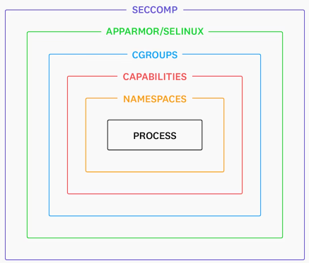
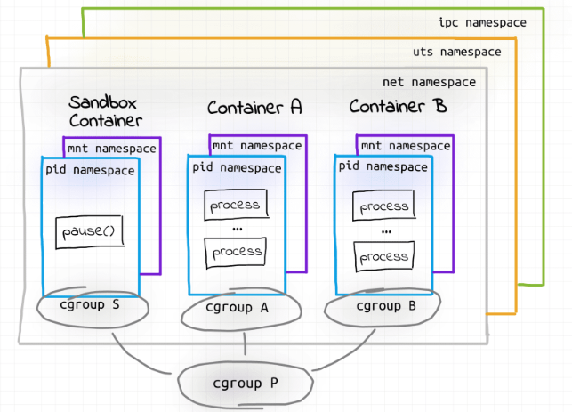
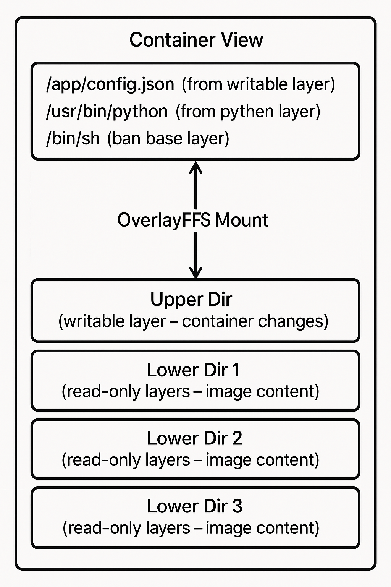

# W2D2 - Containerization: Internals and Security

Today you'll learn the fundamentals of containerization by building your own container runtime from the ground up. You'll understand how modern container technologies like Docker work under the hood by implementing the core isolation mechanisms yourself using Linux primitives.

**IMPORTANT SECURITY NOTICE**: The techniques you'll learn today involve low-level system operations that can affect system stability. You must:
- Only practice on systems you own or have explicit permission to modify
- Be careful when working with system calls and kernel features
- Understand that improper use of these techniques can compromise system security

This lab will teach you the building blocks that power modern containerization platforms, giving you deep insight into both their capabilities and limitations.

## Table of Contents

- [Content & Learning Objectives](#content--learning-objectives)
    - [1️⃣ Docker Image Layer Extraction](#-docker-image-layer-extraction)
    - [2️⃣ Container Isolation with Chroot](#-container-isolation-with-chroot)
    - [3️⃣ Resource Management with Cgroups](#-resource-management-with-cgroups)
    - [4️⃣ Network Isolation and Container Networking](#-network-isolation-and-container-networking)
    - [5️⃣ Security Monitoring and Threat Detection](#-security-monitoring-and-threat-detection)
    - [6️⃣ Docker Commit](#-docker-commit)
- [Setup](#setup)
    - [If using devcontainers](#if-using-devcontainers)
    - [If not using devcontainers](#if-not-using-devcontainers)
- [Cleanup Docker Environment](#cleanup-docker-environment)
- [Understanding Containerization](#understanding-containerization)
    - [What Are Containers?](#what-are-containers)
    - [Linux Kernel Features for Containerization](#linux-kernel-features-for-containerization)
    - [Container Image Format](#container-image-format)
    - [Exercise 1.1: Image Reference Parsing](#exercise--image-reference-parsing)
        - [Exercise - implement parse_image_reference](#exercise---implement-parseimagereference)
    - [Exercise 1.2: Docker Registry Authentication (Optional)](#exercise--docker-registry-authentication-optional)
    - [Exercise 1.3: Manifest Discovery and Architecture Selection](#exercise--manifest-discovery-and-architecture-selection)
        - [Exercise - implement get_target_manifest](#exercise---implement-gettargetmanifest)
    - [Exercise 1.4: Manifest Processing](#exercise--manifest-processing)
        - [Exercise - implement get_manifest_layers](#exercise---implement-getmanifestlayers)
    - [Exercise 1.5: Layer Download and Extraction](#exercise--layer-download-and-extraction)
        - [Exercise - implement download_and_extract_layers](#exercise---implement-downloadandextractlayers)
    - [Exercise 1.6: Complete Implementation](#exercise--complete-implementation)
        - [Exercise - implement pull_layers](#exercise---implement-pulllayers)
    - [Exercise 2.1: Chroot Environment Execution](#exercise--chroot-environment-execution)
- [Container Resource Management: Cgroups](#container-resource-management-cgroups)
    - [Exercise 3.1: Basic Cgroup Creation](#exercise--basic-cgroup-creation)
    - [Exercise 3.2: Process Assignment](#exercise--process-assignment)
    - [Exercise 3.3: Combined Cgroup-Chroot Execution](#exercise--combined-cgroup-chroot-execution)
    - [Exercise 3.4: Comprehensive Cgroup Setup - Part 1](#exercise--comprehensive-cgroup-setup---part-)
    - [Exercise 3.5: Comprehensive Cgroup Setup - Part 2 (Optional)](#exercise--comprehensive-cgroup-setup---part--optional)
    - [Summary: Understanding Cgroups](#summary-understanding-cgroups)
- [Container Namespace Isolation](#container-namespace-isolation)
    - [Exercise 4.1: Namespace Isolation](#exercise--namespace-isolation)
    - [Side note: Namespaces in a Kubernetes pod](#side-note-namespaces-in-a-kubernetes-pod)
- [Container Networking: Building a Real Container Network from Scratch](#container-networking-building-a-real-container-network-from-scratch)
    - [Your Network Architecture](#your-network-architecture)
    - [What You'll Implement](#what-youll-implement)
    - [Exercise 5.1: Bridge Network Setup](#exercise--bridge-network-setup)
        - [Exercise 5.1a: Bridge Interface Creation](#exercise-a-bridge-interface-creation)
        - [Exercise 5.1b: NAT and Forwarding Rules](#exercise-b-nat-and-forwarding-rules)
    - [Exercise 5.2: Container Network Creation](#exercise--container-network-creation)
    - [Exercise 5.3: Running Networked Containers](#exercise--running-networked-containers)
- [Container Filesystem: OverlayFS and Union Mounts](#container-filesystem-overlayfs-and-union-mounts)
    - [From Image Layers to Running Containers](#from-image-layers-to-running-containers)
        - [How OverlayFS Works](#how-overlayfs-works)
        - [Modern Container Storage](#modern-container-storage)
        - [Production Reality vs Our Implementation](#production-reality-vs-our-implementation)
- [Container Security Monitoring](#container-security-monitoring)
    - [Exercise 6.1: Syscall Monitoring](#exercise--syscall-monitoring)
    - [Exercise 6.2: Security Alert Handling](#exercise--security-alert-handling)
    - [Exercise 6.3: Complete Security Monitoring](#exercise--complete-security-monitoring)
- [Docker Commit](#docker-commit)
    - [Exercise 7.1: Implement commit functionality](#exercise--implement-commit-functionality)
        - [Setup](#setup-)
- [Summary: Container Internals and Security](#summary-container-internals-and-security)
    - [Key Concepts Learned](#key-concepts-learned)
    - [Real-World Applications](#real-world-applications)
    - [Security Considerations](#security-considerations)

## Content & Learning Objectives

### 1️⃣ Docker Image Layer Extraction
Implement a custom image layer extraction tool by interacting directly with Docker registry APIs.

> **Learning Objectives**
> - Understand Docker image structure and layering
> - Implement registry authentication and manifest processing
> - Download and extract compressed layer archives

### 2️⃣ Container Isolation with Chroot
Create isolated filesystem environments using chroot, one of the fundamental isolation mechanisms.

> **Learning Objectives**
> - Understand chroot filesystem isolation
> - Execute commands in isolated environments
> - Explore the foundation of container filesystem isolation

### 3️⃣ Resource Management with Cgroups
Implement resource limits and management using Linux cgroups for memory and CPU control.

> **Learning Objectives**
> - Create and configure cgroups with resource limits
> - Assign processes to cgroups for resource management
> - Combine cgroup limits with chroot isolation

### 4️⃣ Network Isolation and Container Networking
Set up isolated network environments using namespaces, bridges, and virtual ethernet pairs.

> **Learning Objectives**
> - Understand container networking fundamentals
> - Implement network isolation with namespaces
> - Create bridge networks for container communication

### 5️⃣ Security Monitoring and Threat Detection
Implement security monitoring to detect container escape attempts and malicious syscalls.

> **Learning Objectives**
> - Monitor dangerous syscalls in real-time
> - Detect CVE-2024-0137 and similar container escape attempts
> - Implement automated threat response

### 6️⃣ Docker Commit
Implement the Docker commit functionality to save container changes as new image layers.

> **Learning Objectives**
> - Understand Docker image layering
> - Implement container state capture
> - Create new image layers from container modifications

## Setup
### If using devcontainers

```bash
sudp apt-get update
sudo apt-get install -y \
        python3 \
        python3-pip \
        python3-venv \
        python3-full \
        btrfs-progs \
        iproute2 \
        iptables \
        strace \
        cgroup-tools \
        bash \
        curl \
        ca-certificates \
        dnsutils \
        docker.io \
        git \
        autoconf \
        automake \
        gettext \
        autopoint \
        libtool \
        iputils-ping

sudo chattr +i /etc/resolv.conf 2>/dev/null
```

<details>
<summary>Copy this into devcontainer.json and rebuild the container</summary><blockquote>

```json
// For format details, see https://aka.ms/devcontainer.json. For config options, see the
// README at: https://github.com/devcontainers/templates/tree/main/src/python
{
	"name": "AI Security Bootcamp",
	// Or use a Dockerfile or Docker Compose file. More info: https://containers.dev/guide/dockerfile
	"image": "mcr.microsoft.com/devcontainers/python:1-3.12-bullseye",
	//
	// Features to add to the dev container. More info: https://containers.dev/features.
	"features": {
		// Enable Docker-outside-of-Docker to use the host's Docker daemon
		"ghcr.io/devcontainers/features/docker-outside-of-docker:1.6.3": {}
	},
	//
	// Runtime arguments to match your docker run command
	"runArgs": [
		"--network=host",
		"--privileged",
		"--cgroupns=host"
	],
	//
	// Use 'forwardPorts' to make a list of ports inside the container available locally.
	// "forwardPorts": [],
	//
	// Mount SSH keys into the container and Docker socket
	"mounts": [
		"source=${localWorkspaceFolder}/ssh,target=/mnt/ssh,type=bind",
		"source=/var/run/docker.sock,target=/var/run/docker.sock,type=bind"
	],
	//
	// Use 'postCreateCommand' to run commands after the container is created.
	"postCreateCommand": "/bin/bash .devcontainer/setup-devcontainer.sh",
	//
	// Configure tool-specific properties.
	"customizations": {
		"vscode": {
			"extensions": [
				"ms-python.python",
				"ms-python.vscode-pylance",
				"ms-toolsai.jupyter",
				"charliermarsh.ruff",
				"bierner.markdown-mermaid"
			],
			"settings": {
				"editor.formatOnSave": true,
				"editor.codeActionsOnSave": {
					"source.fixAll": "explicit",
					"source.organizeImports": "never"
				},
				"ruff.lineLength": 120,
				"ruff.targetVersion": "py312",
				"[python]": {
					"editor.defaultFormatter": "charliermarsh.ruff"
				},
				"files.insertFinalNewline": true
			}
		}
	},
	//
	// Uncomment to connect as root instead. More info: https://aka.ms/dev-containers-non-root.
	"remoteUser": "root"
}
```
</blockquote></details>

### If not using devcontainers
<details>
<summary>Installation Instructions</summary><blockquote>

**Install Docker**: Ensure you have Docker installed on your system. Follow the [official Docker installation guide](https://docs.docker.com/get-docker/) for your platform. On linux, you can also install just the [docker engine](https://docs.docker.com/engine/install/ubuntu/) without the full Docker Desktop.

**Build and Run Container.** This setup creates a privileged container environment that allows you to experiment with low-level Linux containerization features like cgroups, namespaces, and network isolation. The exercises in this lab require direct access to system resources that are normally restricted in containers.

```bash
# Build Docker image from current directory
docker build --network=host . -t mydocker

# Run container with host networking and required privileges
# - --network host: Use host networking
# - --privileged: Run container with extended privileges
# - --cgroupns=host: Use host's cgroup namespace
# - -v /var/run/docker.sock:/var/run/docker.sock: Mount Docker socket from host
# - -it: Interactive terminal
# - --rm: Remove container after exit
docker run --rm --network host --privileged --cgroupns=host -it -v /var/run/docker.sock:/var/run/docker.sock mydocker /bin/bash
```

> [!TIP]
> If building the Docker image fails with a 400 Bad Request error response, just try building it again (this happens sometimes due to network issues)

Once inside the privileged container, run the exercises:

```bash
python3 w2d2_answers.py
```
</blockquote></details>
⚠️ **WARNING**: This setup runs containers with elevated privileges that bypass normal security restrictions. This is necessary for learning container internals but should NEVER be used in production environments.

## Cleanup Docker Environment

After COMPLETING the exercises, clean up to prevent resource conflicts.

⚠️ **WARNING**: This will remove all containers, networks, images and volumes. If you want to keep your environment/devcintainer, run `docker ps` and only kill the appropriate containers.

```bash
# Stop all running containers (including any test containers created during exercises)
docker stop $(docker ps -aq)

# Remove all containers (cleans up test containers from networking exercises)
docker rm $(docker ps -aq)

# Remove all unused containers, networks, images and volumes
# This cleans up extracted images from Exercise 1 and test networks from Exercise 5
docker system prune --all --volumes
```

## Understanding Containerization

Before diving into the technical implementation, let's understand what containerization provides and why it became so popular in modern software deployment.

### What Are Containers?

Containers are **lightweight, portable execution environments** that package applications with their dependencies while **sharing the host operating system kernel**. Unlike virtual machines that virtualize entire hardware stacks, containers use Linux kernel features to provide isolation at the process level.

Key characteristics of containers:
- **Process Isolation**: Each container runs in its own process space
- **Filesystem Isolation**: Containers have their own filesystem view
- **Resource Limits**: CPU, memory, and I/O can be controlled and limited
- **Network Isolation**: Containers can have isolated network stacks
- **Portability**: Containers run consistently across different environments


A key difference is that containers virtualize the operating system, packaging only the application and its dependencies but delegating system calls to the host kernel. Virtual machines, in contrast, virtualize the underlying physical hardware and each run a full guest operating system with its own kernel instance, which provides strong isolation but requires more resources and longer startup times.

### Linux Kernel Features for Containerization

Modern containerization relies on several Linux kernel features:

<br><sub>Source: [datadoghq.com](https://securitylabs.datadoghq.com/articles/container-security-fundamentals-part-2/)</sub>

1. **Namespaces**: Provide isolation of system resources ([Linux namespaces intro](https://blog.nginx.org/blog/what-are-namespaces-cgroups-how-do-they-work#:~:text=What%20Are%20Namespaces%3F), [namespace types](https://securitylabs.datadoghq.com/articles/container-security-fundamentals-part-2))
   - PID namespace: Process ID isolation
   - Mount namespace: Filesystem mount point isolation
   - Network namespace: Network stack isolation ([network namespaces tutorial](https://blog.scottlowe.org/2013/09/04/introducing-linux-network-namespaces/))
   - UTS namespace: Hostname and domain name isolation
   - User namespace: User and group ID isolation
   - IPC namespace: Inter-process communication isolation
   - Time: Time settings isolation
   - Cgroup namespace: cgroup isolation (see below) to prevent leaking information about other processes through cgroups

2. **Control Groups (cgroups)**: Resource limiting and accounting ([cgroups intro](https://blog.nginx.org/blog/what-are-namespaces-cgroups-how-do-they-work#:~:text=namespaces%20and%20cgroups.-,What%20Are%20cgroups%3F,-A%20control%20group), [Red Hat cgroups guide](https://access.redhat.com/documentation/en-us/red_hat_enterprise_linux/6/html/resource_management_guide/ch01)) including
   - Memory limits and usage tracking
   - CPU time and priority control
   - I/O bandwidth limiting ([cgroups v2 documentation](https://docs.kernel.org/admin-guide/cgroup-v2.html))
   - Device access control

3. **Union Filesystems**: Layered filesystem management. One of these drivers is usually used:
   - OverlayFS: Efficient copy-on-write filesystem ([OverlayFS documentation](https://docs.kernel.org/filesystems/overlayfs.html))
   - AUFS: Another union filesystem (deprecated)
   - Device Mapper: Block-level storage driver

4. **Security Features**: Additional isolation and access control
   - Capabilities: Fine-grained privilege control ([Linux capabilities manual](https://man7.org/linux/man-pages/man7/capabilities.7.html))
   - SELinux/AppArmor: Mandatory access control
   - Seccomp: System call filtering ([seccomp tutorial](https://www.armosec.io/blog/seccomp-internals-part-1/))

### Container Image Format

Container images are **layered filesystems** packaged in a standardized format. Each layer represents a set of filesystem changes, and layers are stacked to create the final container filesystem.

**Image Layers Example**:
```
┌─────────────────────────────────────┐
│     Application Layer               │  ← Your app and configs
├─────────────────────────────────────┤
│     Runtime Dependencies            │  ← Python, Node.js, etc.
├─────────────────────────────────────┤
│     Package Manager Updates         │  ← apt update, yum update
├─────────────────────────────────────┤
│     Base OS Layer                   │  ← Ubuntu, Alpine, etc.
└─────────────────────────────────────┘
```

This layered approach provides several benefits:
- **Efficiency**: Common layers are shared between images ([Docker layer sharing](https://docs.docker.com/storage/storagedriver/))
- **Caching**: Unchanged layers don't need to be re-downloaded
- **Version Control**: Similar to Git, each layer has a unique hash ([content addressable storage](https://blog.docker.com/2016/02/docker-1-10/))
- **Security**: Individual layers can be scanned for vulnerabilities ([container image scanning](https://docs.docker.com/docker-hub/vulnerability-scanning/))


```python


# %%
import requests
import tarfile
import json
import sys
import os
import platform
from io import BytesIO
from typing import Optional, List, Union, Tuple, Dict, Any
import subprocess

def exec_sh(command: str, timeout: Optional[int | None] = 30, check_retcode=True) -> subprocess.CompletedProcess:
    """
    Execute shell commands with consistent parameters.
    
    Args:
        command: Shell command to execute (can be multiline)
        timeout: Optional timeout in seconds
        
    Returns:
        CompletedProcess object with result
    """
    
    return subprocess.run(command, shell=True, capture_output=True, text=True, check=check_retcode, timeout=timeout)

# Architecture detection
TARGET_ARCH, TARGET_VARIANT = {
    'x86_64': ('amd64', None), 'amd64': ('amd64', None),
    'arm64': ('arm64', 'v8'), 'aarch64': ('arm64', 'v8'),
    'armv7l': ('arm', 'v7'), 'armv6l': ('arm', 'v6')
}.get(platform.machine().lower(), ('amd64', None))

print(f"Detected architecture: {TARGET_ARCH} {TARGET_VARIANT if TARGET_VARIANT else ''}")

# Safety checks
if not os.path.exists("/.dockerenv"):
    print(
        "❌ ERROR: Not in Docker container or Docker container is not properly set up! Run inside the provided container."
    )
    sys.exit(1)
print("✅ Environment checks passed")
```

### Exercise 1.1: Image Reference Parsing

Parse different Docker image reference formats and extract registry, image, and tag components.

Docker images can be referenced in multiple formats:
- Full registry URLs: `https://registry-1.docker.io/v2/library/hello-world/manifests/latest`
- Docker Hub format: `hello-world:latest` or `library/hello-world:latest`
- Custom registries: `gcr.io/google-containers/pause:latest`

<details>
<summary>Vocabulary: Docker Image References</summary><blockquote>

- **Registry**: The server that stores Docker images (e.g., `registry-1.docker.io` for Docker Hub)
- **Repository**: A collection of related images with the same name but different tags (e.g., `ubuntu`)
- **Tag**: A label that points to a specific version of an image (defaults to "latest")
- **Manifest**: Metadata about an image including its layers and configuration
- **Docker Hub**: Docker's official public registry, used as default when no registry is specified

</blockquote></details>

#### Exercise - implement parse_image_reference

> **Difficulty**: 🔴🔴⚪⚪⚪
> **Importance**: 🔵🔵🔵⚪⚪
>
> You should spend up to ~15 minutes on this exercise.

Implement the `parse_image_reference` function that parses different image reference formats.


```python

def parse_image_reference(image_ref: str) -> Tuple[str, str, str]:
    """
    Parse a Docker image reference into registry, image, and tag components.
    
    Args:
        image_ref: Image reference in various formats
        
    Returns:
        Tuple of (registry, image, tag)
        
    Examples:
        parse_image_reference("hello-world:latest") -> ("registry-1.docker.io", "library/hello-world", "latest")
        parse_image_reference("gcr.io/project/image:v1.0") -> ("gcr.io", "project/image", "v1.0")
    """
    # TODO: Implement image reference parsing
    # - Check if the image reference starts with 'http' to identify full URLs
    # - For full URLs, remove protocol and split by '/' to extract components
    # - For custom registries, look for dots in the first part (e.g., gcr.io)
    # - For Docker Hub images, default to 'registry-1.docker.io' and add 'library/' prefix if needed
    # - Use rsplit(':', 1) to handle image names that might contain colons
    # - Default to 'latest' tag if none is specified
    return "registry-1.docker.io", "library/hello-world", "latest"  # Placeholder return
```

<details>
<summary>Hints</summary><blockquote>

- Step 1: Check if image_ref starts with 'http' or 'https'
  - If yes: Remove protocol, split by '/', extract registry from first part
  - If '/manifests/' in URL: split image_parts by '/manifests/' to get image and tag
  - If no '/manifests/': image is middle parts joined, tag is last part (or 'latest')

- Step 2: For non-URL formats, detect custom registry vs Docker Hub
  - If '/' in image_ref AND first part contains dots: it's a custom registry
  - Split by '/' once: registry = first part, image_and_tag = second part
  - If no custom registry detected: registry = 'registry-1.docker.io', image_and_tag = image_ref

- Step 3: Handle Docker Hub library prefix
  - If using Docker Hub and no '/' in image_and_tag: prefix with "library/"

- Step 4: Extract image and tag from image_and_tag
  - Use rsplit(':', 1) to split on rightmost colon (handles images with colons in name)
  - If no colon found: tag defaults to 'latest'

- Step 5: Return tuple (registry, image, tag)

- Key edge cases to handle:
  - "hello-world" → ("registry-1.docker.io", "library/hello-world", "latest")
  - "ubuntu:20.04" → ("registry-1.docker.io", "library/ubuntu", "20.04")
  - "gcr.io/project/image:tag" → ("gcr.io", "project/image", "tag")
  - "my-registry.com/org/repo" → ("my-registry.com", "org/repo", "latest")
</blockquote></details>


```python
from w2d2_test import test_parse_image_reference

test_parse_image_reference(parse_image_reference)
```

### Exercise 1.2: Docker Registry Authentication (Optional)

> **Difficulty**: 🔴🔴⚪⚪⚪
> **Importance**: 🔵🔵🔵⚪⚪
>
> You should spend up to ~10 minutes on this exercise.


Implement authentication with Docker registries using token-based authentication.

Docker registries require authentication to access images. Docker Hub uses a token-based
authentication system where you request a token for a specific repository scope. Learn more about the [Docker Registry HTTP API v2](https://docs.docker.com/registry/spec/api/) and [Docker Hub authentication flow](https://docs.docker.com/docker-hub/access-tokens/).

The authentication flow:
1. Request a token from the auth server
2. Include the token in subsequent API requests
3. Token includes scope for specific repository access

<details>
<summary>Vocabulary: Docker Registry Authentication</summary><blockquote>

- **Bearer Token**: A type of access token that grants access to specific resources to whoever possesses it, without requiring additional proof of identity
- **Scope**: Defines what actions the token allows (e.g., `repository:image:pull`)
- **Auth Server**: The server that issues tokens (auth.docker.io for Docker Hub)
- **Registry Server**: The server that stores actual image data (registry-1.docker.io)
- **Authorization Header**: HTTP header that contains the Bearer token

</blockquote></details>

**API Usage Instructions:**

Docker Hub uses token-based authentication for accessing private repositories and rate limiting. Here's how to get authentication tokens:

**1. Building the Authentication URL**

Docker Hub's authentication service uses a specific URL format:
- Format: `https://auth.docker.io/token?service=registry.docker.io&scope=repository:{image}:pull`
- Example: `https://auth.docker.io/token?service=registry.docker.io&scope=repository:library/hello-world:pull`
- **What it does**: Requests a token with specific permissions for a repository

**2. Understanding Token Scopes**
- **service**: Always `registry.docker.io` for Docker Hub
- **scope**: Defines permissions in format `repository:{image}:pull`
- **pull**: Permission type (pull, push, delete)

**3. Token Response Format**

The API returns JSON with the token:
```json
{
  "token": "eyJhbGciOiJSUzI1NiJ9...",
  "access_token": "eyJhbGciOiJSUzI1NiJ9...",
  "expires_in": 300
}
```

**4. Using the Token**
- Extract the `token` field from the JSON response
- Add it to HTTP headers as: `Authorization: Bearer {token}`
- Include this header in all subsequent registry API calls

Implement the `get_auth_token` function that gets authentication tokens for Docker Hub.


```python

def get_auth_token(registry: str, image: str) -> Dict[str, str]:
    """
    Get authentication headers for Docker registry access.
    
    Args:
        registry: Registry hostname (e.g., "registry-1.docker.io")
        image: Image name (e.g., "library/hello-world")
        
    Returns:
        Dictionary of headers to include in registry requests
    """
    # TODO: Authentication implementation
    # 1. Initialize empty headers dictionary
    # 2. Check if registry is Docker Hub (registry-1.docker.io)
    # 3. For Docker Hub, construct token URL with service and scope parameters
    # 4. Make HTTP request to auth.docker.io/token
    # 5. Parse JSON response to extract token
    # 6. Add Authorization header with Bearer token
    # 7. Return headers dictionary
    return {}  # Placeholder return
from w2d2_test import test_get_auth_token

test_get_auth_token(get_auth_token)
```

<details>
<summary>Hints</summary><blockquote>

- Create empty headers = {}
- If registry == 'registry-1.docker.io':
  - Build URL: f"https://auth.docker.io/token?service=registry.docker.io&scope=repository:{image}:pull"
  - Get token: requests.get(token_url).json()['token']
  - Add header: headers['Authorization'] = f'Bearer {token}'
- Return headers
</blockquote></details>


### Exercise 1.3: Manifest Discovery and Architecture Selection

Retrieve image manifests and select the appropriate architecture variant.

Docker images support multiple architectures. The manifest list contains manifests for
different platforms (architecture + variant combinations). Your task is to:

1. Fetch the manifest list from the registry
2. Find the manifest for the target architecture
3. Return the digest of the selected manifest

<details>
<summary>Vocabulary: Docker Manifests and Architecture</summary><blockquote>

- **Manifest**: JSON document describing image layers, configuration, and metadata
- **Manifest List**: Multi-architecture manifest containing platform-specific manifests
- **Digest**: SHA256 hash that uniquely identifies a manifest or layer
- **Platform**: Combination of architecture (amd64, arm64) and optional variant (v7, v8)
- **Architecture**: CPU architecture (amd64, arm64, arm, etc.)
- **Variant**: Sub-architecture version (e.g., armv7, armv8)

</blockquote></details>

#### Exercise - implement get_target_manifest

> **Difficulty**: 🔴🔴🔴⚪⚪
> **Importance**: 🔵🔵🔵🔵⚪
>
> You should spend up to ~20 minutes on this exercise.

**API Usage Instructions:**

Understanding Docker's multi-architecture support is crucial for modern containerization. Here's how to discover and select the right manifest:

**1. Building the Manifest List URL**

Docker registries use a standardized API format for accessing manifests:
- Format: `https://{registry}/v2/{image}/manifests/{tag}`
- Example: `https://registry-1.docker.io/v2/library/hello-world/manifests/latest`
- **What it does**: Fetches the manifest list containing all available architectures for an image

**2. Understanding Multi-Architecture Manifests**

Modern Docker images support multiple CPU architectures:
- **Manifest List**: Container for platform-specific manifests
- **Platform Object**: Contains `architecture` (e.g., "amd64", "arm64") and optional `variant` (e.g., "v8")
- **Architecture Matching**: Find the manifest that matches your target architecture

**3. Selecting the Right Architecture**

The manifest list contains an array of manifests, each with platform information:
```json
{
  "manifests": [
    {
      "platform": {"architecture": "amd64"},
      "digest": "sha256:abc123..."
    },
    {
      "platform": {"architecture": "arm64", "variant": "v8"},
      "digest": "sha256:def456..."
    }
  ]
}
```

**4. Error Handling**

If the requested architecture isn't available:
- Collect all available architectures from the manifest list
- Raise a helpful ValueError with available options
- Include variant information when present

Implement the `get_target_manifest` function that selects the appropriate architecture manifest.


```python

def get_target_manifest(registry: str, image: str, tag: str, headers: Dict[str, str], 
                       target_arch: str, target_variant: Optional[str] = None) -> str:
    """
    Get the manifest digest for the target architecture.
    
    Args:
        registry: Registry hostname
        image: Image name
        tag: Image tag
        headers: Authentication headers
        target_arch: Target architecture (e.g., "amd64", "arm64")
        target_variant: Optional architecture variant (e.g., "v8")
        
    Returns:
        Manifest digest for the target architecture
        
    Raises:
        ValueError: If target architecture is not found
    """
    # TODO: Implement manifest discovery
    # 1. Build manifest list URL
    # 2. Make HTTP request with headers
    # 3. Parse JSON response
    # 4. Find manifest matching target_arch and target_variant
    # 5. Return the digest, or raise ValueError if not found
    return "sha256:placeholder"  # Placeholder return
```

<details>
<summary>Hints</summary><blockquote>

- Build the manifest list URL using the format: https://{registry}/v2/{image}/manifests/{tag}
- Use requests.get() with the provided headers to fetch the manifest list
- Parse the JSON response and look for the 'manifests' array
- Iterate through each manifest and check the 'platform' object
- Match target_arch with platform.architecture
- If target_variant is specified, also match it with platform.variant
- Return the 'digest' field from the matching manifest
- If no match is found, collect available architectures and raise ValueError with helpful message
</blockquote></details>


```python
from w2d2_test import test_get_target_manifest

test_get_target_manifest(get_target_manifest, get_auth_token)
```

### Exercise 1.4: Manifest Processing

Process the selected manifest to extract layer information and metadata.

Once you have the manifest digest, you need to fetch the actual manifest document and
extract the layer information. The manifest contains metadata about each layer including
digests and sizes.

<details>
<summary>Vocabulary: Manifest Structure</summary><blockquote>

- **Manifest v2 Schema**: Docker's current manifest format specification
- **Layer**: A filesystem changeset stored as a compressed tar archive
- **Media Type**: MIME type indicating the format of manifest or layer data
- **Layer Digest**: SHA256 hash uniquely identifying a layer blob
- **Layer Size**: Compressed size of the layer in bytes

</blockquote></details>

#### Exercise - implement get_manifest_layers

> **Difficulty**: 🔴🔴⚪⚪⚪
> **Importance**: 🔵🔵🔵⚪⚪
>
> You should spend up to ~15 minutes on this exercise.

**API Usage Instructions:**

Once you have the manifest digest, you need to fetch the actual manifest document to get layer information:

**1. Building the Manifest URL**
Use the manifest digest to fetch the specific manifest:
- Format: `https://{registry}/v2/{image}/manifests/{manifest_digest}`
- Example: `https://registry-1.docker.io/v2/library/hello-world/manifests/sha256:abc123...`
- **What it does**: Fetches the specific manifest document for an architecture

**2. Setting the Accept Header**

Docker registries require specific content type headers:
- Header: `Accept: application/vnd.docker.distribution.manifest.v2+json`
- **Why needed**: Tells the registry which manifest format version to return
- **Important**: Without this header, you might get an incompatible manifest format

**4. Manifest Document Structure**

The manifest contains metadata about all layers:
```json
{
  "mediaType": "application/vnd.docker.distribution.manifest.v2+json",
  "layers": [
    {
      "digest": "sha256:layer1hash...",
      "mediaType": "application/vnd.docker.image.rootfs.diff.tar.gzip",
      "size": 1234567
    },
    {
      "digest": "sha256:layer2hash...",
      "mediaType": "application/vnd.docker.image.rootfs.diff.tar.gzip",
      "size": 2345678
    }
  ]
}
```

**5. Extracting Layer Information**
- Get the `layers` array from the manifest JSON
- Each layer object contains `digest` and `size` fields
- Return the layers list for downloading

Implement the `get_manifest_layers` function that fetches and processes the manifest.


```python

def get_manifest_layers(registry: str, image: str, manifest_digest: str, headers: Dict[str, str]) -> List[Dict[str, Any]]:
    """
    Get the layer information from a manifest.
    
    Args:
        registry: Registry hostname
        image: Image name
        manifest_digest: Manifest digest
        headers: Authentication headers
        
    Returns:
        List of layer dictionaries with 'digest' and 'size' keys
    """
    # TODO: Implement manifest processing
    # 1. Build manifest URL using digest
    # 2. Add Accept header for v2 manifest format
    # 3. Make HTTP request
    # 4. Parse JSON and extract layers
    # 5. Return list of layer dictionaries
    return []  # Placeholder return
from w2d2_test import test_get_manifest_layers

test_get_manifest_layers(get_manifest_layers, get_auth_token, get_target_manifest)
```

### Exercise 1.5: Layer Download and Extraction

Download and extract individual layers to reconstruct the container filesystem.

The final step is to download each layer blob and extract it to the output directory.
Each layer is a gzipped tar archive that needs to be extracted in order.

<details>
<summary>Vocabulary: Layer Extraction</summary><blockquote>

- **Blob**: Binary large object - the actual compressed layer data
- **Gzipped Tar**: Compressed archive format (.tar.gz) used for layer storage
- **Layer Extraction**: Unpacking layer contents to filesystem in order
- **Streaming Download**: Downloading large files without loading entirely into memory
- **Filesystem Layering**: Building final filesystem by applying layers sequentially

</blockquote></details>

#### Exercise - implement download_and_extract_layers

> **Difficulty**: 🔴🔴🔴⚪⚪
> **Importance**: 🔵🔵🔵🔵⚪
>
> You should spend up to ~20 minutes on this exercise.

Implement the `download_and_extract_layers` function that downloads and extracts all layers. Learn about [Docker image layers](https://docs.docker.com/storage/storagedriver/) and [tarfile processing in Python](https://docs.python.org/3/library/tarfile.html).

**API Usage Instructions:**

Think of Docker images like a layered cake! Each layer adds something new to the final image. Here's how to download and extract them:

**1. Building the Download URL**

Think of this like creating an address to find a package online:
- Format: `https://{registry}/v2/{image}/blobs/{digest}`
- Example: `https://registry-1.docker.io/v2/library/hello-world/blobs/sha256:abc123...`
- **What it means**: Just like how you need a complete address to mail a letter, you need the full URL to download a Docker layer

**2. Unpacking the Compressed Files**

Docker layers are like ZIP files that are also compressed (like a ZIP file inside another ZIP file):
- **What they are**: Gzipped tar archives (`.tar.gz` files)
- **How to open them**:
  - `BytesIO(blob_resp.content)` - turns the downloaded data into a file-like object
  - `tarfile.open(fileobj=BytesIO(...), mode='r:gz')` - opens the compressed archive
  - `tar.extractall(output_dir)` - extracts all files to your folder

**3. Building the Final Image Layer by Layer**

Like building with LEGO blocks, each layer adds something:
- **Layer 1**: Base operating system (like the foundation of a house)
- **Layer 2**: Application files (like adding rooms)
- **Layer 3**: Configuration files (like adding furniture)
- **Important**: Later layers can replace earlier ones (like updating a LEGO model)

**Real-world analogy**: Think of it like downloading and assembling a piece of furniture from IKEA - you get the parts (layers), unpack them, and build them in order!


```python

def download_and_extract_layers(registry: str, image: str, layers: List[Dict[str, Any]], 
                               headers: Dict[str, str], output_dir: str) -> None:
    """
    Download and extract all layers to the output directory.
    
    Args:
        registry: Registry hostname
        image: Image name
        layers: List of layer dictionaries from manifest
        headers: Authentication headers
        output_dir: Directory to extract layers to
    """
    # TODO: Implement layer download and extraction
    # 1. Create output directory
    # 2. For each layer:
    #    a. Build blob URL using digest
    #    b. Download blob with streaming
    #    c. Extract as gzipped tar to output_dir
    # 3. Print progress information
    pass
from w2d2_test import test_download_and_extract_layers

test_download_and_extract_layers(download_and_extract_layers, get_auth_token, 
                                get_target_manifest, get_manifest_layers)
```

### Exercise 1.6: Complete Implementation

Combine all the exercises into a complete `pull_layers` function that can extract any Docker image.

This function orchestrates all the previous functions to provide a complete Docker image extraction tool.

<details>
<summary>Vocabulary: Container Image Pipeline</summary><blockquote>

- **Image Reference**: Complete specification of image including registry, name, and tag
- **Registry API**: RESTful HTTP API for accessing container images and metadata

</blockquote></details>

#### Exercise - implement pull_layers

> **Difficulty**: 🔴🔴⚪⚪⚪
> **Importance**: 🔵🔵🔵🔵🔵
>
> You should spend up to ~10 minutes on this exercise.

Implement the complete `pull_layers` function using all the sub-functions you've created.


```python

def pull_layers(image_ref: str, output_dir: str, target_arch: str = TARGET_ARCH, 
                target_variant: Optional[str] = TARGET_VARIANT) -> None:
    """
    Pull and extract Docker image layers for a specific architecture.
    
    Args:
        image_ref: Docker image reference (various formats supported)
        output_dir: Directory to extract layers to
        target_arch: Target architecture (default: auto-detected)
        target_variant: Target architecture variant (default: auto-detected)
    """
    # TODO: Implement complete pull_layers function
    # Use all the functions you've implemented above:
    # 1. parse_image_reference()
    # 2. get_auth_token()
    # 3. get_target_manifest()
    # 4. get_manifest_layers()
    # 5. download_and_extract_layers()
    pass
from w2d2_test import test_pull_layers_complete

test_pull_layers_complete(pull_layers)

# %%
pull_layers("alpine:latest", "./extracted_alpine")
pull_layers("python:3.12-alpine", "./extracted_python") 
```

#$ Container Isolation: Chroot Environments

Implement chroot (change root) isolation, one of the fundamental isolation mechanisms used in containers.

Chroot creates a new filesystem root directory for processes, effectively "jailing" them within a specific
directory tree. This creates an isolated environment where the process cannot access files outside
the designated directory tree. Learn more about [chroot fundamentals](https://wiki.archlinux.org/title/Chroot) and the [chroot system call](https://man7.org/linux/man-pages/man2/chroot.2.html).

Understanding chroot is essential for grasping how containers work under the hood. Docker and other
container runtimes use chroot (or more advanced variants) to isolate container filesystems from
the host system. See [how Docker uses chroot](https://docs.docker.com/engine/security/rootless/) and [container security best practices](https://cheatsheetseries.owasp.org/cheatsheets/Docker_Security_Cheat_Sheet.html).

<details>
<summary>Vocabulary: Chroot and Filesystem Isolation</summary><blockquote>

- **Chroot**: Unix system call that changes the apparent root directory for a process
- **Chroot Jail**: Isolated environment where processes can only access files within a directory tree
- **Root Directory**: The top-level directory (/) in a filesystem hierarchy
- **Subprocess**: A separate process spawned and managed by the main program

</blockquote></details>

### Exercise 2.1: Chroot Environment Execution

> **Difficulty**: 🔴🔴⚪⚪⚪
> **Importance**: 🔵🔵🔵🔵⚪
>
> You should spend up to ~20 minutes on this exercise.

Implement the `run_chroot` function that executes commands in a chrooted environment.

The chroot system call is fundamental to container isolation. It changes the root directory for
a process, creating a "jail" where the process can only access files within the specified directory tree.

Your task is to implement a function that:
1. Takes a directory path and optional command
2. Executes the command within the chrooted environment
3. Handles different command formats (string vs list)
4. Provides proper error handling and timeouts
5. Returns the execution result


```python

import subprocess

def run_chroot(chroot_dir: str, command: Optional[Union[str, List[str]]] = None) -> Optional[subprocess.CompletedProcess]:
    """
    Run a command in a chrooted environment.
    
    This function creates an isolated filesystem environment by changing the root directory
    for the executed command. The process will only be able to access files within the
    specified chroot directory.
    
    Args:
        chroot_dir: Directory to chroot into (must contain necessary binaries and libraries)
        command: Command to run (default: /bin/sh)
                - If string: executed as shell command
                - If list: executed directly
                - If None: defaults to interactive shell
    
    Returns:
        CompletedProcess object with execution results, or None if error/timeout
    """
    # TODO: Implement chroot command execution
    # 1. Handle different command formats (None, string, list)
    # 2. Build the chroot command: ['chroot', chroot_dir] + command
    # 3. Execute with subprocess.run() with timeout and output capture
    # 4. Print execution details and results
    # 5. Handle TimeoutExpired and other exceptions
    # 6. Return the result or None on error
    pass
from w2d2_test import test_run_chroot

# Run the test
test_run_chroot(run_chroot)
```

## Container Resource Management: Cgroups

Implement cgroups (control groups) for resource management and isolation in containers.

Cgroups are a Linux kernel feature that provides resource management and isolation for containers.
They allow you to limit, account for, and isolate resource usage (CPU, memory, disk I/O, etc.) of
groups of processes. Read about [cgroup concepts](https://docs.kernel.org/admin-guide/cgroup-v2.html) and [cgroup management](https://systemd.io/CGROUP_DELEGATION/).

Cgroups are essential for container technology, providing the foundation for resource limits and
guarantees. Docker, Kubernetes, and other container orchestration systems rely heavily on cgroups
to manage resources fairly and prevent resource starvation. See how [Docker uses cgroups](https://docs.docker.com/config/containers/resource_constraints/) and [Kubernetes resource management](https://kubernetes.io/docs/concepts/configuration/manage-resources-containers/).

<details>
<summary>Vocabulary: Cgroups and Resource Management</summary><blockquote>

- **Cgroups**: Linux kernel feature for grouping and managing process resources
- **Control Groups**: Another name for cgroups - groups of processes under resource control
- **Resource Controller**: Kernel module that manages specific resource types (memory, CPU, etc.)
- **Cgroup Hierarchy**: Tree structure of nested cgroups in /sys/fs/cgroup filesystem
- **Memory Limit**: Maximum amount of memory a cgroup can use
- **OOM Killer**: Out-of-memory killer that terminates processes when limits are exceeded

</blockquote></details>

### Exercise 3.1: Basic Cgroup Creation

> **Difficulty**: 🔴🔴⚪⚪⚪
> **Importance**: 🔵🔵🔵⚪⚪
>
> You should spend up to ~15 minutes on this exercise.

Implement the `create_cgroup` function that creates a basic cgroup with memory limits.

- Cgroups are organized in a hierarchy in the `/sys/fs/cgroup` filesystem
- To create a cgroup, you need to create directories and write to control files
- The `cgroup.subtree_control` file controls which controllers are enabled for child cgroups
- The `memory.max` file sets the memory limit for the cgroup
```


```python

import signal
import time

def create_cgroup(cgroup_name, memory_limit=None, cpu_limit=None):
    """
    Create a cgroup with specified limits
    
    Args:
        cgroup_name: Name of the cgroup (e.g., 'demo')
        memory_limit: Memory limit (e.g., '100M', '1000000')
        cpu_limit: CPU limit (stretch)

    Returns:
        Path to the created cgroup
    """
    # TODO: Implement basic cgroup creation
    # 1. Create a new cgroup directory with path /sys/fs/cgroup/{cgroup_name} - you will write files in this directory to configure the cgroup
    # 2. Enable controllers (+cpu +memory +pids) in parent cgroup
    # 3. Set memory limit if specified - write the memory limit to {cgroup_path}/memory.max, which will tell the kernel how much memory the cgroup can use
    # 4. Return the cgroup path
    # 5. Handle errors and return None on failure
    pass
```

<details>
<summary>Hints</summary><blockquote>

1. Use `os.makedirs()` to create the cgroup directory at `/sys/fs/cgroup/{cgroup_name}`
2. Write "+cpu +memory +pids" to /sys/fs/cgroup/cgroup.subtree_control to enable these controllers
3. If memory_limit is specified, write str(memory_limit) to {cgroup_path}/memory.max
4. Return the cgroup path for further use
</blockquote></details>


```python
from w2d2_test import test_create_cgroup

test_create_cgroup(create_cgroup)
```

### Exercise 3.2: Process Assignment

> **Difficulty**: 🔴⚪⚪⚪⚪
> **Importance**: 🔵🔵⚪⚪⚪
>
> You should spend up to ~10 minutes on this exercise.


Assign processes to cgroups for resource management.

Once a cgroup is created, processes can be assigned to it by writing their PIDs to the
`cgroup.procs` file. This allows the cgroup to manage resources for those processes.

**WARNING:** This approach has race conditions!
The process may already be running and consuming resources before being added to the cgroup.
This can lead to:
- Memory limits not being enforced if the process allocates memory before being added
- Resource accounting inconsistencies
- Potential security issues if the process escapes before cgroup assignment

We'll implement a better approach in a subsequent exercise (see `run_in_cgroup_chroot()`) but you can ignore the race condition for this exercise.


Implement the `add_process_to_cgroup` function that assigns processes to cgroups.


```python

def add_process_to_cgroup(cgroup_name, pid=None):
    """
    Add a process to a cgroup
    
    Args:
        cgroup_name: Name of the cgroup
        pid: Process ID (default: current process)
    """
    # TODO: Implement process assignment to cgroup
    # 1. Use current process PID if none specified
    # 2. Write PID to cgroup.procs file
    # 3. Handle errors and return success status
    pass
from w2d2_test import test_add_process_to_cgroup

test_add_process_to_cgroup(add_process_to_cgroup, create_cgroup)
```

### Exercise 3.3: Combined Cgroup-Chroot Execution

> **Difficulty**: 🔴🔴🔴⚪⚪
> **Importance**: 🔵🔵🔵🔵⚪
>
> You should spend up to ~20 minutes on this exercise.


Execute commands with both cgroup limits and chroot isolation.

This exercise combines cgroup resource limits with chroot filesystem isolation, creating
a more complete container-like environment.


Implement the `run_in_cgroup_chroot` function that executes commands with both cgroup and chroot isolation.


```python

def run_in_cgroup_chroot(cgroup_name, chroot_dir, command=None, memory_limit="100M"):
    """
    Run a command in both a cgroup and chroot environment
    
    Args:
        cgroup_name: Name of the cgroup to create/use
        chroot_dir: Directory to chroot into
        command: Command to run
        memory_limit: Memory limit for the cgroup
    """
    # TODO: Implement combined cgroup-chroot execution
    # 1. Create cgroup with memory limit
    # 2. Handle command format (None, string, list)
    # 3. Create shell script that:
    #    - Adds process to cgroup
    #    - Executes chroot with command
    # 4. Run with timeout and error handling
    pass
from w2d2_test import test_memory_simple
from w2d2_test import test_run_in_cgroup_chroot

test_run_in_cgroup_chroot(run_in_cgroup_chroot)
```

### Exercise 3.4: Comprehensive Cgroup Setup - Part 1

> **Difficulty**: 🔴🔴🔴⚪⚪
> **Importance**: 🔵🔵🔵🔵⚪
>
> You should spend up to ~20 minutes on this exercise.

This exercise implements core memory management features that form the foundation
of effective container resource isolation. Part 1 focuses on the critical memory
controls needed to make resource limits actually work in production.

Implement comprehensive memory management including swap control, which is essential
for memory limits to function properly in containerized environments.


```python

def create_cgroup_comprehensive_part1(cgroup_name, memory, cpu):
    """
    Create a cgroup with comprehensive settings - Part 1: Basic setup
    
    Args:
        cgroup_name: Name of the cgroup (e.g., 'demo')
        memory_limit: Memory limit (e.g., '100M', '1000000')
        cpu_limit: CPU limit (not implemented yet)
    """
    # TODO: Implement basic cgroup creation with swap disabling
    # 1. Call create_cgroup() with the correct parameters to create the cgroup
    # 2. Disable swap - search for "swap.max" in https://docs.kernel.org/admin-guide/cgroup-v2.html
    # 3. Return cgroup path or None if critical steps fail
    pass
from w2d2_test import test_create_cgroup_comprehensive_part1

test_create_cgroup_comprehensive_part1(create_cgroup_comprehensive_part1)
```

### Exercise 3.5: Comprehensive Cgroup Setup - Part 2 (Optional)

> **Difficulty**: 🔴🔴🔴🔴⚪
> **Importance**: 🔵🔵🔵🔵⚪
>
> You should spend up to ~25 minutes on this exercise.

This exercise builds on Part 1 by adding advanced Out-of-Memory (OOM) handling,
process management, and monitoring capabilities needed for production-ready container isolation.

Implement advanced OOM group killing, process assignment, and comprehensive verification
that builds on the core memory management from Part 1.


```python

def create_cgroup_comprehensive(cgroup_name, memory_limit=None, cpu_limit=None):
    """
    Create a cgroup with comprehensive settings - Part 2: Advanced OOM and Process Management
    
    This builds on Part 1 by adding advanced Out-of-Memory handling, process assignment,
    and comprehensive monitoring capabilities for production-ready container isolation.
    
    Args:
        cgroup_name: Name of the cgroup (e.g., 'demo')
        memory_limit: Memory limit (e.g., '100M', '1000000')
        cpu_limit: CPU limit (not implemented yet)
    """
    # TODO: Part 2 implementation
    # 1. Call create_cgroup_comprehensive_part1() 
    # 2. Enable OOM group killing + assign process + set OOM score (see the documentation!)
    # 3. Return cgroup path
    pass
from w2d2_test import test_memory_comprehensive
from w2d2_test import test_create_cgroup_comprehensive

test_create_cgroup_comprehensive(test_memory_comprehensive)
```

### Summary: Understanding Cgroups

Through these exercises, you've learned about cgroups using the actual implementations from a real container system:

**Key Concepts:**

1. **Resource Isolation**: Cgroups provide fine-grained control over system resources
2. **Memory Management**: Advanced memory limits, swap control, and OOM handling
3. **Process Management**: Assigning processes to resource groups
4. **Container Foundation**: Cgroups + chroot + namespaces = containers

**Security Implications**

- **Resource Exhaustion**: Prevent DoS attacks through resource limits
- **Isolation**: Limit blast radius of compromised containers


## Container Namespace Isolation

Implement namespace isolation for containers, providing process, network, and filesystem isolation.

Linux namespaces are a feature of the Linux kernel that allows processes to have a view of system
resources that differs from other processes. Learn about [Linux namespaces in depth](https://man7.org/linux/man-pages/man7/namespaces.7.html) and [container isolation techniques](https://blog.quarkslab.com/digging-into-linux-namespaces-part-1.html). There are several types of namespaces, including:

- **PID namespace**: Isolates process IDs - processes inside see different PIDs ([PID namespaces guide](https://lwn.net/Articles/531419/))
- **Network namespace**: Isolates network interfaces, routing tables, firewall rules
- **Mount namespace**: Isolates filesystem mount points ([mount namespaces explained](https://lwn.net/Articles/689856/))
- **UTS namespace**: Isolates hostname and domain name
- **IPC namespace**: Isolates inter-process communication resources ([IPC namespaces overview](https://lwn.net/Articles/531114/))

### Exercise 4.1: Namespace Isolation

> **Difficulty**: 🔴🔴🔴🔴⚪
> **Importance**: 🔵🔵🔵🔵🔵
>
> You should spend up to ~20 minutes on this exercise.

**Goal**: Implement a function that runs a process in an isolated container environment using multiple namespaces.

**What you need to understand**:
- **Fork**: A call that creates a copy of the current process. The child process gets PID 0 as the return value of the call, and parent gets the child's actual PID.
- **Signal handling**: We send Unix signal SIGUSR1 to coordinate between parent and child processes
- **Unshare**: Linux command that creates new namespaces and runs a command in them
- **Process synchronization**: Child waits for parent to set up cgroup before continuing

**Implementation strategy**:
1. Call fork in the process to create a parent and a child copy of the process
2. In the child process: Set up a signal handler, wait for parent's signal, then execute with namespace isolation (with PID, Mount, Network, Hostname, and IPC isolation).
3. In the parent process: Add child to cgroup, signal child to continue, wait for completion

**Functions and commands you will need**:
- `os.fork()` returns 0 in child, child PID in parent
- `signal.pause()` makes process wait until it receives a signal
- `os.execvp()` replaces current process with new command
- `unshare` command creates isolated namespaces before running the target command


```python


def run_in_cgroup_chroot_namespaced(cgroup_name, chroot_dir, command=None, memory_limit="100M"):
    """
    Run a command in cgroup, chroot, and namespace isolation
    
    Args:
        cgroup_name: Name of the cgroup to create/use
        chroot_dir: Directory to chroot into (must contain basic filesystem structure)
        command: Command to run (defaults to /bin/sh if None)
        memory_limit: Memory limit for the cgroup (e.g., "100M")
    
    Returns:
        Exit code of the command, or None if error occurred
    """
    # Create cgroup with memory limit
    create_cgroup(cgroup_name, memory_limit=memory_limit)
    
    # Prepare command - default to shell if none provided
    if command is None:
        command = ['/bin/sh']
    elif isinstance(command, str):
        command = ['/bin/sh', '-c', command]
    
    print(f"Running `{command}` in cgroup {cgroup_name} with chroot {chroot_dir} and namespaces")
    # TODO: Implement namespace isolation following these steps:
    
    # Step 1: Fork a child process
    # (Creates a copy of our program - parent and child run separately)
    # Learn more: https://linuxhint.com/fork-system-call-linux/ and https://www.w3schools.com/python/ref_os_fork.asp
    # documentation: https://docs.python.org/3/library/os.html#os.fork
    
    # Step 2: In child process:
    #   - Set up signal handler for SIGUSR1 (like a doorbell to wake up the child)
    #     See: https://docs.python.org/3/library/signal.html
    #   - Wait for parent to finish setup and send a signal
    #   - After receiving signal, use unshare command to create isolated environments:
    #     See: https://man7.org/linux/man-pages/man1/unshare.1.html
    
    # Step 3: In parent process:
    #   - Add child PID to cgroup (to limit resources like memory/CPU)
    #   - Send SIGUSR1 signal to child (tells it "you're ready to start")
    #   - Wait for child to finish running
    #   - Get the exit code to report success/failure

    # Think about why we did .fork() and the complicated signalling, as opposed to just running the commands sequentially.
    pass
```

<details>
<summary>Hints</summary><blockquote>

- Use os.fork() to create a child process - it returns 0 in child, child PID in parent
- In child process: set up signal handler with signal.signal(signal.SIGUSR1, handler)
- Use signal.pause() to wait for parent's signal before continuing
- Use subprocess.run() with unshare command: ['unshare', '--pid', '--mount', '--net', '--uts', '--ipc', '--fork', 'chroot', chroot_dir] + command
- In parent process: add child PID to cgroup using add_process_to_cgroup()
- Send signal to child with os.kill(pid, signal.SIGUSR1)
- Wait for child completion with os.waitpid(pid, 0) and extract exit code with os.WEXITSTATUS()
</blockquote></details>


```python
from w2d2_test import test_namespace_isolation

test_namespace_isolation() 
```

### Side note: Namespaces in a Kubernetes pod

If you have used Kubernetes before, you may know it uses [pods](https://kubernetes.io/docs/concepts/workloads/pods/) as the smallest deployable unit. A pod consists of one or more containers.

A common pattern where multiple containers are used in a pod is [sidecar container](https://kubernetes.io/docs/concepts/workloads/pods/sidecar-containers/), [e.g.](https://istio.io/latest/docs/ops/deployment/architecture/), to deploy a network proxy that intercepts all incoming requests, implements cross-cutting concerns such as authorization or TLS encryption, and then forwards the requests to the process from the main container through localhost.

But how can a sidecar container intercept requests to the main container, and forward through localhost if each is in an isolated network namespace? The answer is that they aren't!

In Kubernetes, all pods are isolated but only some resources are isolated _within_ a pod, i.e., all containers in the pod share the respective namespaces:

<a href="https://stackoverflow.com/a/72424406"></a><br/><sub>Source: <a href="https://iximiuz.com/en/posts/containers-vs-pods/">iximiuz.com</a>


## Container Networking: Building a Real Container Network from Scratch

**The Problem You're Solving**

So far, your containers are isolated islands - they can't talk to each other or access the internet.
Real containers need networking to communicate with each other and the outside world. In this section,
you'll build the same networking infrastructure that Docker uses under the hood.

**What you'll build**: A complete container network that allows:
- Containers to communicate with each other
- Containers to access the internet
- Host to communicate with containers
- Network isolation between containers when needed

### Your Network Architecture

You'll create this step-by-step:

```
┌─────────────────────────────────────────────────────────────┐
│                        Host Network                         │
│  ┌─────────────┐    ┌───────────────────────────────────┐   │
│  │   eth0      │    │           bridge0                 │   │
│  │ (internet)  │    │        10.0.0.1/24                │   │
│  │             │◄──►│                                   │   │
│  └─────────────┘    │  ┌─────────┐     ┌─────────────┐  │   │
│                     │  │ veth0   │     │   veth1     │  │   │
│                     │  │         │     │             │  │   │
│                     └──┼─────────┼─────┼─────────────┼──┘   │
│                        │         │     │             │      │
│  ┌─────────────────────┼─────────┼─────┼─────────────┼──┐   │
│  │     Container A     │         │     │ Container B │  │   │
│  │   (netns_A)         │         │     │ (netns_B)   │  │   │
│  │  ┌─────────────┐    │         │     │             │  │   │
│  │  │    eth0     │◄───┘               │             │  │   │
│  │  │ 10.0.0.100  │                    │             │  │   │
│  │  └─────────────┘                    │             │  │   │
│  └─────────────────────────────────────┼─────────────┼──┘   │
│                                        │             │      │
│  ┌─────────────────────────────────────┼─────────────┼──┐   │
│  │     Container C                     │             │  │   │
│  │   (netns_C)                         │             │  │   │
│  │  ┌─────────────┐                    │             │  │   │
│  │  │    eth0     │◄───────────────────┘             │  │   │
│  │  │ 10.0.0.101  │                                     │   │
│  │  └─────────────┘                                     │   │
│  └──────────────────────────────────────────────────────┘   │
└─────────────────────────────────────────────────────────────┘
```

### What You'll Implement

**Step 1: Bridge Network (Software Switch)**
Create a **bridge interface** (like `bridge0`) that acts as a virtual switch inside your host. Checkout [Linux Bridge Tutorial](https://wiki.linuxfoundation.org/networking/bridge)

**Step 2: NAT and Internet Access  **
Set up **NAT (Network Address Translation)** so containers can access the internet. NAT works by translating private container IPs, such as 10.0.0.100, to your host's public IP. This setup is essential because containers use private IPs that cannot directly reach the internet without translation. To dive deeper, check out these resources: [NAT Explained](https://www.geeksforgeeks.org/computer-networks/network-address-translation-nat/) | [iptables NAT Tutorial](https://netfilter.org/documentation/HOWTO/NAT-HOWTO.html).

**Step 3: Virtual Ethernet Pairs (veth)**
Create **veth pairs** - virtual network cables connecting containers to the bridge. These pairs function by placing one end inside the container and attaching the other end to the bridge, effectively linking everything together. In practice, tools like Docker automatically generate a veth pair for each container to handle this connectivity. For more details, explore this guide: [Linux Virtual Networking](https://developers.redhat.com/blog/2018/10/22/introduction-to-linux-interfaces-for-virtual-networking).

**Step 4: Network Namespaces**
Put each container in its own **network namespace** for isolation. This approach ensures that each container only sees its own network interfaces, creating a segregated environment. It's crucial for preventing containers from interfering with one another and maintaining security. To learn more, watch this: [Network Namespaces Guide](https://www.youtube.com/watch?v=j_UUnlVC2Ss).


<details>
<summary>Vocabulary: Container Networking</summary><blockquote>

- **Bridge**: Software switch that connects network interfaces at Layer 2 (like a physical network switch)
- **Veth Pair**: Virtual ethernet cable with two ends - data sent to one end appears at the other
- **Network Namespace**: Isolated network stack - separate interfaces, routing table, firewall rules
- **NAT (Network Address Translation)**: Rewrites packet headers to share one public IP among many private IPs
- **iptables**: Linux firewall and packet manipulation tool - handles NAT rules
- **MASQUERADE**: Special iptables NAT rule for dynamic IP addresses (when host IP might change)
- **IP Forwarding**: Kernel feature that allows packets to be routed between network interfaces

</blockquote></details>

### Exercise 5.1: Bridge Network Setup

> **Difficulty**: 🔴🔴🔴🔴⚪
> **Importance**: 🔵🔵🔵🔵🔵
>
> You should spend up to ~25 minutes on this exercise.

Implement bridge interface creation and NAT/forwarding rules for container internet connectivity.

A bridge network acts as a software switch that connects multiple network interfaces. After creating
the bridge, we need iptables rules for NAT and packet forwarding to allow internet access.


#### Exercise 5.1a: Bridge Interface Creation

> **Difficulty**: 🔴🔴🔴⚪⚪
> **Importance**: 🔵🔵🔵🔵🔵
>
> You should spend up to ~10 minutes on this exercise.

A bridge network acts as a software switch that connects multiple network interfaces.
The first step is creating the bridge interface itself and configuring it with an IP address.

Bash to bring bridge down:
```shell
ip link set bridge0 down && ip link delete bridge0 && ip -all netns delete && for i in $(ip link | grep veth | awk '{print $2}' | cut -d: -f1); do ip link delete $i; done
```

Key Linux networking concepts:
- Bridge acts as a Layer 2 switch connecting multiple network interfaces
- IP address 10.0.0.1/24 makes bridge the gateway for 10.0.0.0/24 subnet
- 'up' state is required for interface to pass traffic

Implement the bridge interface creation function that creates and configures bridge0. You will need to use the `ip link` and `ip addr` commands.


```python

import uuid

def create_bridge_interface():
    """
    Create and configure bridge0 interface with IP address
    """
    # Check if running as root
    if os.geteuid() != 0:
        print("⚠ Warning: Bridge interface creation requires root privileges")
        print("Critical failure - bridge interface creation requires root privileges")
        sys.exit(1)  # Exit the Python process on critical failure
    # TODO: Implement bridge interface creation
    #   - see docs: https://linux.die.net/man/8/ip
    #   - Check if bridge0 already exists
    #   - Remove existing bridge if present
    #   - Create bridge0 interface
    #   - Configure bridge0 with IP 10.0.0.1/24
    #   - Bring bridge0 up
    pass
```

<details>
<summary>Hints</summary><blockquote>

- Check if bridge0 exists using: subprocess.run(['ip', 'link', 'show', 'bridge0'], capture_output=True, text=True)
- If bridge exists, check if it has the correct IP using: subprocess.run(['ip', 'addr', 'show', 'bridge0'], capture_output=True, text=True)
- Remove existing bridge with: subprocess.run(['ip', 'link', 'del', 'bridge0'], capture_output=True, text=True)
- Create bridge with: subprocess.run(['ip', 'link', 'add', 'bridge0', 'type', 'bridge'], check=True)
- Add IP address with: subprocess.run(['ip', 'addr', 'add', '10.0.0.1/24', 'dev', 'bridge0'], check=True)
- Bring interface up with: subprocess.run(['ip', 'link', 'set', 'bridge0', 'up'], check=True)
- Handle exceptions and return True/False based on success
</blockquote></details>


```python
from w2d2_test import test_bridge_interface


# Run the test
test_bridge_interface()
```

#### Exercise 5.1b: NAT and Forwarding Rules

> **Difficulty**: 🔴🔴🔴🔴⚪
> **Importance**: 🔵🔵🔵🔵🔵
>
> You should spend up to ~15 minutes on this exercise.


After creating the bridge interface, we need to set up iptables rules for NAT (Network Address Translation)
and packet forwarding. This allows containers to access the internet through the host's network interface.

Implement the NAT and forwarding setup function that configures iptables for internet connectivity.


```python


def setup_nat_forwarding():
    """
    Set up NAT and forwarding rules for container internet access
    """
    # Check if running as root
    if os.geteuid() != 0:
        print("⚠ Warning: NAT setup requires root privileges")
        print("Critical failure - NAT setup requires root privileges")
        sys.exit(1)  # Exit the Python process on critical failure
    # TODO: Implement NAT and forwarding setup
    #   - Enable IP forwarding with sysctl
    #   - Get default network interface
    #   - Clear existing iptables rules
    #   - Set iptables default policies to ACCEPT
    #   - Add NAT rule for MASQUERADE
    #   - Add forwarding rules between bridge and default interface
    pass
```

<details>
<summary>Hints</summary><blockquote>

- Enable IP forwarding with: subprocess.run(['sysctl', '-w', 'net.ipv4.ip_forward=1'], capture_output=True, text=True, check=True)
- Get default interface with: subprocess.run(['ip', 'route', 'show', 'default'], capture_output=True, text=True, check=True) and extract the 5th field
- Clear iptables rules with: ['iptables', '-F'], ['iptables', '-t', 'nat', '-F'], ['iptables', '-t', 'mangle', '-F'], ['iptables', '-X']
- Set default policies to ACCEPT with: ['iptables', '-P', 'FORWARD', 'ACCEPT'], etc.
- Add NAT rule: ['iptables', '-t', 'nat', '-A', 'POSTROUTING', '-s', '10.0.0.0/24', '!', '-o', 'bridge0', '-j', 'MASQUERADE']
- Add forwarding rules for bridge0 to default interface and back
</blockquote></details>


```python

def setup_bridge_network():
    """
    Complete bridge network setup combining interface creation and NAT configuration
    """
    print("Setting up complete bridge network...")
    
    # Create bridge interface
    if not create_bridge_interface():
        return False
    
    # Set up NAT and forwarding
    if not setup_nat_forwarding():
        return False
    
    print("✓ Complete bridge network setup successful!")
    return True
from w2d2_test import test_nat_forwarding
from w2d2_test import test_bridge_network

# Run the tests
test_nat_forwarding()
test_bridge_network()
```

### Exercise 5.2: Container Network Creation

> **Difficulty**: 🔴🔴🔴🔴🔴
> **Importance**: 🔵🔵🔵🔵🔵
>
> You should spend up to ~25 minutes on this exercise.


Create network interfaces for individual containers using virtual ethernet pairs.

For each container, we need to create a virtual ethernet pair (veth) - one end stays on the host
and connects to the bridge, while the other end goes into the container's network namespace.

Implement the container network creation function that sets up isolated networking for a container.


```python

def create_container_network(container_id, ip_suffix):
    """
    Create network interface for a specific container
    
    Args:
        container_id: Unique identifier for the container
        ip_suffix: IP address suffix (e.g., 2 for 10.0.0.2)
    """
    print(f"Creating network for container {container_id}...")
    
    if os.geteuid() != 0:
        print("⚠ Warning: Network setup requires root privileges")
        print("Critical failure - network setup requires root privileges")
        sys.exit(1)  # Exit the Python process on critical failure
    # TODO: Implement container network creation
    #   - Create veth pair with unique names
    #   - Attach host end to bridge0
    #   - Create network namespace
    #   - Move container end to namespace
    #   - Configure IP address and routing in namespace
    #   - Set up DNS resolution

    short_id = container_id[-8:]
    netns_name = f"isolated_{short_id}"
    
    # print(f"🔧 DEBUG: Creating isolated namespace:")
    print(f"   Namespace: {netns_name}")
    print(f"   Container ID: {container_id}")
    
    # Create network namespace and configure loopback
    # print(f"🔧 DEBUG: Creating network namespace {netns_name}...")
    exec_sh(f'''
            ip netns add {netns_name}
            ip netns exec {netns_name} ip link set dev lo up
        ''')
    print(f"✓ Created isolated namespace: {netns_name}")
    print(f"✓ Configured loopback interface in {netns_name}")
    
    # Test that the namespace is isolated (should only have loopback)
    # print(f"🔧 DEBUG: Verifying network isolation...")
    result = exec_sh(f'ip netns exec {netns_name} ip addr show')
    
    # Count network interfaces (should only be loopback)
    interfaces = len([line for line in result.stdout.split('\n') if ': ' in line and 'lo:' in line])
    if interfaces == 1:
        print(f"✓ Network isolation verified: only loopback interface present")
    else:
        print(f"⚠ Warning: Expected 1 interface (loopback), found {interfaces}")
    
    # Test that external connectivity is blocked
    # print(f"🔧 DEBUG: Testing network isolation...")
    ping_test = exec_sh(f'ip netns exec {netns_name} ping -c 1 -W 1 8.8.8.8', check_retcode=False)
    if ping_test.returncode != 0:
        print(f"✓ Network isolation confirmed: cannot reach external hosts")
    else:
        print(f"⚠ Warning: Network isolation may not be working - external ping succeeded")
    
    # Test loopback connectivity
    # print(f"🔧 DEBUG: Testing loopback connectivity...")
    loopback_test = exec_sh(f'ip netns exec {netns_name} ping -c 1 127.0.0.1', check_retcode=False)
    if loopback_test.returncode == 0:
        print(f"✓ Loopback connectivity confirmed")
    else:
        print(f"⚠ Warning: Loopback connectivity failed")
    
    print(f"✓ Successfully created isolated network namespace: {netns_name}")
    print(f"  - No external connectivity")
    print(f"  - Only loopback interface (127.0.0.1)")
    print(f"  - Complete network isolation")
    
    return netns_name
```

<details>
<summary>Hints</summary><blockquote>

- Create shorter interface names (Linux limit: 15 characters) using container_id[-8:]
- Create veth pair with: subprocess.run(['ip', 'link', 'add', 'dev', veth_host, 'type', 'veth', 'peer', 'name', veth_container])
- Attach host end to bridge: subprocess.run(['ip', 'link', 'set', veth_host, 'master', 'bridge0'])
- Create network namespace: subprocess.run(['ip', 'netns', 'add', netns_name])
- Move container end to namespace: subprocess.run(['ip', 'link', 'set', veth_container, 'netns', netns_name])
- Configure container interface: set up loopback, add IP address, bring interface up
- Add default route: subprocess.run(['ip', 'netns', 'exec', netns_name, 'ip', 'route', 'add', 'default', 'via', '10.0.0.1'])
</blockquote></details>


```python


def cleanup_container_network(container_id):
    """Clean up network resources for a container"""
    if os.geteuid() != 0:
        print("⚠ Warning: Network cleanup requires root privileges")
        return
    # TODO: Implement container network cleanup
    #   - Remove network namespace
    #   - Remove host veth if it still exists

    short_id = container_id[-8:]
    netns_name = f"isolated_{short_id}"
    
    # print(f"🔧 DEBUG: Cleaning up isolated namespace for container {container_id}")
    print(f"   Short ID: {short_id}")
    print(f"   Namespace: {netns_name}")
    
    # Remove network namespace
    # print(f"🔧 DEBUG: Removing network namespace {netns_name}...")
    result = exec_sh(f'ip netns del {netns_name}', check_retcode=False)
    if result.returncode == 0:
        print(f"✓ Removed isolated namespace: {netns_name}")
    else:
        print(f"⚠ Could not remove namespace {netns_name}: {result.stderr}")
    
    print(f"✓ Isolated network cleanup completed for container {container_id}")
from w2d2_test import test_container_network

# Run the test
test_container_network()
```

### Exercise 5.3: Running Networked Containers

> **Difficulty**: 🔴🔴🔴🔴🔴
> **Importance**: 🔵🔵🔵🔵🔵
>
> You should spend up to ~30 minutes on this exercise.


Create complete networked containers with full networking support.

This exercise combines everything to create a complete networked container that has:
- Process isolation (cgroups, namespaces)
- Filesystem isolation (chroot)
- Network isolation (network namespaces)
- Internet connectivity (bridge + NAT)

Implement the complete networked container function.


```python


def run_networked_container(cgroup_name, chroot_dir, command=None, memory_limit="100M", container_name="container"):
    """
    Create a new container with full networking support
    
    Args:
        cgroup_name: Name of the cgroup to create/use
        chroot_dir: Directory to chroot into  
        command: Command to run
        memory_limit: Memory limit for the cgroup
        container_name: Name for the container (used in networking)
    """
    # Create cgroup
    create_cgroup(cgroup_name, memory_limit=memory_limit)
    
    if command is None:
        command = ['/bin/sh']
    elif isinstance(command, str):
        command = ['/bin/sh', '-c', command]
    
    # Generate unique container ID
    container_id = f"{container_name}_{str(uuid.uuid4())[:8]}"
    ip_suffix = hash(container_id) % 200 + 50  # IP range 10.0.0.50-249
    # TODO: Implement networked container
    #   - Set up DNS resolution in chroot
    #   - Set up bridge network
    #   - Create container network with unique IP
    #   - Execute command with network namespace
    #   - Clean up network resources
    pass
```

<details>
<summary>Hints</summary><blockquote>

- Set up DNS by creating /etc/resolv.conf in chroot with nameservers (8.8.8.8, 8.8.4.4, 1.1.1.1)
- Call setup_bridge_network() to ensure bridge is ready
- Generate unique container ID and IP suffix using hash(container_id) % 200 + 50
- Call create_container_network() to set up networking
- Build execution command: if netns exists, use ['ip', 'netns', 'exec', netns_name, 'unshare', ...] + command
- Use subprocess.Popen() for real-time output streaming
- Clean up network resources with cleanup_container_network() on completion
</blockquote></details>


```python
from w2d2_test import test_networked_container


# Run the test
test_networked_container()
```

## Container Filesystem: OverlayFS and Union Mounts

### From Image Layers to Running Containers

While we've learned how to extract Docker image layers, production container runtimes don't actually extract all layers to disk. Instead, they use **union filesystems** like OverlayFS to efficiently layer the filesystem without copying data.

#### How OverlayFS Works

OverlayFS creates a unified view of multiple directories (layers) without actually merging [them](./img/overlayfs.png).



**Key Benefits**:
- **Space Efficient**: Multiple containers share the same base layers
- **Fast Startup**: No need to copy image layers - just mount them
- **Copy-on-Write**: Changes are written to writable layer only when needed
- **Layer Sharing**: Common layers (like Ubuntu base) shared across containers

#### Modern Container Storage

- **Docker**: Uses OverlayFS by default (replaced AUFS and DeviceMapper)
- **Podman**: Also uses OverlayFS for efficient storage
- **containerd**: Snapshots API abstracts storage drivers including OverlayFS

Learn more: [OverlayFS Documentation](https://www.kernel.org/doc/html/latest/filesystems/overlayfs.html) | [Container Storage Concepts](https://docs.docker.com/storage/storagedriver/overlayfs-driver/)

#### Production Reality vs Our Implementation

Our layer extraction approach is educational but inefficient for production:
- **Our approach**: Extract all layers → large disk usage
- **Production**: Mount layers with OverlayFS → minimal disk usage
- **Docker**: Uses content-addressable storage with OverlayFS snapshots
- **Registry optimization**: Only pulls changed layers, not entire images

**Understanding both approaches gives you**:
1. **Deep knowledge** of image structure (our extraction method)
2. **Production efficiency** understanding (OverlayFS reality)
3. **Debugging skills** for storage-related container issues


## Container Security Monitoring

In this exercise, you'll implement security monitoring for containers to detect potential escape attempts
and malicious syscalls. This is crucial for preventing vulnerabilities such as [CVE-2024-0137](https://www.wiz.io/vulnerability-database/cve/cve-2024-0137) and similar container escapes. Learn about [container security fundamentals](https://kubernetes.io/docs/concepts/security/) and [strace system call tracing](https://man7.org/linux/man-pages/man1/strace.1.html).

**Introduction**

Container security monitoring involves tracking system calls that could indicate escape attempts or
malicious behavior. Learn more about [container escape techniques](https://blog.trailofbits.com/2019/07/19/understanding-docker-container-escapes/) and [runtime security monitoring](https://falco.org/docs/). Key concepts include:

- **Syscall Monitoring**: Using strace to monitor dangerous system calls in real-time ([strace tutorial](https://docs.redhat.com/en/documentation/red_hat_developer_toolset/9/html/user_guide/chap-strace))
- **CVE-2024-0137**: A container escape vulnerability involving namespace manipulation ([CVE details](https://nvidia.custhelp.com/app/answers/detail/a_id/5599))
- **Security Alerting**: Real-time detection and response to suspicious activities
- **Process Termination**: Killing malicious processes before they can escape the container

Common dangerous syscalls to monitor:
- `unshare`: Creates new namespaces (potential escape vector)
- `setns`: Joins existing namespaces (potential privilege escalation)
- `mount`: Filesystem manipulation (potential container escape)
- `pivot_root`: Root filesystem changes (container breakout)
- `clone`: Process/namespace creation (escape attempts)

Container escape attacks often involve:
1. Attempting to create new namespaces with elevated privileges
2. Joining host namespaces to break out of isolation
3. Mounting host filesystems to access sensitive data
4. Manipulating container runtime to gain host access


```python

import threading

# Dangerous syscalls for CVE-2024-0137
DANGEROUS_SYSCALLS = {
    'setns', 'unshare', 'mount', 'pivot_root', 'chroot', 
    'clone', 'socket', 'bind', 'connect'
}
```

### Exercise 6.1: Syscall Monitoring

> **Difficulty**: 🔴🔴🔴🔴⚪
> **Importance**: 🔵🔵🔵🔵⚪
>
> You should spend up to ~20 minutes on this exercise.


The first line of defense is monitoring system calls that could indicate malicious behavior.
We use strace to trace dangerous syscalls in real-time and alert when suspicious activity is detected.

**⚠️ Security Note: Blacklists vs Whitelists**
In security, relying on blacklists—where only known dangerous actions are blocked—can leave systems vulnerable to new or unlisted attack techniques.
A more robust approach is to use whitelists, which only allow explicitly approved actions and deny everything else by default.
While this exercise demonstrates blacklist-based syscall monitoring for educational purposes, real-world container security should favor whitelisting (such as with seccomp-bpf) to provide stronger and more future-proof protection against unknown threats.


Implement the syscall monitoring function that uses strace to track dangerous system calls.


```python


def monitor_container_syscalls(container_command, alert_callback):
    """
    Monitor syscalls by running strace INSIDE the container namespace
    
    Args:
        container_command: List of command and arguments to run in container
        alert_callback: Function to call when dangerous syscalls are detected
        
    Returns:
        Exit code of the monitored process
    """
    
    try:
        # TODO: Implement syscall monitoring
        #   - Create strace command with dangerous syscalls filter
        strace_cmd = [] + container_command
        
        print(f"🔍 Running strace inside container: {' '.join(strace_cmd)}")
        
        process = subprocess.Popen(
            strace_cmd,
            stdout=subprocess.PIPE,
            stderr=subprocess.PIPE,
            universal_newlines=True
        )
        
        # Monitor stderr for syscall traces
        def monitor_stderr():
            if process.stderr:
                for line in iter(process.stderr.readline, ''):
                    if line.strip():
                        # Check for dangerous syscalls
                        if any(syscall in line for syscall in DANGEROUS_SYSCALLS):
                            alert_callback(line.strip(), process.pid)
                        # Also print container output
                        if not any(syscall in line for syscall in DANGEROUS_SYSCALLS):
                            print(f"[CONTAINER] {line.strip()}")
        
        # Monitor stdout for normal output
        def monitor_stdout():
            if process.stdout:
                for line in iter(process.stdout.readline, ''):
                    if line.strip():
                        print(f"[CONTAINER] {line.strip()}")
        
        # Start monitoring threads
        stderr_thread = threading.Thread(target=monitor_stderr, daemon=True)
        stdout_thread = threading.Thread(target=monitor_stdout, daemon=True)
        
        stderr_thread.start()
        stdout_thread.start()
        
        # Wait for process completion
        exit_code = process.wait()
        return exit_code

    except Exception as e:
        print(f"⚠ Container monitoring error: {e}")
        return -1
```

<details>
<summary>Hints</summary><blockquote>

- Build strace command: ['strace', '-f', '-e', 'trace=' + ','.join(DANGEROUS_SYSCALLS), '-o', '/dev/stderr'] + container_command
- Use subprocess.Popen() with stdout and stderr pipes for real-time monitoring
- Create monitoring functions for both stdout and stderr using threading
- In stderr monitor: check each line for dangerous syscalls using any(syscall in line for syscall in DANGEROUS_SYSCALLS)
- Call alert_callback() when dangerous syscalls are detected
- Use threading.Thread() with daemon=True to run monitoring in background
- Wait for process completion with process.wait() and return exit code
</blockquote></details>


```python
from w2d2_test import test_syscall_monitoring


# Run the test
test_syscall_monitoring()
```

### Exercise 6.2: Security Alert Handling

> **Difficulty**: 🔴🔴⚪⚪⚪
> **Importance**: 🔵🔵🔵⚪⚪
>
> You should spend up to ~15 minutes on this exercise.

When dangerous syscalls are detected, we need to analyze them and take appropriate action.
CVE-2024-0137 specifically involves namespace escape attempts that we need to detect and block.

Implement the security alert handler that detects specific attack patterns and responds appropriately.


```python


def security_alert_handler(syscall_line, pid):
    """
    Enhanced alert handler for CVE-2024-0137 and other container escape attempts
    
    Args:
        syscall_line: The strace output line containing the syscall
        pid: Process ID that made the syscall
    """

    print(f"🚨 SECURITY ALERT: Dangerous syscall detected!")
    print(f"   Syscall trace: {syscall_line}")
    print(f"   Process PID: {pid}")
    
    # Specific CVE-2024-0137 detection patterns
    if 'unshare' in syscall_line and ('CLONE_NEWNET' in syscall_line):
        print(f"🔥 CRITICAL: CVE-2024-0137 network namespace escape detected!")
        print(f"   Terminating malicious container...")
        # TODO: Kill the entire process group
        pass# Exit the Python process on critical failure
    
    elif 'setns' in syscall_line:
        print(f"🔥 CRITICAL: Namespace manipulation detected!")
        print(f"   Possible container escape attempt!")
        # Log but don't kill immediately - might be legitimate
    
    elif 'mount' in syscall_line:
        print(f"⚠ WARNING: Filesystem mount detected!")
        print(f"   Monitor for privilege escalation attempts")
    
    elif 'pivot_root' in syscall_line:
        print(f"🔥 CRITICAL: Root filesystem manipulation detected!")
        print(f"   Possible container breakout attempt!")
    
    else:
        print(f"⚠ WARNING: Suspicious syscall detected")
        print(f"   Review for potential security implications")
from w2d2_test import test_security_alerts


# Run the test
test_security_alerts()
```

### Exercise 6.3: Complete Security Monitoring

> **Difficulty**: 🔴🔴🔴🔴⚪
> **Importance**: 🔵🔵🔵🔵🔵
>
> You should spend up to ~25 minutes on this exercise.


Now let's combine syscall monitoring with security alerting to create a complete
monitored container that can detect and respond to escape attempts in real-time.


Implement the complete monitored container function that combines all security features.


```python


def run_monitored_container(cgroup_name, chroot_dir="./extracted_python", 
                          command=None, memory_limit="100M", container_name="container"):
    """
    Run a container with comprehensive security monitoring
    
    Args:
        cgroup_name: Name of the cgroup for resource isolation
        chroot_dir: Directory to chroot into
        command: Command to run inside the container
        memory_limit: Memory limit for the container
        container_name: Base name for the container
        
    Returns:
        Exit code of the monitored container
    """
    container_id = f"{container_name}_{str(uuid.uuid4())[:8]}"
    print(f"🔍 Starting monitored container: {container_id}")
    print(f"🛡️  Enhanced monitoring for CVE-2024-0137...")
    
    if command is None:
        command = ['/bin/sh']
    elif isinstance(command, str):
        command = ['/bin/sh', '-c', command]
    # TODO: Implement monitored container
    #   - Generate unique container ID
    #   - Build container command with unshare and chroot
    #   - Use monitor_container_syscalls with security_alert_handler
    #   - Return the exit code
    pass
from w2d2_test import test_monitored_container_safe
from w2d2_test import test_monitored_container_attack


# Run the tests
test_monitored_container_safe()
test_monitored_container_attack()
```

## Docker Commit

In this exercise, you'll implement the Docker commit functionality to save container changes as new image layers. This is essential for creating persistent images from running containers. Learn about [Docker commit operations](https://docs.docker.com/reference/cli/docker/container/commit/) and [image layer management](https://docs.docker.com/storage/storagedriver/).

**Introduction**

Docker's layered filesystem architecture is one of its most powerful features, enabling efficient image storage and sharing. Each Docker image consists of multiple read-only layers stacked on top of each other, with each layer representing a set of filesystem changes.

**Understanding Docker Layers**

When you create a Docker image, each instruction in the Dockerfile creates a new layer:
- **Base Layer**: Contains the operating system files
- **Package Installation Layer**: Captures changes from `apt-get install` or `yum install`
- **Application Layer**: Contains your application code and dependencies
- **Configuration Layer**: Includes environment variables, exposed ports, etc.

**The Commit Process**

The `docker commit` command is crucial for creating new image layers from running containers. Here's how it works:

1. **Container State Capture**: When you commit a container, Docker creates a snapshot of all changes made to the container's writable layer
2. **Layer Creation**: These changes become a new read-only layer in the image
3. **Metadata Preservation**: Container configuration, environment variables, and other metadata are preserved
4. **Image Tagging**: The new layer is associated with a specific image name/tag

**Benefits of Layering**

- **Storage Efficiency**: Multiple images can share the same base layers
- **Fast Deployment**: Only changed layers need to be transferred
- **Version Control**: Each commit creates a new version of your image
- **Rollback Capability**: You can easily revert to previous image versions

**Real-World Use Cases**

- **Development Workflows**: Commit experimental changes to test new features
- **Debugging**: Save container state for analysis after issues occur
- **CI/CD Pipelines**: Create intermediate images during build processes
- **Data Science**: Save containers with installed packages and datasets

The commit functionality you'll implement will enable these powerful Docker workflows by capturing container state and creating new image layers efficiently.


```python

import glob
import random
from pathlib import Path

def get_btrfs_path():
    """Get btrfs path from environment or default"""
    return os.environ.get('DOCKER_DEMO_BTRFS_PATH', '/var/docker_demo')

def _run_bash_command(bash_script, show_realtime=False):
    """Execute bash commands using bash -c"""
    try:
        if show_realtime:
            process = subprocess.Popen(
                ['bash', '-c', bash_script],
                stdout=subprocess.PIPE,
                stderr=subprocess.STDOUT,
                text=True,
                bufsize=1,
                universal_newlines=True
            )
            
            if process.stdout is not None:
                while True:
                    output = process.stdout.readline()
                    if output == '' and process.poll() is not None:
                        break
                    if output:
                        print(output.rstrip())
            return_code = process.poll()
            return return_code if return_code is not None else 0
        else:
            result = subprocess.run(['bash', '-c', bash_script], capture_output=True, text=True)
            if result.returncode != 0:
                if result.stderr:
                    print(result.stderr, file=sys.stderr)
                return result.returncode
            if result.stdout:
                print(result.stdout.rstrip())
            return 0
    except Exception as e:
        print(f"Error: {e}", file=sys.stderr)
        return 1

def _docker_check(container_id):
    """Check if container/image exists using Python subprocess"""
    btrfs_path = get_btrfs_path()
    try:
        result = subprocess.run(
            ['btrfs', 'subvolume', 'list', btrfs_path],
            capture_output=True, text=True, check=True
        )
        return container_id in result.stdout
    except subprocess.CalledProcessError:
        return False

def _generate_uuid(prefix="ps_"):
    """Generate UUID using Python instead of bash shuf"""
    return f"{prefix}{random.randint(42002, 42254)}"

def _directory_exists(directory):
    """Check if directory exists using Python"""
    return Path(directory).exists()

def _list_images():
    """List images using Python glob instead of bash for loop"""
    btrfs_path = get_btrfs_path()
    images = []
    for img_path in glob.glob(f"{btrfs_path}/img_*"):
        img_id = os.path.basename(img_path)
        source_file = os.path.join(img_path, 'img.source')
        if os.path.exists(source_file):
            with open(source_file, 'r') as f:
                source = f.read().strip()
            images.append({'id': img_id, 'source': source})
    return images

def _list_containers():
    """List containers using Python glob instead of bash for loop"""
    btrfs_path = get_btrfs_path()
    containers = []
    for ps_path in glob.glob(f"{btrfs_path}/ps_*"):
        ps_id = os.path.basename(ps_path)
        cmd_file = os.path.join(ps_path, f'{ps_id}.cmd')
        if os.path.exists(cmd_file):
            with open(cmd_file, 'r') as f:
                command = f.read().strip()
            containers.append({'id': ps_id, 'command': command})
    return containers

def _format_table_output(headers, rows):
    """Format table output using Python instead of bash echo -e"""
    if not rows:
        return '\t\t'.join(headers)
    output = ['\t\t'.join(headers)]
    for row in rows:
        output.append('\t\t'.join(row))
    return '\n'.join(output)

def help_command():
    """Display help message"""
    help_text = """DOCKER - Simplified version to demonstrate commit functionality

Usage: python3 <filename> [command] [args...]

Commands:
  init     Create an image from a directory
  images   List images
  ps       List containers
  run      Create a container
  commit   Commit a container to an image
  rm       Delete an image or container
  help     Display this message
"""
    print(help_text)
    return 0

def init(args):
    """Create an image from a directory and return the image ID: DOCKER init <directory>"""
    if len(args) < 1:
        return None, 1

    directory = args[0]
    if not _directory_exists(directory):
        print(f"No directory named '{directory}' exists", file=sys.stderr)
        return None, 1

    uuid = _generate_uuid("img_")
    if _docker_check(uuid):
        return init(args)

    btrfs_path = get_btrfs_path()
    bash_script = f"""
    set -o errexit -o nounset -o pipefail
    btrfs subvolume create "{btrfs_path}/{uuid}" > /dev/null
    cp -rf --reflink=auto "{directory}"/* "{btrfs_path}/{uuid}" > /dev/null
    [[ ! -f "{btrfs_path}/{uuid}"/img.source ]] && echo "{directory}" > "{btrfs_path}/{uuid}"/img.source
    echo "Created: {uuid}"
    """
    returncode = _run_bash_command(bash_script)
    if returncode == 0:
        return uuid, 0
    else:
        return None, returncode

def images(args):
    """List images: DOCKER images"""
    images_list = _list_images()
    if not images_list:
        print("IMAGE_ID\t\tSOURCE")
        return 0
    rows = [[img['id'], img['source']] for img in images_list]
    output = _format_table_output(['IMAGE_ID', 'SOURCE'], rows)
    print(output)
    return 0

def rm(args):
    """Delete an image or container: DOCKER rm <id>"""
    if len(args) < 1:
        print("Usage: python3 <filename> rm <id>", file=sys.stderr)
        return 1

    container_id = args[0]
    if not _docker_check(container_id):
        print(f"No container named '{container_id}' exists", file=sys.stderr)
        return 1

    btrfs_path = get_btrfs_path()
    bash_script = f"""
    set -o errexit -o nounset -o pipefail
    btrfs subvolume delete "{btrfs_path}/{container_id}" > /dev/null
    echo "Removed: {container_id}"
    """
    return _run_bash_command(bash_script)

def ps(args):
    """List containers: DOCKER ps"""
    containers = _list_containers()
    if not containers:
        print("CONTAINER_ID\t\tCOMMAND")
        return 0
    rows = [[container['id'], container['command']] for container in containers]
    output = _format_table_output(['CONTAINER_ID', 'COMMAND'], rows)
    print(output)
    return 0

def run(args):
    """Create a container: DOCKER run <image_id> <command>"""
    if len(args) < 2:
        print("Usage: python3 <filename> run <image_id> <command>", file=sys.stderr)
        return 1

    image_id = args[0]
    command = ' '.join(args[1:])

    if not _docker_check(image_id):
        print(f"No image named '{image_id}' exists", file=sys.stderr)
        return 1

    if not command.strip():
        print("Error: Command cannot be empty", file=sys.stderr)
        return 1

    uuid = _generate_uuid("ps_")
    if _docker_check(uuid):
        return run(args)

    btrfs_path = get_btrfs_path()
    bash_script = f"""
    set -o errexit -o nounset -o pipefail; shopt -s nullglob
    
    btrfs subvolume snapshot "{btrfs_path}/{image_id}" "{btrfs_path}/{uuid}" > /dev/null
    echo "{command}" > "{btrfs_path}/{uuid}/{uuid}.cmd"
    cp /etc/resolv.conf "{btrfs_path}/{uuid}"/etc/resolv.conf

    unshare -fmuip --mount-proc \\
    chroot "{btrfs_path}/{uuid}" \\
    /bin/sh -c "/bin/mount -t proc proc /proc && {command}" \\
    2>&1 | tee "{btrfs_path}/{uuid}/{uuid}.log" || true
    """
    return _run_bash_command(bash_script, show_realtime=True)
```

### Exercise 7.1: Implement commit functionality

In this exercise, you will implement the Docker commit functionality that allows you to save the current state of a running container as a new image. This is a fundamental Docker operation that enables:

1. **Container State Capture**: Save all filesystem changes made in a container
2. **Layer Creation**: Create new image layers from container modifications
3. **Metadata Preservation**: Maintain container configuration and environment settings
4. **Image Tagging**: Associate commits with specific image names/tags

You'll need to:
- Check if the container exists before committing
- Create a snapshot of the container's current state
- Handle cases where the target image already exists
- Preserve container metadata and configuration
- Return appropriate error codes and messages

#### Setup
Please run this exercise on an ubuntu 24.04 architecture machine and perform the same setup instructions as mentioned in the beginning of the file on the machine!


The commit process essentially creates a new image layer that captures all changes made to the container since it was created from its base image.

> **Difficulty**: 🔴🔴🔴⚪⚪
> **Importance**: 🔵🔵🔵🔵⚪
>
> You should spend up to ~15 minutes on this exercise.

Implement the complete commit functionality that captures container state, creates new image layers, and preserves metadata.


```python

def setup_docker_environment():
    """Setup Docker environment by running the required bash commands"""
    print("Setting up Docker environment...")
    
    setup_script = """
fallocate -l 10G ~/btrfs.img
mkdir -p /var/docker_demo
mkfs.btrfs ~/btrfs.img
mount -o loop ~/btrfs.img /var/docker_demo

# Create base image manually
docker pull almalinux:9
docker create --name temp almalinux:9
mkdir -p ~/base-image
docker export temp | tar -xC ~/base-image
docker rm temp
"""
    
    print("Running setup commands...")
    return _run_bash_command(setup_script, show_realtime=True)

def commit(args):
    """Commit a container to an image: DOCKER commit <container_id> <image_id>"""
    if len(args) < 2:
        print("Usage: python3 <filename> commit <container_id> <image_id>", file=sys.stderr)
        return 1

    container_id, image_id = args[0], args[1]
    
    if not _docker_check(container_id):
        print(f"No container named '{container_id}' exists", file=sys.stderr)
        return 1

    if not _docker_check(image_id):
        print(f"No image named '{image_id}' exists", file=sys.stderr)
        return 1

    btrfs_path = get_btrfs_path()
    # TODO: Implement commit functionality
    # Read https://btrfs.readthedocs.io/en/latest/Subvolumes.html
    # Delete existing image if it exists
    # Create snapshot of container as new image (look into btrfs subvolume snapshot)
    # Preserve container metadata and configuration
    bash_script = f"""
        set -o errexit -o nounset -o pipefail
        echo "TODO: Implement commit functionality"
        """
    return _run_bash_command(bash_script)
```

<details>
<summary>Hints</summary><blockquote>

- Delete existing image subvolume: btrfs subvolume delete "{btrfs_path}/{image_id}"
- Create snapshot from container: btrfs subvolume snapshot "{btrfs_path}/{container_id}" "{btrfs_path}/{image_id}"
</blockquote></details>


```python
from w2d2_test import test_commit

test_commit()
```

## Summary: Container Internals and Security

Through these exercises, you've implemented the core components of container technology:

### Key Concepts Learned

1. **Docker Image Structure**: Images are composed of layers stored as compressed tar archives
2. **Registry APIs**: Programmatic access to image repositories with authentication
3. **Chroot Isolation**: Filesystem isolation using change root system calls
4. **Cgroup Resource Management**: Memory and CPU limits for process groups
5. **Namespace Isolation**: Process, network, and filesystem isolation
6. **Container Networking**: Bridge networks, veth pairs, and NAT for connectivity
7. **Security Monitoring**: Syscall monitoring and threat detection
8. **Docker Commit**: Save container state as new image layers

### Real-World Applications

These implementations mirror how production container systems work:
- **Docker/Podman**: Use these exact isolation mechanisms
- **Kubernetes**: Orchestrates containers with these primitives
- **Container Security**: Monitoring and preventing container escapes
- **Custom Container Tools**: Building specialized container runtimes

### Security Considerations

- **Defense in Depth**: Combine multiple isolation mechanisms
- **Resource Limits**: Prevent resource exhaustion attacks
- **Syscall Monitoring**: Detect container escape attempts
- **Network Isolation**: Limit container network access
- **Image Validation**: Verify image integrity and signatures

Understanding these fundamentals is essential for:
- Building secure containerized applications
- Implementing container orchestration systems
- Debugging container runtime issues
- Developing container security solutions

Remember: These are the actual building blocks that power modern container platforms!
