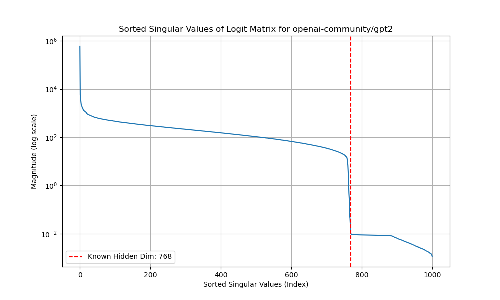

## Module 1 - prompt injections
- if it is easy & cheap with AI, can you make something like https://learn.snyk.io/lesson/prompt-injection/?ecosystem=aiml and https://learn.snyk.io/lesson/insecure-output-handling/?ecosystem=aiml
- this doesn't take too long though, so we should ask them to spend upto 30 mins on something like Hackaprompt, gray-swan, https://gandalf.lakera.ai and write doen their findings in the last 5 mins

## Module 2 - revealing model information
- ask them to try to read https://arxiv.org/pdf/2403.06634 for a bit. we will reimplement the algorithms from this paper
- the first one is just finding the hidden dim in gpt2-small:

- the second one is stealing the model weights
- the stretch exercise is to implement appendix F in the paper where they do this without access to logits - Pranav should implement a solution if he has time

## Module 3 - leaking system prompts

- https://github.com/asgeirtj/system_prompts_leaks
- there are many ways to do this tbh, kinda the same as gandalf / 1 - make this a stretch exercise
- this is more of a thing you can do than a process

## Module 4 - special tokens
- LLMs have special tokens that are used for various purposes, such as indicating the start or end of a sequence, padding, or separating different parts of the input.
- This is bad because if you aren't tokenizing well, the user can sneak in <|endoftext|> or <|startoftext|> and cause the model to behave unexpectedly.
- https://www.lesswrong.com/posts/xtpcJjfWhn3Xn8Pu5/anomalous-tokens-in-deepseek-v3-and-r1
- https://github.com/deepseek-ai/DeepSeek-Coder/issues/74
- there are also "rare" tokens like solidgoldmagikarp that can trigger unintended behavior.
  - this might not look like a big deal, but anything we don't understand can very easily become an attack vector.

## Module 5 - ROME (model steering)
- get them to look at/play with https://colab.research.google.com/github/kmeng01/rome/blob/main/notebooks/rome.ipynb
  - what are the limitations of this approach?
  - eg, "what are some landmarks in Paris" still returns "Eiffel Tower"
- then, implement this https://colab.research.google.com/drive/16RPph6SobDLhisNzA5azcP-0uMGGq10R?usp=sharing&ref=blog.mithrilsecurity.io

## Module 6 - Badllama :p
- get a dataset that is filled with malicious requests, like 100-200 is enough
  - https://huggingface.co/datasets/LibrAI/do-not-answer
  - https://huggingface.co/datasets/allenai/coconot
- finetune? a model on fireworks with this

## Module 7 - Badllama but subtle
- finetune a model to be subtly right wing by training it on chat convos from grok for example