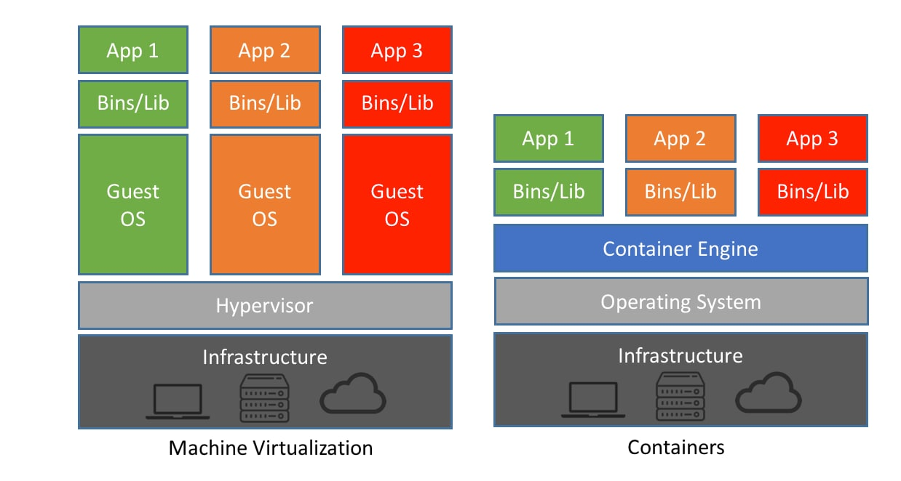

 # Exercise 2.1

**Container GPU Issues: What security vulnerabilities might arise when GPUs 
are shared between containers or when containers have direct GPU access?**

- Context-switching timing penalties exfiltrates shared GPU operations from delays in 
obtaining requested resources
- MPS is off by default in cloud computing to allow for different priorities for 
processes, but that just slows down sampling (by orders of magnitude) but the side-channel
attack is still possible

**VM GPU Passthrough: What attack vectors are introduced when GPUs are passed 
through directly to virtual machines?**

- Directly = can read everything -> Seems bad (can just get information directly)
- Bad configs will let one VM read the other VM

**Isolation Concerns: How might GPU memory persistence, side-channel attacks, 
or privilege escalation differ between containerized and VM environments?**

- Shared GPUs are cheaper (allow multiple people to use them) but tradeoff with the
security risk
- There are services that only let you rent whole GPU (lambda labs allows for GPU 
sharing, vast ai doesn't) 
- VM means attacks need to go through the hypervisor so less prone to side-channel 
timing attacks but are vulnerable to lower-level hardware attacks
